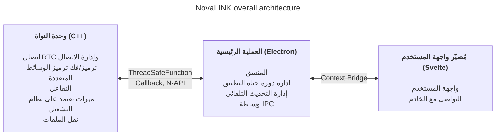

صُممت NovaLINK لتعدد المنصات منذ البداية. لا يعمل برنامج التحكم عن بُعد على Windows فقط، بل على نطاق واسع على macOS وLinux أيضًا، وتختلف النشر والتحديثات وسياسات الأمان حسب المنصة. مع ذلك يريد المستخدمون أن تبقى الشاشات والتجربة «كما هي» بغض النظر عن المنصة. أردنا أيضًا بيئة تطوير متسقة. لشركة صغيرة، ليس من السهل توحيد كل البيئات داخليًا. كان يجب تركيز الهندسة على جوهر المنتج والاعتماد على أنظمة بيئية ناضجة للباقي. لذلك فكّرنا بعمق في تعدد المنصات من مرحلة مبكرة.

«تعدد المنصات» هنا لا يعني مجرد «نفس الشيفرة تُبنى على عدة أنظمة تشغيل». تختلف نماذج الأذونات للتقاط الشاشة واعتراض الإدخال وإمكانية الوصول واستثناءات جدار الحماية والطاقة والسكون؛ وتتفاوت أنظمة الإحداثيات والتحجيم تحت HiDPI وشاشات متعددة وعروض افتراضية بشكل طفيف. وتختلف التوقعات بشأن مسارات التثبيت والتشغيل التلقائي والسلوك في الخلفية. للمستخدم التجربة «نفسها في كل مكان»، وللمطور الأمر أقرب لتكرار العمل نفسه عشرات الطرق. لذلك فصلنا منذ البداية بين «دور رسم الواجهة» و«دور الأذونات والأداء الحساس» لتقليل **التكرار**.

السوق يقدم العديد من المكدسات متعددة المنصات — Flutter وReact Native و.NET وQt وغيرها. لكل منها إيجابيات وسلبيات واضحة؛ ومع الأخذ في الاعتبار الوثائق والمجتمعات لحل المشكلات غير المتوقعة، يتسع الخيار. لكن خدمة التحكم عن بُعد تضيف قيدًا يضيق المجال: **الأداء**. التقاط الشاشة والترميز/فك الترميز وتأخير الإدخال والتخزين المؤقت أمام تقلبات الشبكة ونقل الملفات — كلها تتوقع استجابة شبه فورية. غالبًا تضيف أطر العمل متعددة المنصات طبقات وغلافًا لوضع أنظمة تشغيل متعددة تحت تجريد واحد؛ تلك الطبقات تشتري سهولة التطوير بثمن اختناقات أو تأخير يصعب توقعه في أسوأ الأحوال. نضج المنصة لا يلغي تلك الحدود تلقائيًا. يصعب وضع «مكدس متعدد منصات شائع» و«الأداء المطلوب للتحكم عن بُعد» على محور واحد للمقارنة البسيطة.

في التحكم عن بُعد، الأداء ليس شعارًا مجردًا؛ يرتبط مباشرة بالجودة المدركة. التأخير من الإدخال إلى النواة ومرورًا بالترميز والنقل وفك الترميز حتى الشاشة؛ السياسات عند فقد الحزم وازدياد التذبذب (إسقاط الإطارات مقابل توسيع المخزن المؤقت؛ تركيبات الدقة ومعدل الإطارات ومعدل البت والترميز — كلها تشكل انطباع «الاستجابة الفورية». لا تُحل هذه المشكلات براحة إطار واجهة المستخدم وحدها؛ يلزم مسارات التقاط خاصة بكل نظام وتسريع عتادي وحتى جدولة الخيوط. لذلك أولينا **مسارًا ساخنًا رقيقًا وقابلًا للتحكم** على أمل أن «مكدسًا واحدًا يحل كل شيء».

عند استعراض أدوات تعدد المنصات المبكرة، بدا بعضها كغلاف واجهة رقيق فوق الأصلي، وبعضها يفرض بناء عالم آخر داخل الإطار. كان Java Swing عمليًا لعصره لكنه محدود في الاتساق البصري وتوقعات تجربة المستخدم الحديثة. أثار Qt الإعجاب باتساق واجهة المستخدم وسلسلة الأدوات؛ ومثل عائلة .NET يتطلب فهم البناء والنشر والنظام البيئي للإضافات — ويختلف عبء التعلم حسب الفريق. المثير أنه حتى بين الأدوات التي تدّعي «تعدد المنصات» استمرت استثناءات خاصة بكل منصة في التكامل المستمر والتعبئة وتوقيع الشيفرة. سهّل Python واجهات سطح المكتب عبر ربطات Qt؛ لكن المفسّر وGIL قد يثقلان خطوط الأنابيب الزمنية الحقيقية المعقدة على المدى الطويل.

في الآونة الأخيرة، عزّز WebAssembly والربط الأصلي المختلف مزيج «تقنيات الويب + أصلي للمسارات الحرجة». استنتاج NovaLINK ليس بعيدًا عن هذا الاتجاه. لكن التحكم عن بُعد عملية طويلة الأمد بتيار مستمر من الوسائط والإدخال؛ لذلك كان الأهم ليس تكاملًا على مستوى العرض فقط، بل كيفية الحفاظ على الحدود من منظور التشغيل — التحديثات واستعادة الأعطال واستقرار الذاكرة.

مع الوقت، تزايدت واجهات برمجة التطبيقات التي تكشف القدرات الأصلية بشكل رقيق؛ وانتقلت المكدسات ذات قاعدة مطورين واسعة (Node وReact) بشكل طبيعي إلى تطبيقات سطح المكتب. كان Visual Studio Code على Electron نقطة تحول — مع تحسين عميق وفصل المُصيّر ومضيف الامتدادات. ومع ذلك فحقيقة وجود منتج بمستوى بيئة تطوير متكاملة فوق تقنيات الويب ونظام Node البيئي يكسر افتراض أن تعدد المنصات يعني أداءً منخفضًا. شوّقت العديد من بيئات التطوير والأدوات من VS Code أو استلهمت منه — نقرأ ذلك تحققًا سوقيًا. دفعنا ذلك إلى الاعتقاد بأن الأداء وتجربة المستخدم يمكن مطاردتهما معًا بمكدس متعدد المنصات.

بالطبع لنهج Electron تكاليف حقيقية: الذاكرة والاعتماد على Chromium وحجم التوزيع. بلا تحسين بمستوى VS Code يتذبذب الأداء المدرك بسهولة. مع ذلك يمكن لفريق صغير التكرار السريع واعتماد أنماط ناضجة للتحديث التلقائي والامتدادات وتكامل الأدوات — ميزة كبيرة. المهم **ألا يترك المُصيّر كل العمل لنفسه**؛ يجب أن ينزل العمل الثقيل إلى النواة بتصميم.

في الوقت نفسه، لم نحاول أن يتحمل إطار واحد الأداء وتجربة المستخدم حتى النهاية. الجواب العملي هو فصل الأدوار والتفويض. بعد عدة محاولات اختارت NovaLINK بنية هجينة: فصل تجربة المستخدم عن النواة قدر الإمكان؛ صياغة النواة للمسارات الحساسة للأداء والواجهة للعلامة وسهولة الاستخدام. الصورة الكبيرة تبدو بسيطة، لكن في التفاصيل — شبه فركتالية — يعيد كل ميزة نفس الأسئلة: المُصيّر أم النواة للتحكم بالتأخير واستهلاك الطاقة؟ لا تُحدد الحدود مرة واحدة؛ تُعاد عند تغيّر أنماط المرور وسياسات نظام التشغيل.

عمليًا، النواة بـ C++: RTC والوسائط المتعددة والإدخال منخفض المستوى ونقل الملفات في مكان واحد. تربط إضافات Node (N-API) ودوال آمنة للخيوط واستدعاءات العكس العملية الرئيسية حتى يعمل العمل خارج حلقة أحداث واجهة المستخدم على خيوط منفصلة مع رفع النتائج بأمان عند الحاجة. تركز العملية الرئيسية لـ Electron على عمر التطبيق والتحديث التلقائي والغلاف (النوافذ والشريط والاختصارات العامة) ووساطة IPC. يتولى المُصيّر المبني على Svelte تدفقات المستخدم والحوار مع الخوادم. نموذج المكوّنات الخفيف يساعد على الحفاظ على شاشات التحكم عن بُعد المتغيرة كثيرًا دون قالب مفرط.

سوق التحكم عن بُعد يؤكد أولويات مختلفة: سياسات المؤسسات وسجلات التدقيق مقابل بث زمن تأخير منخفض جدًا. تسعى NovaLINK إلى توازن — ليس سطرًا واحدًا من معيار أداء، بل سلوكًا يمكن توقعه في سيناريوهات حقيقية متكررة: الاتصال وإعادة الاتصال وتغيير الدقة وجودة الشبكة والجلسات الطويلة. لذلك تسأل البنية أيضًا كيف عزل أوضاع الفشل: كيف تعلم واجهة المستخدم إذا توقفت النواة؟ كيف تُنظَّف الجلسات إذا تجمد المُصيّر؟ ليس مثيرًا، لكنه ضروري للثقة في تطبيق متعدد المنصات.

تشغيل هذه البنية يتطلب أكثر من التصميم — انضباطًا مستمرًا. نموذج الخيط الواحد حول حلقة الأحداث دائمًا في توتر مع تعدد الخيوط والعمل الأصلي في النواة. تختلف المؤقتات والإدخال وسياسات الطاقة حسب المنصة؛ النمط غير المتزامن نفسه لا يعطي دائمًا نفس النتيجة. تتطلب رسائل IPC مخططات متوافقة وتكلفة تسلسل مضبوطة؛ دفع خط أنابيب الوسائط والتفاعل معًا يعني تقليل النسخ وتنافس الأقفال مرارًا. هذه ليست مشكلة NovaLINK فقط — شائعة في التحكم عن بُعد والتعاون في الوقت الفعلي ومنتجات البث. لكن فصل النواة والرئيسي والمُصيّر يضيف عبءًا صريحًا على العقود وتوافق الإصدارات واستراتيجيات الاسترداد عند الحدود.

من ناحية الأمان، كلما كانت الحدود أوضح كان أفضل: سطح أصغر للمُصيّر؛ ربط القدرات الحساسة بالسياسات في العملية الرئيسية والنواة. تقييد واجهات برمجة التطبيقات المعروضة عبر Context Bridge والحفاظ على رسائل قابلة للتسلسل ومصفوفة توافق لإصدارات الوحدات الأصلية والتطبيق — مرهق في البداية لكنه يسهّل تحليل الحوادث والتراجع.

أخيرًا، تعدد المنصات ليس «تفكيرًا مرة في البداية» — إنه سلسلة قرارات طالما المنتج حيّ. تحديثات نظام التشغيل تغيّر حوارات الأذونات؛ تعارض برامج تشغيل GPU وجدران الحماية والأمان يغيّر الإحساس بنفس الشيفرة. في كل مرة نعيد قراءة حدود النواة–واجهة المستخدم وننقل المسؤوليات ونرفع إصدارات العقود. هذا التكرار أقل أناقة من مكدس موحّد — لكنه يعود للمستخدم كتحديثات مستقرة وشاشات مألوفة.

الهجين سيف ذو حدّين لتجربة المطورين: تزداد طوابق تتبع الأخطاء وتنتشر السجلات على عدة عمليات. نفضّل مقاييس قابلة للقياس — إحصاءات الإطارات وعمق الطابور وزمن ذهاب وإياب IPC واستخدام CPU للنواة — على «يبدو سريعًا». اختبارات الانحدار لكل منصة ونشر canary والتشغيل البيني مع عملاء قدامى هي تكاليف خفية لمنتجات متعددة المنصات. نقبل هذه التكاليف لقاء قابلية التنبؤ في النواة وسرعة التحسين في واجهة المستخدم.

**مفاضلات البنية الحالية لـ NovaLINK وطرق التخفيف**

| عيب | المعنى | التخفيف |
|-----|--------|---------|
| استخدام الذاكرة | عمليات Chromium ترفع الخط الأساسي | المسارات الحرجة للأداء في C++ قدر الإمكان |
| وقت البدء البارد | تحميل Electron قد يستغرق ثوانٍ | شاشة بداية لتحسين تجربة المستخدم المدركة |
| تعقيد ربط N-API | صيانة جسر C++↔JS | هيكل عمليات حسب الغرض؛ لكل عملية اتصال C++ خاص |
| حجم الثنائي | Electron مع بناء C++ يعطي مثبتات كبيرة | تجميع ASAR + حزم اختيارية لكل منصة |
| تعقيد بيئة البناء | npm مع حزم تطوير لكل منصة | بناء منفصل لكل منصة في التكامل المستمر |

تحديث واحد لا يزيل كل الاختناقات. ستستمر قرارات ومفاضلات مماثلة. مع ذلك نؤمن أن الاتجاه — إعادة موازنة ما يبقى في النواة مقابل واجهة المستخدم والتحقق بالأرقام — صحيح، وسنواصل التحسين بناءً على ملاحظات المستخدمين والقياسات. المقال طويل والفكرة بسيطة: تعدد المنصات ليس اختيارًا لمرة واحدة بل تصميمًا مستمرًا، وNovaLINK تواصل هذا التفكير يوميًا.
