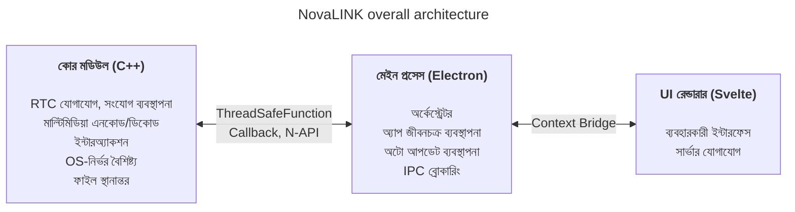
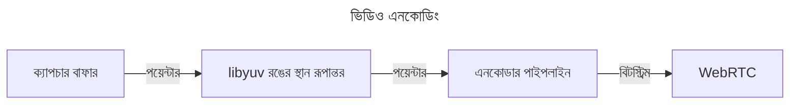
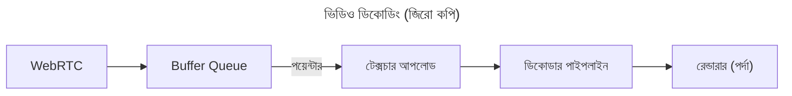

NovaLINK শুরু থেকেই ক্রস-প্ল্যাটফর্মের জন্য ডিজাইন করা হয়েছিল। রিমোট কন্ট্রোল সফটওয়্যার শুধু Windows-এ নয়, macOS ও Linux-েও বিস্তৃতভাবে চলে; মোতায়েন, আপডেট ও নিরাপত্তা নীতি প্ল্যাটফর্ম ভেদে আলাদা। তবু ব্যবহারকারীরা চান একবার ব্যবহৃত স্ক্রিন ও অভিজ্ঞতা «একই» থাকুক—প্ল্যাটফর্ম যাই হোক না কেন। আমরাও সামঞ্জস্যপূর্ণ উন্নয়ন পরিবেশ চেয়েছিলাম। ছোট কোম্পানির পক্ষে সব পরিবেশ একীভূত করা সহজ নয়। প্রকৌশল শক্তি কোর পণ্যে কেন্দ্রীভূত করতে হয়েছিল; বাকিটা পরিপক্ক ইকোসিস্টেমের ওপর নির্ভর। তাই প্রাথমিক পর্যায় থেকেই আমরা ক্রস-প্ল্যাটফর্ম নিয়ে গভীরভাবে ভেবেছি।

এখানে «ক্রস-প্ল্যাটফর্ম» মানে শুধু «একই কোড একাধিক OS-এ বিল্ড হয়» তা নয়। স্ক্রিন ক্যাপচার, ইনপুট হুকিং, অ্যাক্সেসিবিলিটি, ফায়ারওয়াল ব্যতিক্রম, পাওয়ার ও স্লিপের মতো অনুমতি মডেল OS অনুযায়ী আলাদা; HiDPI, মাল্টি মনিটর ও ভার্চুয়াল ডিসপ্লেতে স্থানাঙ্ক ও স্কেলিং সূক্ষ্মভাবে ভিন্ন। ইনস্টল পাথ, অটো স্টার্ট ও ব্যাকগ্রাউন্ড আচরণের প্রত্যাশাও ভিন্ন। ব্যবহারকারীর কাছে এটি «সব জায়গায় একই অভিজ্ঞতা», উন্নয়নের দিক থেকে একই কাজ অনেক রকমভাবে পুনরাবৃত্তি। তাই শুরু থেকেই «যা UI আঁকে» ও «যেখানে অনুমতি ও পারফরম্যানস জমে» তা আলাদা করে **পুনরাবৃত্তি কমানোর** সিদ্ধান্ত নেওয়া হয়েছিল।

বাজারে Flutter, React Native, .NET, Qt ইত্যাদি অসংখ্য ক্রস-প্ল্যাটফর্ম স্ট্যাক আছে। প্রত্যেকের স্পষ্ট সুবিধা-অসুবিধা; অপ্রত্যাশিত সমস্যার ডকুমেন্টেশন ও কমিউনিটি যোগ করলে বিকল্প আরও বাড়ে। কিন্তু রিমোট কন্ট্রোল সেবা একটি সীমাবদ্ধতা যোগ করে যা ক্ষেত্র সঙ্কীর্ণ করে: **পারফরম্যানস**। স্ক্রিন ক্যাপচার, এনকোড/ডিকোড, ইনপুট বিলম্ব, নেটওয়ার্ক ওঠানামার বিরুদ্ধে বাফারিং, ফাইল স্থানান্তর—সবকিছু প্রায় রিয়েল টাইম প্রতিক্রিয়ার প্রত্যাশা করে। ক্রস-প্ল্যাটফর্ম ফ্রেমওয়ার্ক প্রায়শই একাধিক OS এক অমূর্ততার ওপর রাখতে স্তর ও র‍্যাপার যোগ করে; সেই স্তর উন্নয়ন সুবিধার বিনিময়ে সর্বোচ্চ খারাপ ক্ষেত্রে বাধা বা অপ্রত্যাশিত বিলম্ব হতে পারে। প্ল্যাটফর্ম পরিপক্ক হলেই এই সীমা স্বয়ংক্রিয়ভাবে মুছে যায় না। «জনপ্রিয় ক্রস-প্ল্যাটফর্ম স্ট্যাক» ও «রিমোট কন্ট্রোলের প্রয়োজনীয় পারফরম্যানস» একই অক্ষে সহজ তুলনা করা কঠিন।

রিমোট কন্ট্রোলে পারফরম্যানস বিমূর্ত স্লোগান নয়—এটি সরাসরি অনুভূত গুণমানের সঙ্গে যুক্ত। ইনপুট কোরে পৌঁছানো থেকে এনকোড, ট্রান্সমিশন, ডিকোড হয়ে স্ক্রিনে ফেরা পর্যন্ত বিলম্ব; প্যাকেট হার ও জিটার বাড়লে ফ্রেম ফেলা বা বাফার বাড়ানোর নীতি; রেজোলিউশন, ফ্রেম রেট, বিটরেট ও কোডেক সংমিশ্রণ—সব ব্যবহারকারীর «তাৎক্ষণিক প্রতিক্রিয়া» ধারণাকে গঠন করে। এগুলো UI ফ্রেমওয়ার্কের সুবিধায় মাত্র সমাধান হয় না; OS-নির্দিষ্ট ক্যাপচার পথ, হার্ডওয়্যার অ্যাক্সেলারেশন ও থ্রেড শিডিউলিং দেখতে হয়। তাই আমরা «একটি স্ট্যাক সব সমাধান করবে»-এর চেয়ে **হট পথ পাতলা ও নিয়ন্ত্রণযোগ্য রাখাকে** অগ্রাধিকার দিয়েছি।

প্রাথমিক ক্রস-প্ল্যাটফর্ম টুলগুলো মনে করলে কিছু নেটিভের ওপর পাতলা UI খোলসের মতো, কিছুতে ফ্রেমওয়ার্কের ভিতরে আরেকটি জগৎ বানাতে হতো। Java Swing তার সময়ের জন্য ব্যবহারযোগ্য ছিল কিন্তু দৃশ্য সামঞ্জস্য ও আধুনিক UX প্রত্যাশায় সীমাবদ্ধ। Qt UI সামঞ্জস্য ও টুলচেইনে চমৎকার; .NET পরিবারের মতো বিল্ড, মোতায়েন ও প্লাগইন ইকোসিস্টেম বোঝা দরকার—দলের উপর নির্ভর করে শেখার খরচ বাড়তে পারে। মজার ব্যাপার, «ক্রস-প্ল্যাটফর্ম» বলে যে টুলগুলো, সেখানেও CI, প্যাকেজিং, কোড সাইনিংয়ের মতো অপারেশনাল বিষয়ে প্ল্যাটফর্ম-নির্দিষ্ট ব্যতিক্রম বারবার উঠে আসত। Python Qt বাইন্ডিং ইত্যাদি দিয়ে ডেস্কটপ UI সহজ ছিল; ইন্টারপ্রেটার ও GIL দীর্ঘমেয়াদি ভারী রিয়েল-টাইম পাইপলাইন ডিজাইনে বোঝা হতে পারে।

সাম্প্রতিককালে WebAssembly ও বিভিন্ন নেটিভ বাইন্ডিংয়ের মাধ্যমে «ওয়েব প্রযুক্তি + পারফরম্যানস-সংবেদনশীল অংশ নেটিভ» সংযোজন সাধারণ হয়ে উঠেছে। NovaLINK-এর উপসংহারও সেই দিকের কাছাকাছি। তবে রিমোট কন্ট্রোল মিডিয়া ও ইনপুটের অবিচ্ছিন্ন প্রবাহযুক্য দীর্ঘমেয়াদি প্রক্রিয়া; তাই শুধু ডেমো স্তরের একীকরণ নয়, আপডেট, বিপর্যয় পুনরুদ্ধার ও মেমোরি স্থিতিশীলতাসহ অপারেশনাল দৃষ্টিকোণ থেকে সীমা কীভাবে রক্ষা করা হবে—তা গুরুত্বপূর্ণ ছিল।

সময়ের সঙ্গে নেটিভ ক্ষমতা পাতলাভাবে প্রকাশকারী API বেড়েছে; Node বা React-এর মতো বিস্তৃত ডেভেলপার পুলের স্ট্যাক ডেস্কটপ অ্যাপে স্বাভাবিকভাবে ঢুকেছে। Electron-ভিত্তিক Visual Studio Code-এর পরিপক্কতা একটি বড় মোড় ছিল। আমরা জানি তার পেছনে গভীর প্রোফাইলিং ও রেন্ডারার-এক্সটেনশন হোস্ট পৃথকীকরণের মতো অপ্টিমাইজেশন আছে। তবু «ওয়েব প্রযুক্তি ও Node ইকোসিস্টেমের ওপর IDE-স্তরের পণ্য সম্ভব»—এই সত্য ক্রস-প্ল্যাটফর্ম মানেই নিম্ন পারফরম্যানস—এই ধারণা ভাঙে। অনেক IDE ও টুল VS Code ফর্ক করেছে বা অনুপ্রেরণা নিয়েছে—আমরা এটিকে বাজারের বৈধতা মনে করি। এটি আমাদের «ক্রস-প্ল্যাটফর্ম স্ট্যাক দিয়ে পারফরম্যানস ও UX একসঙ্গে লক্ষ্য করা যায়»—এই চিন্তায় নিয়ে গেছে।

অবশ্যই Electron-ভিত্তিক পদ্ধতির বাস্তব খরচ আছে: মেমোরি, Chromium নির্ভরতা, বিতরণ আকার। VS Code-স্তরের অপ্টিমাইজেশন ছাড়া অনুভূত পারফরম্যানস সহজেই নড়বড়ে হয়। তবু ছোট দলের পক্ষে দ্রুত পণ্য উন্নতি ও অটো আপডেট, এক্সটেনশন, টুল ইন্টিগ্রেশনের মতো «সমগ্র অ্যাপ ঘিরে» সমস্যাগুলো পরিপক্ক প্যাটার্নে নেওয়া বড় সুবিধা। গুরুত্বপূর্ণ ছিল **রেন্ডারারকে সব কাজ করতে না দেওয়া**; ভারী কাজ ডিজাইন অনুযায়ী কোরে নামাতে হবে।

একই সঙ্গে আমরা এক ফ্রেমওয়ার্কের মধ্যে পারফরম্যানস ও UX শেষ পর্যন্ত একা বহন করতে চাইনি। বাস্তব উত্তর ভূমিকার বিভাজন ও প্রত্যায়োজনের কাছাকাছি। একাধিক চেষ্টার পর NovaLINK যে কাঠামো বেছে নিয়েছে তা হাইব্রিড: UX ও কোর যতটা সম্ভব আলাদা; কোর পারফরম্যানস-অনুকূল, UI ব্র্যান্ড ও ব্যবহারযোগ্যতা একীভূত করার উপযোগী। বড় ছবি সহজ দেখায়, বিস্তারিতে—প্রায় ফ্র্যাক্টালের মতো—প্রতিটি বৈশিষ্ট্য একই প্রশ্ন পুনরাবৃত্তি করে: এটি রেন্ডারারে না কোরে—বিলম্ব ও শক্তি খরচ নিয়ন্ত্রণের জন্য? সীমা একবার স্থির হয়ে শেষ নয়; ট্রাফিক প্যাটার্ন ও OS নীতি বদলালে আবার মিলিয়ে নিতে হয়।

সংক্ষেপে কোর C++: RTC, মাল্টিমিডিয়া, নিম্ন-স্তরের ইনপুট ও ফাইল স্থানান্তরের মতো বিলম্ব ও থ্রুপুট-সংবেদনশীল পথ এক জায়গায়। Node অ্যাড-অন (N-API), থ্রেড-সেফ ফাংশন ও কলব্যাক মেইন প্রসেসের সঙ্গে যুক্ত করে UI ইভেন্ট লুপ থেকে আলাদা থ্রেডে কাজ চালিয়ে প্রয়োজনমতো নিরাপদে ফলাফল তুলে দেয়। Electron মেইন প্রসেস অ্যাপ জীবনচক্র, অটো আপডেট, উইন্ডো, ট্রে, গ্লোবাল শর্টকাটের মতো শেল ভূমিকা ও IPC ব্রোকারিংয়ে মনোযোগ দেয়। Svelte-ভিত্তিক রেন্ডারার ব্যবহারকারী প্রবাহ ও সার্ভারের সঙ্গে কথোপকথন সামলায়। হালকা কম্পোনেন্ট মডেল ও স্পষ্ট স্টেট পরিবর্তন রিমোট কন্ট্রোলের মতো প্রায়ই বদলানো স্ক্রিন কম বয়লারপ্লেটে টেকসই রাখতে সাহায্য করে।

রিমোট কন্ট্রোল বাজারে পণ্য ভিন্ন ভিন্ন জোর দেয়: কিছু এন্টারপ্রাইজ নীতি ও অডিট লগে, কিছু অতি-নিম্ন বিলম্ব স্ট্রিমিংয়ে। NovaLINK যে ভারসাম্য চায় তা «নির্দিষ্ট বেঞ্চমার্কের এক লাইন» নয়—বাস্তব ব্যবহারে পুনরাবৃত্ত পরিস্থিতিতে—সংযোগ, পুনঃসংযোগ, রেজোলিউশন পরিবর্তন, নেটওয়ার্ক গুণমান, দীর্ঘ সেশন—অনুমানযোগ্য আচরণ। তাই আর্কিটেকচার বৈশিষ্ট্য তালিকার পাশাপাশি ব্যর্থতা মোড কীভাবে বিচ্ছিন্ন করা হবে তাও জিজ্ঞাসা করে: কোর থেমে গেলে UI কীভাবে জানবে? রেন্ডারার অচল হলে সেশন কীভাবে পরিষ্কার করবেন? আকর্ষণীয় নয়, কিন্তু ক্রস-প্ল্যাটফর্ম অ্যাপে বিশ্বাসের জন্য অপরিহার্য।

এই কাঠামো চালাতে শুধু ডিজাইন যথেষ্ট নয়—ধারাবাহিক অপারেশন ও সংযম লাগে। উদাহরণস্বরূপ ইভেন্ট লুপ-কেন্দ্রিক একক-থ্রেড মডেল ও কোরের মাল্টিথ্রেডেড নেটিভ কাজের মধ্যে সিঙ্ক্রোনাইজেশন সবসময় উত্তেজনাপূর্ণ। প্ল্যাটফর্ম অনুযায়ী টাইমার, ইনপুট ও পাওয়ার ব্যবস্থাপনা নীতি আলাদা; একই অ্যাসিঙ্ক্রোনাস প্যাটার্ন সবসময় একই ফল দেয় না। IPC বার্তার স্কিমা মিলিয়ে সিরিয়ালাইজেশন খরচ নিয়ন্ত্রণ করতে হয়; মিডিয়া পাইপলাইন ও ইন্টারঅ্যাকশন একসঙ্গে চালালে অপ্রয়োজনীয় কপি ও লক প্রতিযোগিতা কমাতে হয়। এগুলো শুধু NovaLINK-এর নয়—রিমোট কন্ট্রোল, রিয়েল-টাইম সহযোগিতা ও স্ট্রিমিং ধরনের পণ্যে সাধারণ। তবে কোর, মেইন ও রেন্ডারার স্তরে ভাগ করলে সীমানায় চুক্তি, সংস্করণ সামঞ্জস্য ও ব্যর্থতা পুনরুদ্ধার কৌশল স্পষ্টভাবে পরিচালনার বোঝা বাড়ে।

নিরাপত্তার দিক থেকেও সীমা যত স্পষ্ট তত ভালো: রেন্ডারার যতটা সম্ভব সীমিত পৃষ্ঠ; সংবেদনশীল ক্ষমতা মেইন ও কোরে অনুমতি ও নীতির সঙ্গে। Context Bridge দিয়ে প্রকাশিত API সীমিত রাখা, সিরিয়ালাইজযোগ্য বার্তা বজায় রাখা, নেটিভ মডিউল ও অ্যাপ সংস্করণের সংমিশ্রণ সামঞ্জস্য ম্যাট্রিক্সে পরিচালনা—প্রথমে ঝামেলা, দীর্ঘমেয়াদে ঘটনা বিশ্লেষণ ও রোলব্যাক সহজ।

শেষমেশ, ক্রস-প্ল্যাটফর্ম «শুরুতে একবার ভেবে শেষ» নয়—পণ্য বেঁচে থাকা পর্যন্ত নির্বাচনের ধারাবাহিকতা। OS আপডেট অনুমতি ডায়ালগ বদলায়; GPU ড্রাইভার, ফায়ারওয়াল, নিরাপত্তা সফটওয়্যার হস্তক্ষেপ করলে একই কোডেও অনুভূতি বদলায়। তখন কোর ও UI-এর সীমা আবার পড়তে হয়, প্রয়োজনে দায়িত্ব সরাতে হয়, চুক্তি সংস্করণ আপগ্রেড করতে হয়। একক স্ট্যাকের চেয়ে কম মোহনীয় শোনা এই পুনরাবৃত্তি শেষমেশ ব্যবহারকারীর কাছে স্থিতিশীল আপডেট ও পরিচিত স্ক্রিন হয়ে ফিরে আসে।

ডেভেলপার অভিজ্ঞতায়ও হাইব্রিড দুই ধারের তলোয়ার: স্তর বাড়লে ডিবাগ স্ট্যাক লম্বা, পুনরুত্পাদন পরিবেশের জন্য লগ ও স্যাম্পলিং বিন্দু একাধিক প্রসেসে ভাগ করতে হয়। তাই আমরা «মনে হয় দ্রুত»-এর চেয়ে ফ্রেম পরিসংখ্যান, কিউ জমাট, IPC রাউন্ড ট্রিপ, কোর CPU ব্যবহারের মতো মাপযোগ্য সূচক অগ্রাধিকার দিই। প্ল্যাটফর্ম-ভিত্তিক রিগ্রেশন টেস্ট, ক্যানারি মোতায়েন, পুরনো ক্লায়েন্টের সাথে আন্তঃক্রিয়াও ক্রস-প্ল্যাটফর্ম পণ্যের লুকানো খরচ। আমরা এই খরচ কোরে অনুমানযোগ্যতা ও UI-তে দ্রুত উন্নতির গতি একসঙ্গে পেতে মেনে নিই।

**NovaLINK বর্তমান কাঠামোর ট্রেড-অফ ও প্রশমন**

| অসুবিধা | বিষয়বস্তু | প্রশমন |
|---------|------------|--------|
| মেমোরি ব্যবহার | Chromium প্রসেসের কারণে ভিত্তি মেমোরি বেশি | পারফরম্যানস সংবেদনশীল পথ যতটা সম্ভব C++-এ |
| প্রাথমিক চালনার সময় | Electron লোডিংয়ে কয়েক সেকেন্ড | স্প্ল্যাশ স্ক্রিনে UX প্রশমন |
| N-API বাইন্ডিং জটিলতা | C++↔JS ব্রিজ কোড রক্ষণাবেক্ষণ | উদ্দেশ্য অনুযায়ী আলাদা প্রসেস কাঠামো; প্রতিটি প্রসেসে আলাদা C++ যোগাযোগ |
| বাইনারি আকার | Electron + C++ বিল্ডে ইনস্টলার বড় | ASAR প্যাকিং + প্ল্যাটফর্ম-ভিত্তিক ঐচ্ছিক বান্ডল |
| বিল্ড পরিবেশ জটিলতা | npm + প্ল্যাটফর্ম SDK একসঙ্গে | CI-তে প্ল্যাটফর্ম অনুযায়ী আলাদা বিল্ড |

একটি আপডেটে সব বাধা মুছে যায় না। ভবিষ্যতেও অনুরূপ সিদ্ধান্ত ও ট্রেড-অফ থাকবে। তবু আমরা বিশ্বাস করি বর্তমান দিক—কোরে কী রাখব ও UI-তে কী ছাড়ব তা বারবার পুনঃসমন্বয় ও সংখ্যায় যাচাই—ভুল নয়, এবং ব্যবহারকারী প্রতিক্রিয়া ও পরিমাপের ভিত্তিতে আমরা চালিয়ে যাব। লেখাটি দীর্ঘ হয়েছে কিন্তু মূল কথা সহজ: ক্রস-প্ল্যাটফর্ম একক নির্বাচন নয়, নিরবিচ্ছিন্ন ডিজাইন—এবং NovaLINK প্রতিদিন সেই চিন্তা চালিয়ে যায়।
