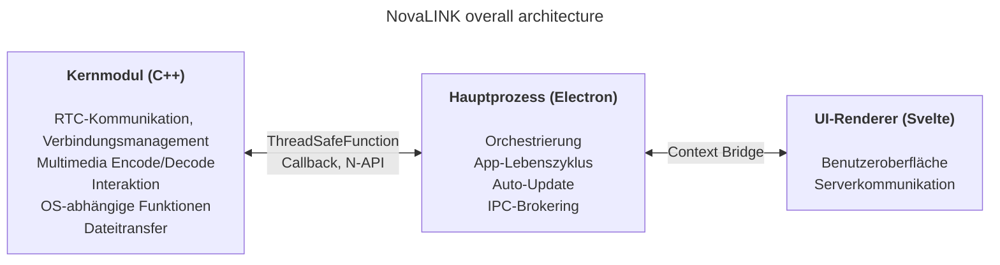
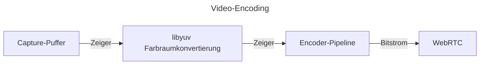
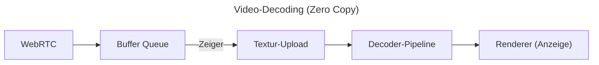

NovaLINK wurde von Anfang an für Cross-Platform konzipiert. Fernsteuerungssoftware läuft nicht nur unter Windows, sondern breit unter macOS und Linux; Verteilung, Updates und Sicherheitsrichtlinien unterscheiden sich je Plattform. Nutzer wollen dennoch, dass sich Bildschirme und Erfahrungen „gleich“ anfühlen – plattformunabhängig. Auch wir wollten eine einheitliche Entwicklungsumgebung. Für ein kleines Unternehmen ist es nicht trivial, alle Umgebungen intern zu vereinheitlichen. Engineering musste auf die Kernfunktion konzentriert werden; der Rest sollte auf gereifte Ökosysteme setzen. Deshalb haben wir früh intensiv über Cross-Platform nachgedacht.

Cross-Platform bedeutet hier nicht nur „derselbe Code baut auf mehreren Betriebssystemen“. Berechtigungsmodelle für Bildschirmaufnahme, Input-Hooking, Barrierefreiheit, Firewall-Ausnahmen, Energie und Ruhezustand unterscheiden sich; Koordinatensysteme und Skalierung unter HiDPI, Multi-Monitor und virtuellen Displays weichen subtil ab. Erwartungen an Installationspfade, Autostart und Hintergrundverhalten variieren. Für Nutzer ist es „überall dieselbe Erfahrung“, für Entwickler eher dieselbe Arbeit dutzendfach anders. Deshalb trennten wir früh „was die Oberfläche zeichnet“ von „was Berechtigungen und Performance-lastige Arbeit trägt“, um **Wiederholung zu reduzieren**.

Der Markt bietet viele Cross-Platform-Stacks – Flutter, React Native, .NET, Qt und mehr. Jeder hat klare Vor- und Nachteile; mit Dokumentation und Community für unerwartete Probleme wird die Auswahl größer. Fernsteuerung fügt aber eine Einschränkung hinzu: **Performance**. Bildaufnahme, Encode/Decode, Eingabelatenz, Pufferung bei Netzschwankungen und Dateitransfer sollen sich fast in Echtzeit anfühlen. Cross-Platform-Frameworks legen oft Schichten und Wrapper an, um viele OS unter einer Abstraktion zu vereinen; diese Schichten können im schlimmsten Fall Engpässe oder schwer vorhersagbare Latenz bedeuten. Ein reifes Ökosystem hebt diese Grenzen nicht automatisch auf. „Beliebtes Cross-Platform“ und „Performance für Fernsteuerung“ lassen sich nicht einfach auf einer Achse vergleichen.

Bei Fernsteuerung ist Performance kein abstrakter Slogan, sondern direkt mit wahrgenommener Qualität verknüpft. Verzögerung von der Eingabe bis zum Kern und zurück über Encode, Übertragung und Decode; Strategien bei Paketverlust und Jitter (Frames verwerfen vs. Puffer vergrößern); Kombinationen aus Auflösung, Bildrate, Bitrate und Codec prägen den Eindruck „sofortige Reaktion“. Das löst man nicht allein mit UI-Framework-Komfort; es braucht OS-spezifische Capture-Pfade, Hardwarebeschleunigung und sogar Thread-Scheduling. Wir priorisierten daher einen **dünnen, kontrollierbaren Hot Path** gegenüber der Hoffnung, „ein Stack löst alles“.

Frühe Cross-Platform-Tools wirkten mal wie eine dünne UI-Hülle auf Native, mal musste man eine Welt im Framework bauen. Java Swing war seinerzeit pragmatisch, erreichte aber nicht moderne visuelle Konsistenz und UX-Erwartungen. Qt beeindruckte mit UI-Konsistenz und Tooling; dennoch braucht es wie .NET ein Verständnis für Build, Deployment und Plugin-Ökosystem – Lernkurven variieren mit dem Team. Selbst unter „Cross-Platform“-Tools tauchen in CI, Packaging und Code-Signing ständig plattformspezifische Sonderfälle auf. Python erleichtert Desktop-UIs via Qt-Bindings; Interpreter und GIL können jedoch langfristig bei komplexen Echtzeit-Pipelines belasten.

In letzter Zeit sind Kombinationen aus WebAssembly und nativen Bindings – „Web-Technologie + Native für den Hot Path“ – üblich geworden. NovaLINKs Schlussfolgerung weicht kaum ab. Fernsteuerung ist jedoch ein langlebiger Prozess mit kontinuierlichem Medien- und Input-Fluss; entscheidend war nicht nur Demo-Integration, sondern wie man Grenzen im Betrieb – Updates, Fehlerbehebung, Speicherstabilität – hält.

Im Laufe der Zeit kamen dünnere APIs für native Funktionen; Stacks mit großen Entwicklerpools wie Node und React erreichten Desktop-Apps. Visual Studio Code auf Electron war ein Wendepunkt – mit viel Profiling und Optimierungen wie getrenntem Renderer und Extension-Host. Dennoch: Ein IDE-ähnliches Produkt auf Web-Tech und Node-Ökosystem widerlegt nicht pauschal „Cross-Platform = langsam“. Viele IDEs und Tools forken oder orientieren sich an VS Code – wir lesen das als Marktvalidierung. Es motivierte uns, Performance und UX mit einem Cross-Platform-Stack anzustreben.

Natürlich hat Electron Kosten: Speicher, Chromium-Abhängigkeit, Paketgröße. Ohne VS-Code-Niveau an Optimierung schwankt die wahrgenommene Performance. Dennoch profitieren kleine Teams von schneller Iteration und gereiften Mustern für Auto-Update, Erweiterungen und Tooling. Entscheidend: **Dem Renderer nicht alles überlassen** – schwere Arbeit muss konstruktiv in den Kern.

Gleichzeitig wollten wir nicht, dass ein Framework Performance und UX allein bis zum Ende trägt. Die pragmatische Antwort ist Rollentrennung und Delegation. Nach vielen Versuchen wählte NovaLINK eine hybride Architektur: UX und Kern maximal trennen; den kernnah für performancekritische Pfade, die UI für Marke und Bedienbarkeit. Das große Bild wirkt einfach, doch im Detail – fraktal – stellt jede Funktion dieselben Fragen: Renderer oder Kern, um Latenz und Energie zu steuern? Grenzen sind nicht einmalig, sie müssen bei Traffic und OS-Richtlinien neu verhandelt werden.

Konkret ist der Kern in C++ gehalten: RTC, Multimedia, Low-Level-Input und Dateitransfer laufen gebündelt an einem Ort. Node-Addons (N-API), thread-sichere Funktionen und Callbacks verbinden den Hauptprozess, sodass Arbeit außerhalb der UI-Event-Schleife auf Threads laufen und Ergebnisse sicher nach oben gegeben werden können. Der Electron-Hauptprozess kümmert sich um Lebenszyklus, Auto-Update, Shell (Fenster, Tray, globale Shortcuts) und IPC-Brokering. Der Svelte-Renderer übernimmt Nutzerflüsse und Serverkommunikation. Das leichte Komponentenmodell hilft, häufig wechselnde Fernsteuerungs-Oberflächen wartbar zu halten.

Der Fernsteuerungsmarkt setzt Schwerpunkte unterschiedlich: Unternehmensrichtlinien und Audit-Logs versus Ultra-Low-Latency-Streaming. NovaLINK strebt Balance an – nicht eine einzelne Benchmark-Zeile, sondern vorhersagbares Verhalten in realen Szenarien: verbinden, neu verbinden, Auflösungswechsel, Netzqualität, lange Sessions. Die Architektur fragt daher auch, wie Fehlermodi isoliert werden: Wie informiert die UI, wenn der Kern hängt? Wie werden Sessions bereinigt, wenn der Renderer einfriert? Unspektakulär, aber nötig für Vertrauen.

Betrieb erfordert mehr als Design: Disziplin. Das einthreadige Event-Loop-Modell steht immer im Spannungsfeld zu Multithreading und nativer Arbeit im Kern. Timer, Input und Energiepolitik unterscheiden sich je Plattform; dasselbe async Muster liefert nicht immer dasselbe. IPC-Nachrichten brauchen Schemas und kontrollierte Serialisierung; gleichzeitige Medien- und Interaktionspfade erfordern weniger Kopien und Lock-Kontention. Das ist nicht nur NovaLINK-spezifisch, sondern typisch für Fernsteuerung, Echtzeit-Kollaboration und Streaming. Mehr Schichten bedeuten aber explizitere Verträge, Versionskompatibilität und Recovery an den Grenzen.

Sicherheit profitiert von klaren Grenzen: Renderer-Oberfläche klein halten; sensible Funktionen mit Policy im Hauptprozess und Kern koppeln. Context-Bridge-APIs begrenzen, Nachrichten serialisierbar halten, Kompatibilitätsmatrizen für native Module und App-Versionen – mühsam zuerst, hilfreich bei Incidents und Rollbacks.

Cross-Platform ist kein „einmal am Anfang durchdenken“, sondern eine Kette von Entscheidungen über die Produktlebensdauer. OS-Updates ändern Berechtigungsdialoge; GPU-Treiber, Firewalls und Security-Software beeinflussen das Empfinden. Immer wieder lesen wir die Kern-UI-Grenze neu, verschieben Verantwortung, versionieren Verträge. Weniger elegant als ein einheitlicher Stack – dafür stabilere Updates und vertraute Oberflächen für Nutzer.

Hybrid ist ein zweischneidiges Schwert für Entwickler: längere Debug-Stacks, Logs über Prozesse verteilt. Wir bevorzugen messbare Größen – Frame-Statistiken, Queue-Tiefe, IPC-Roundtrips, Kern-CPU – gegenüber „fühlt sich schnell an“. Regression pro Plattform, Canary-Releases und Interop mit alten Clients sind versteckte Kosten.

**Kompromisse in NovaLINKs aktueller Struktur und Abschwächungen**

| Nachteil | Bedeutung | Abschwächung |
|----------|-----------|----------------|
| Speicher | Chromium-Prozesse erhöhen die Baseline | Performance-kritische Pfade möglichst in C++ |
| Kaltstart | Electron-Ladevorgang kann Sekunden dauern | Splash-Screen für wahrgenommene UX |
| N-API-Komplexität | Pflege der C++↔JS-Brücke | Prozessaufteilung nach Zweck; je Prozess eigene C++-Kommunikation |
| Binärgröße | Electron plus C++-Builds ergeben große Installer | ASAR-Packing + optionale plattformspezifische Bundles |
| Build-Komplexität | npm plus SDKs pro Plattform | Getrennte Builds pro Plattform in CI |

Kein einzelnes Update beseitigt alle Engpässe. Ähnliche Entscheidungen werden weitergehen. Wir glauben, die Richtung – Kern vs. UI ständig neu ausbalancieren und mit Zahlen validieren – ist richtig und werden anhand von Feedback und Messungen nachschärfen. Der Text ist lang, der Punkt kurz: Cross-Platform ist fortlaufendes Design, und NovaLINK setzt diese Arbeit täglich fort.
