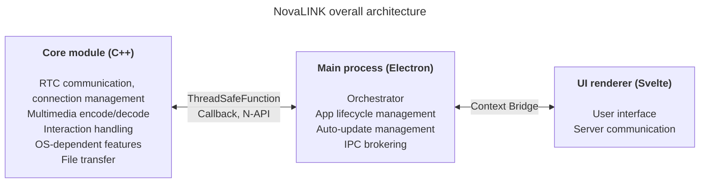
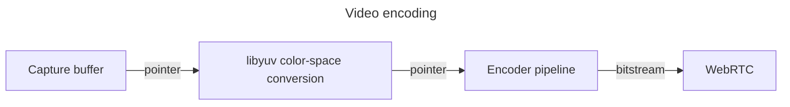

NovaLINK was designed for cross-platform from day one. Remote-control software runs not only on Windows but also widely on macOS and Linux, and deployment, updates, and security policies differ by platform. Yet users want the screens and experience they have used once to stay “the same,” regardless of platform. We also wanted a consistent, unified development environment. For a small company, unifying every environment in-house is not easy. We had to focus engineering on the core product and lean on mature ecosystems for the rest. That is why we thought deeply about cross-platform from an early stage.

Here, “cross-platform” does not mean merely “the same code builds on several OSes.” Permission models for screen capture, input hooking, accessibility, firewall exceptions, power, and sleep differ by OS; coordinate systems and scaling under HiDPI, multi-monitor, and virtual displays drift in subtle ways. Expectations for install paths, auto-start, and background behavior also vary. For users it is “the same experience everywhere,” but for developers it is closer to doing the same work dozens of ways. So from the outset we decided to separate “what draws the UI” from “what owns permissions and performance-heavy work” in order to **reduce repetition**.

The market offers many cross-platform stacks—Flutter, React Native, .NET, Qt, and more. Each has clear pros and cons, and once you factor in docs and communities for unexpected issues, the choice set grows further. But remote control adds a constraint that narrows the field: **performance**. Screen capture, encode/decode, input latency, buffering against network jitter, and file transfer are all expected to feel near real time. Cross-platform frameworks often add layers and wrappers to put many OSes on one abstraction. That convenience can buy bottlenecks or hard-to-predict latency at worst. A mature platform does not erase those limits by itself. “A popular cross-platform stack” and “the performance remote control needs” are hard to place on a single axis for a simple comparison.

In remote control, performance is not an abstract slogan; it ties directly to perceived quality. Delay from input reaching the core through encode, transmit, and decode back to the screen; policies for dropping frames versus growing buffers when packet loss and jitter rise; combinations of resolution, frame rate, bitrate, and codec—all shape whether interaction feels “instant.” These problems are not solved by UI-framework convenience alone; they require OS-specific capture paths, hardware acceleration, and even thread scheduling. So we prioritized keeping the **hot path thin and controllable** over hoping “one stack fixes everything.”

Looking back at early cross-platform tools, some felt like a thin UI shell on native code; others forced you to build another world inside the framework. Java Swing was practical for its time but fell short of modern visual consistency and UX expectations—even today its UI is hard to warm up to. Qt impressed with UI consistency and tooling, and the structure felt relatively intuitive. Yet like the .NET family, Qt demands understanding its own build, deployment, and plugin ecosystem, and learning cost can grow with team shape. Interestingly, even among tools that claim “cross-platform,” operational issues—CI, packaging, code signing—kept surfacing platform-specific exceptions, so supporting cross-platform itself felt like a slog. Python made desktop UIs easy via Qt bindings, but the interpreter and the GIL can weigh on long-running, complex real-time pipelines.

Recently, combinations of WebAssembly and native bindings—“web tech + native for the hot path”—have become common. NovaLINK’s conclusion is not far from that. Remote control is a long-running process with continuous media and input, so what mattered beyond a demo-grade integration was how to sustain boundaries under operations: updates, failure recovery, and memory stability.

Over time, more APIs thinly exposed native capabilities, and stacks with large developer pools—Node, React—naturally reached desktop apps. Visual Studio Code on Electron was a turning point. We know it stands on heavy profiling and optimizations such as splitting the renderer and extension host. Still, the fact that an IDE-class product could exist on web tech and the Node ecosystem broke the assumption that cross-platform means low performance. Many IDEs and tools forked or took inspiration from VS Code; we read that as market validation, not just personal taste. It led us to believe we could pursue both performance and UX with a cross-platform stack.

Of course, Electron brings real costs: memory, Chromium dependency, and distribution size. Without VS Code–grade optimization, perceived performance wobbles easily. Even so, the ability for a small team to iterate quickly and adopt mature patterns for auto-update, extensions, and tooling integration is a major advantage. The key was **not letting the renderer do everything**; heavy work must be pushed down to a core by design.

At the same time, we did not try to make one framework own performance and UX end-to-end. The practical answer was separation of roles and delegation. After many attempts, NovaLINK settled on a hybrid: separate UX from the core as much as possible; shape the core for performance-sensitive work and the UI for brand and usability. The big picture looks simple, but in the details—fractal-like—each feature asks the same questions: does this belong in the renderer, or must it live in the core to control latency and power? Boundaries are not set once; they are revisited as traffic patterns and OS policies change.

Concretely, the core is C++ so delay- and throughput-sensitive paths—RTC, multimedia, low-level input, file transfer—live in one place. Node add-ons (N-API), thread-safe functions, and callbacks connect to the main process so work can run off the UI event loop on separate threads yet surface results safely when needed. The Electron main process focuses on app lifetime, auto-update, shell concerns such as windows, tray, and global shortcuts, and IPC brokering. The Svelte-based renderer handles user flows and conversation with servers. Its light component model and clear state handling help us keep frequently changing remote-control UIs maintainable without excessive boilerplate.

Remote-control products emphasize different things: some align with enterprise policy and audit logs; some focus on ultra-low-latency streaming. NovaLINK aims for balance—not a single benchmark line but predictable behavior across repeated real-world scenarios: connect and reconnect, resolution changes, network quality shifts, long sessions. So architecture asks, alongside feature lists, how to isolate failure modes. Questions like how the UI learns when the core stalls, or how sessions are torn down when the renderer freezes, are not glamorous but essential for trust in a cross-platform app.

Running this structure takes more than design—it needs ongoing discipline. The single-threaded event-loop model and synchronization with multithreaded native work in the core are always in tension. Timers, input, and power policies differ by platform, so the same async pattern does not always behave the same. IPC messages need aligned schemas and controlled serialization cost; pushing media pipelines and interaction handling at once means repeatedly trimming copies and lock contention. These challenges are not unique to NovaLINK—they are common across remote control, real-time collaboration, and streaming-class products. Splitting core, main, and renderer layers does add explicit burden for contracts, version compatibility, and recovery strategies at the boundaries.

Security also benefits from crisp boundaries. Keep the renderer’s surface area small; bind sensitive capabilities with policy in the main process and core. Restricting Context Bridge APIs, keeping messages serializable, and maintaining a compatibility matrix for native module and app versions is tedious at first but eases incident analysis and rollbacks over time.

Finally, cross-platform is not “think once at the start and done”—it is a chain of choices for as long as the product lives. OS updates change permission dialogs; GPU drivers, firewalls, and security software intervene, and the same code can feel different. Each time, we re-read the core–UI boundary, move responsibilities if needed, and version the contracts. This repetition—less elegant than a single unified stack—returns to users as stable updates and familiar screens.

Hybrid stacks cut both ways for developer experience. More layers mean longer debugging stacks and logs and sampling points spread across processes. So we prefer measurable signals—frame stats, queue depth, IPC round trips, core CPU—over “it feels fast.” Per-platform regression tests, canary releases, and interoperability with older clients are hidden costs of cross-platform products. We accept those costs to gain predictability in the core and iteration speed in the UI.

**Trade-offs in NovaLINK’s current structure and mitigations**

| Drawback | What it means | Mitigation |
|----------|---------------|------------|
| Memory use | Chromium processes mean a high baseline | Keep performance-critical paths in C++ as much as possible |
| Cold start | Electron can take seconds to load | Splash screen to improve perceived UX |
| N-API binding complexity | Maintaining C++↔JS bridge code | Purpose-specific process layout; each process has its own C++ communication path |
| Binary size | Electron plus C++ builds yield large installers | ASAR packing + optional per-platform bundles |
| Build complexity | npm plus per-platform SDKs | Split per-platform builds in CI |

No single update removes every bottleneck. Similar decisions and trade-offs will continue. Still, we believe the direction—continually rebalancing what stays in the core versus the UI and validating with numbers—has been sound, and we will keep refining it with user feedback and measurements. The article is long, but the point is simple: cross-platform is not a one-time choice but ongoing design, and NovaLINK keeps wrestling with that every day.
