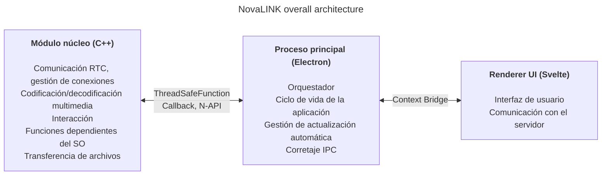
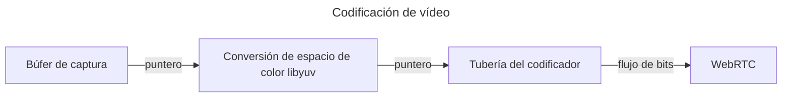
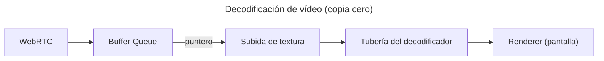

NovaLINK se diseñó multiplataforma desde el principio. El software de control remoto no solo se usa en Windows, sino ampliamente en macOS y Linux, y el despliegue, las actualizaciones y las políticas de seguridad varían según la plataforma. Aun así, los usuarios quieren que las pantallas y la experiencia sigan siendo «las mismas», sin importar la plataforma. Nosotros también queríamos un entorno de desarrollo coherente. Para una empresa pequeña no es fácil unificar todos los entornos internamente. Hubo que concentrar la ingeniería en el núcleo del producto y apoyarse en ecosistemas maduros para el resto. Por eso pensamos en multiplataforma desde una etapa temprana.

Aquí, «multiplataforma» no significa solo «el mismo código compila en varios sistemas operativos». Los modelos de permisos para captura de pantalla, enganche de entrada, accesibilidad, excepciones del cortafuegos, energía y suspensión difieren; los sistemas de coordenadas y el escalado con HiDPI, multimonitor y pantallas virtuales se desalinean sutilmente. Las expectativas sobre rutas de instalación, inicio automático y comportamiento en segundo plano también varían. Para el usuario es «la misma experiencia en todas partes»; para el desarrollador es más bien repetir el mismo trabajo de docenas de maneras. Por eso, desde el inicio separamos «lo que dibuja la interfaz» de «lo que concentra permisos y carga de rendimiento» para **reducir la repetición**.

El mercado ofrece muchas pilas multiplataforma — Flutter, React Native, .NET, Qt, etc. Cada una tiene pros y contras claros; si además se cuentan documentación y comunidades para problemas imprevistos, el abanico crece. Pero el control remoto añade una restricción que acota el campo: el **rendimiento**. Captura de pantalla, codificación/decodificación, latencia de entrada, amortiguación ante variaciones de red y transferencia de archivos deben sentirse casi en tiempo real. Los marcos multiplataforma suelen añadir capas y envoltorios para unificar sistemas operativos; esas capas intercambian comodidad de desarrollo por cuellos de botella o latencias difíciles de predecir en el peor caso. Un ecosistema maduro no elimina automáticamente esos límites. Es difícil comparar en un solo eje «una pila multiplataforma popular» y «el rendimiento que exige el control remoto».

En control remoto, el rendimiento no es un eslogan abstracto: se traduce directamente en calidad percibida. El retraso desde la entrada hasta el núcleo y de vuelta a la pantalla pasando por codificación, transmisión y decodificación; las políticas ante pérdida de paquetes y fluctuación (descartar fotogramas frente a aumentar el búfer); las combinaciones de resolución, velocidad de fotogramas, tasa de bits y códec moldean la sensación de «respuesta instantánea». Estos problemas no se resuelven solo con la comodidad de un marco de UI; hacen falta rutas de captura específicas del SO, aceleración por hardware e incluso la planificación de hilos. Por eso priorizamos un **camino caliente delgado y controlable** frente a la esperanza de que «una sola pila lo arregle todo».

Mirando atrás a las primeras herramientas multiplataforma, algunas parecían una fina capa de UI sobre nativo; otras obligaban a construir otro mundo dentro del marco. Java Swing fue práctico en su momento pero limitado para coherencia visual y expectativas UX modernas. Qt impresionó por coherencia de UI y cadena de herramientas; como .NET, exige entender compilación, despliegue y ecosistema de complementos — el coste de aprendizaje depende del equipo. Curiosamente, incluso entre herramientas «multiplataforma», los temas operativos — CI, empaquetado, firma de código — seguían mostrando excepciones por plataforma. Python facilitaba UIs de escritorio con bindings Qt; el intérprete y el GIL pueden pesar en pipelines en tiempo real complejos a largo plazo.

Recientemente, WebAssembly y enlaces nativos han popularizado «tecnología web + nativo en las partes críticas». La conclusión de NovaLINK no difiere mucho de esa dirección. Pero el control remoto es un proceso de larga duración con flujo continuo de medios y entrada; más allá de una integración de demostración, importaba cómo mantener los límites en operación: actualizaciones, recuperación ante fallos y estabilidad de memoria.

Con el tiempo, más APIs exponen funciones nativas de forma ligera; pilas con muchos desarrolladores (Node, React) llegaron al escritorio. Visual Studio Code sobre Electron fue un punto de inflexión — con mucho perfilado y optimizaciones como separar el renderer y el host de extensiones. Aun así, el hecho de que un producto tipo IDE exista sobre tecnología web y ecosistema Node rompe la idea de que multiplataforma implica bajo rendimiento. Muchos IDEs y herramientas bifurcaron o se inspiraron en VS Code: lo leemos como validación de mercado. Nos llevó a creer que se podían perseguir rendimiento y UX con una pila multiplataforma.

Por supuesto, Electron tiene costes reales: memoria, dependencia de Chromium y tamaño de distribución. Sin optimización de nivel VS Code, el rendimiento percibido fluctúa fácilmente. Aun así, un equipo pequeño puede iterar rápido y adoptar patrones maduros para actualización automática, extensiones e integración con herramientas — una gran ventaja. Lo clave fue **no dejar que el renderer lo haga todo**; el trabajo pesado debe bajar al núcleo por diseño.

Al mismo tiempo, no intentamos que un solo marco lleve rendimiento y UX de principio a fin. La respuesta práctica es separación de roles y delegación. Tras varios intentos, NovaLINK eligió una arquitectura híbrida: separar al máximo la UX del núcleo; formar el núcleo para rutas sensibles al rendimiento y la UI para marca y usabilidad. El panorama general parece simple, pero en el detalle — casi fractal — cada función repite las mismas preguntas: ¿renderer o núcleo para controlar latencia y consumo? Los límites no se fijan una sola vez: se revisan cuando cambian los patrones de tráfico y las políticas del SO.

En concreto, el núcleo está en C++: RTC, multimedia, entrada de bajo nivel y transferencia de archivos se concentran en un solo lugar. Los complementos de Node (N-API), funciones seguras para hilos y callbacks conectan el proceso principal para trabajar fuera del bucle de eventos de la UI y subir resultados de forma segura cuando hace falta. El proceso principal de Electron se centra en el ciclo de vida de la app, actualización automática, caparazón (ventanas, bandeja, atajos globales) y corretaje IPC. El renderer basado en Svelte maneja flujos de usuario y diálogo con los servidores. Su modelo de componentes ligero ayuda a mantener pantallas de control remoto que cambian a menudo sin exceso de código repetitivo.

El mercado de control remoto enfatiza cosas distintas: políticas empresariales y registros de auditoría frente a streaming de ultra baja latencia. NovaLINK busca equilibrio — no una sola línea de benchmark, sino comportamiento predecible en escenarios reales repetidos: conexión, reconexión, cambio de resolución, calidad de red, sesiones largas. Por eso la arquitectura también pregunta cómo aislar modos de fallo: ¿cómo avisa la UI si el núcleo se bloquea? ¿cómo se limpian sesiones si el renderer deja de responder? No es llamativo, pero es esencial para la confianza.

Poner en marcha esta estructura exige más que diseño: disciplina continua. El modelo monohilo centrado en el bucle de eventos siempre está en tensión con el multihilo y el trabajo nativo en el núcleo. Temporizadores, entrada y políticas energéticas varían: el mismo patrón asíncrono no siempre da el mismo resultado. Los mensajes IPC necesitan esquemas alineados y coste de serialización controlado; empujar a la vez pipelines multimedia e interacción obliga a reducir copias y contención de bloqueos. No es un problema exclusivo de NovaLINK — es común en control remoto, colaboración en tiempo real y productos tipo streaming. Pero separar núcleo, principal y renderer añade carga explícita en contratos, compatibilidad de versiones y recuperación en las fronteras.

En seguridad, los límites claros ayudan: superficie del renderer pequeña; capacidades sensibles ligadas a políticas en el principal y el núcleo. Restringir las API expuestas por Context Bridge, mantener mensajes serializables y una matriz de compatibilidad para módulos nativos y versiones de la app es tedioso al principio pero facilita análisis de incidentes y rollbacks.

Por último, multiplataforma no es «pensarlo una vez al inicio»: es una cadena de decisiones mientras viva el producto. Las actualizaciones del SO cambian diálogos de permisos; controladores GPU, cortafuegos y software de seguridad alteran la percepción. Hay que releer la frontera núcleo–UI, mover responsabilidades y versionar contratos. Menos elegante que una pila única — pero para el usuario significa actualizaciones estables y pantallas familiares.

La arquitectura híbrida corta en dos direcciones para los desarrolladores: pilas de depuración más largas, registros repartidos entre procesos. Preferimos métricas — estadísticas de fotogramas, profundidad de cola, ida y vuelta IPC, CPU del núcleo — frente a «se siente rápido». Pruebas de regresión por plataforma, despliegues canary e interoperabilidad con clientes antiguos son costes ocultos del multiplataforma. Aceptamos esos costes para ganar previsibilidad en el núcleo y velocidad de iteración en la UI.

**Compromisos de la estructura actual de NovaLINK y mitigaciones**

| Desventaja | Qué implica | Mitigación |
|------------|-------------|------------|
| Uso de memoria | Los procesos Chromium elevan la línea base | Rutas críticas de rendimiento en C++ en la medida de lo posible |
| Tiempo de arranque en frío | Electron puede tardar segundos en cargar | Pantalla de bienvenida para mejorar la UX percibida |
| Complejidad de enlaces N-API | Mantener el puente C++↔JS | Estructura de procesos por función; cada proceso su comunicación C++ |
| Tamaño del binario | Electron más builds C++ generan instaladores grandes | Empaquetado ASAR + bundles opcionales por plataforma |
| Complejidad del entorno de build | npm más SDK por plataforma | Builds separados por plataforma en CI |

Una sola actualización no elimina todos los cuellos de botella. Seguirán decisiones y compensaciones similares. Aun así, creemos que la dirección — reequilibrar continuamente qué queda en el núcleo frente a la UI y validar con números — es acertada, y seguiremos refinando con comentarios de usuarios y mediciones. El artículo es largo, la idea es simple: multiplataforma no es una elección única sino diseño continuo, y NovaLINK sigue trabajando en ello cada día.
