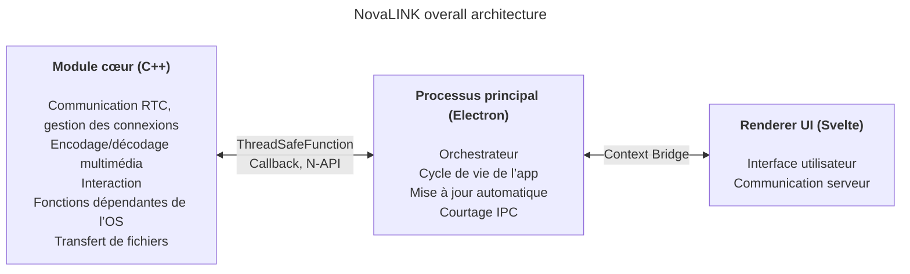
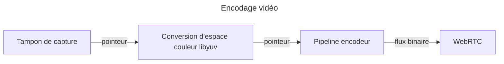

NovaLINK a été conçu pour le multiplateforme dès le départ. Les logiciels de contrôle à distance ne tournent pas seulement sous Windows, mais aussi largement sous macOS et Linux, et le déploiement, les mises à jour et les politiques de sécurité varient selon la plateforme. Pourtant les utilisateurs veulent que les écrans et l’expérience restent « les mêmes », quelle que soit la plateforme. Nous souhaitions aussi un environnement de développement cohérent. Pour une petite entreprise, unifier tous les environnements en interne n’est pas simple. Il fallait concentrer l’ingénierie sur le cœur du produit et s’appuyer sur des écosystèmes matures pour le reste. C’est pourquoi nous avons réfléchi très tôt au multiplateforme.

Ici, le multiplateforme ne se limite pas à « le même code compile sur plusieurs OS ». Les modèles de permissions pour la capture d’écran, le hooking des entrées, l’accessibilité, les exceptions pare-feu, l’alimentation et la veille diffèrent ; les systèmes de coordonnées et le scaling sous HiDPI, multi-écrans et affichages virtuels divergent subtilement. Les attentes concernant les chemins d’installation, le démarrage automatique et le comportement en arrière-plan varient aussi. Pour l’utilisateur c’est « la même expérience partout », pour le développeur c’est plutôt refaire le même travail des dizaines de façons. Dès le départ nous avons donc séparé « ce qui dessine l’interface » de « ce qui porte les permissions et la charge performance » pour **réduire la répétition**.

Le marché propose de nombreuses piles multiplateformes — Flutter, React Native, .NET, Qt, etc. Chacune a des avantages et des inconvénients nets ; une fois la documentation et les communautés prises en compte pour les problèmes imprévus, le choix s’élargit encore. Mais le contrôle à distance ajoute une contrainte qui restreint le champ : la **performance**. Capture d’écran, encodage/décodage, latence d’entrée, mise en mémoire tampon face aux variations réseau, transfert de fichiers : tout doit sembler quasi temps réel. Les frameworks multiplateformes ajoutent souvent des couches pour unifier les OS ; ces couches échangent la facilité de développement contre, au pire, des goulots d’étranglement ou une latence difficile à prédire. Un écosystème mature n’efface pas automatiquement ces limites. Il est difficile de comparer simplement sur un seul axe « une pile multiplateforme populaire » et « la performance dont la télécommande a besoin ».

En télécommande, la performance n’est pas un slogan abstrait : elle se traduit directement en qualité perçue. Le délai entre l’entrée, le cœur, l’encodage, la transmission, le décodage et le retour à l’écran ; la politique de perte de paquets et de gigue (abandonner des images ou agrandir le tampon) ; les combinaisons résolution, images par seconde, débit binaire et codec façonnent l’impression de « réactivité instantanée ». Ces problèmes ne se résolvent pas par la seule commodité d’un framework UI ; il faut des chemins de capture spécifiques à l’OS, l’accélération matérielle, voire l’ordonnancement des threads. Nous avons donc privilégié un **chemin chaud fin et maîtrisable** plutôt qu’« une pile qui tout résout ».

En regardant les premiers outils multiplateformes, certains ressemblaient à une fine coquille UI sur du natif, d’autres obligeaient à construire un monde dans le framework. Java Swing était pragmatique pour l’époque mais limité pour la cohérence visuelle et les attentes UX modernes. Qt impressionnait par la cohérence UI et la chaîne d’outils ; comme .NET, il exige de comprendre build, déploiement et écosystème de plugins — le coût d’apprentissage varie selon l’équipe. Même parmi les outils « multiplateformes », les exceptions spécifiques à chaque OS en CI, packaging et signature de code abondaient. Python facilitait les UI de bureau via des bindings Qt ; l’interpréteur et le GIL peuvent peser sur des pipelines temps réel complexes sur le long terme.

Récemment, WebAssembly et divers bindings natifs ont popularisé « technologies web + natif pour les parties critiques ». La conclusion de NovaLINK va dans le même sens. Mais la télécommande est un processus long avec flux média et entrées continus : au-delà d’une intégration de démo, il fallait maintenir les frontières du point de vue exploitation — mises à jour, reprise après panne, stabilité mémoire.

Au fil du temps, des API exposent plus finement le natif ; des piles avec une large base de développeurs (Node, React) ont gagné le bureau. Visual Studio Code sur Electron a été un tournant — avec beaucoup de profilage et d’optimisations comme la séparation renderer/extension host. Pourtant, un produit de niveau IDE sur technologies web et écosystème Node casse l’idée que multiplateforme égale faible performance. Nombre d’IDE et d’outils ont forké ou s’en sont inspirés : pour nous, c’est une validation de marché. Cela nous a poussés à viser performance et UX avec une pile multiplateforme.

Bien sûr, Electron a un coût : mémoire, dépendance à Chromium, taille de distribution. Sans optimisation de niveau VS Code, la performance perçue vacille vite. Pourtant, pour une petite équipe, itérer vite et adopter des modèles matures pour mise à jour automatique, extensions et intégration d’outils est un atout majeur. L’essentiel : **ne pas tout laisser au renderer** ; le travail lourd doit descendre vers le cœur par conception.

Nous n’avons pas non plus voulu qu’un seul framework porte performance et UX jusqu’au bout. La réponse pragmatique est la séparation des rôles et la délégation. Après plusieurs essais, NovaLINK a opté pour une architecture hybride : séparer au maximum l’UX du cœur ; former le cœur pour les chemins sensibles à la performance et l’UI pour la marque et l’ergonomie. Le tableau d’ensemble semble simple, mais le détail — fractal — repose les mêmes questions pour chaque fonctionnalité : renderer ou cœur pour maîtriser latence et consommation ? Les frontières ne se fixent qu’une fois : elles se réévaluent quand le trafic ou les politiques OS changent.

Concrètement, le cœur est en C++ : RTC, multimédia, entrée bas niveau, transfert de fichiers sont regroupés. Les addons Node (N-API), fonctions thread-safe et callbacks relient le processus principal pour travailler hors boucle d’événements UI tout en remontant les résultats en sécurité. Le processus principal Electron gère le cycle de vie, la mise à jour automatique, la coque (fenêtres, barre système, raccourcis globaux) et le courtage IPC. Le renderer Svelte porte les parcours utilisateur et l’échange avec les serveurs. Son modèle de composants léger aide à garder des écrans de télécommande souvent changeants maintenables sans excès de code répétitif.

Le marché de la télécommande met l’accent différemment selon les produits : politiques d’entreprise et journaux d’audit, ou streaming ultra-faible latence. NovaLINK vise l’équilibre — pas une ligne de benchmark isolée, mais un comportement prévisible dans des scénarios réels répétés : connexion, reconnexion, changement de résolution, qualité réseau, longues sessions. L’architecture se demande donc aussi comment isoler les modes de défaillance : comment l’UI sait-elle si le cœur est bloqué ? comment nettoyer les sessions si le renderer gèle ? Peu spectaculaire, mais indispensable à la confiance.

Faire tourner cette structure exige plus que la conception : discipline continue. Le modèle single-thread autour de la boucle d’événements est toujours en tension avec le multithreading et le travail natif dans le cœur. Minuteurs, entrées et politiques d’énergie varient : le même motif asynchrone ne donne pas toujours le même résultat. Les messages IPC nécessitent des schémas alignés et un coût de sérialisation maîtrisé ; pousser pipelines média et interaction en parallèle impose de réduire copies et contention de verrous. Ce n’est pas propre à NovaLINK — c’est commun au contrôle à distance, à la collaboration temps réel et au streaming. Mais séparer cœur, principal et renderer alourdit explicitement contrats, compatibilité de versions et stratégies de reprise aux frontières.

Côté sécurité, des frontières nettes aident : surface du renderer minimale ; fonctions sensibles liées aux politiques dans le principal et le cœur. Limiter les API exposées via Context Bridge, garder des messages sérialisables, gérer une matrice de compatibilité modules natifs / versions d’app est fastidieux au début mais facilite analyse d’incidents et retours arrière.

Enfin, le multiplateforme n’est pas « réfléchi une fois au début » : c’est une chaîne de choix tant que le produit vit. Les mises à jour OS changent les boîtes de dialogue de permission ; pilotes GPU, pare-feu et logiciels de sécurité modifient la perception. Il faut relire sans cesse la frontière cœur–UI, déplacer les responsabilités, versionner les contrats. Moins élégant qu’une pile unique — mais pour l’utilisateur, mises à jour stables et écrans familiers.

L’hybride est une arme à double tranchant pour les développeurs : piles de debug plus longues, journaux répartis sur plusieurs processus. Nous privilégions des mesures — statistiques d’images, profondeur de file, allers-retours IPC, CPU du cœur — plutôt que « ça a l’air rapide ». Tests de régression par plateforme, déploiements canary et interop avec d’anciens clients sont des coûts cachés du multiplateforme. Nous acceptons ces coûts pour la prévisibilité du cœur et la vitesse d’itération de l’UI.

**Compromis de la structure actuelle de NovaLINK et atténuations**

| Inconvénient | Description | Atténuation |
|--------------|-------------|-------------|
| Mémoire | Les processus Chromium élèvent la ligne de base | Chemins critiques en C++ autant que possible |
| Démarrage à froid | Electron peut prendre des secondes | Écran de démarrage pour l’UX perçue |
| Complexité N-API | Maintenance du pont C++↔JS | Processus séparés par rôle ; chaque processus sa propre communication C++ |
| Taille binaire | Electron + builds C++ donnent de gros installateurs | Empaquetage ASAR + bundles optionnels par plateforme |
| Complexité de build | npm + SDK par plateforme | Builds séparés par plateforme en CI |

Une seule mise à jour n’élimine pas tous les goulots. Des décisions et compromis similaires suivront. Nous croyons que l’orientation — rééquilibrer sans cesse cœur et UI et valider par des chiffres — est la bonne, et nous affinerons avec retours utilisateurs et mesures. L’article est long, l’idée simple : le multiplateforme n’est pas un choix ponctuel mais une conception continue, et NovaLINK poursuit ce travail chaque jour.
