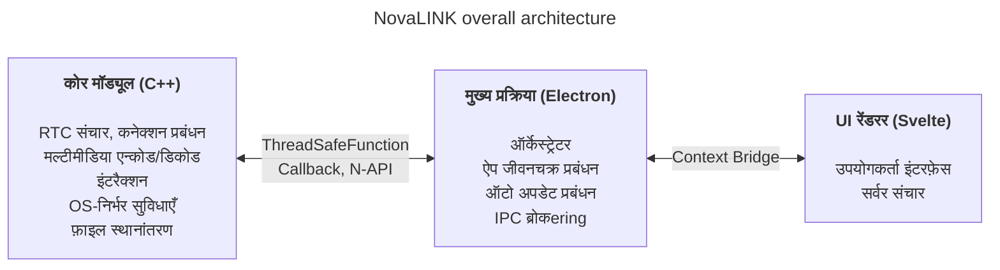
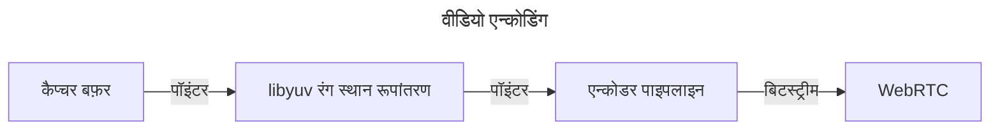
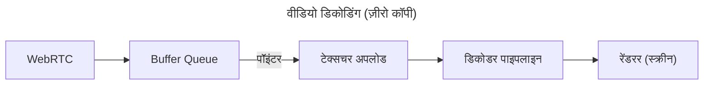

NovaLINK को शुरू से ही क्रॉस-प्लेटफ़ॉर्म के लिए बनाया गया था। रिमोट कंट्रोल सॉफ़्टवेयर केवल Windows पर नहीं, बल्कि macOS और Linux पर भी व्यापक रूप से चलता है, और तैनाती, अपडेट और सुरक्षा नीतियाँ प्लेटफ़ॉर्म के अनुसार भिन्न होती हैं। फिर भी उपयोगकर्ता चाहते हैं कि एक बार इस्तेमाल किए गए स्क्रीन और अनुभव «वैसे ही» रहें—प्लेटफ़ॉर्म से कोई फर्क न पड़े। हम भी एकसान और एकीकृत विकास वातावरण चाहते थे। छोटी कंपनी के लिए सभी वातावरणों को आंतरिक रूप से एक करना आसान नहीं है। इंजीनियरिंग कोर उत्पाद पर केंद्रित करनी थी और बाकी परिपक्व पारिस्थितिकी तंत्र पर निर्भर रहना पड़ा। इसलिए हमने शुरुआती चरण से ही क्रॉस-प्लेटफ़ॉर्म पर गहरा विचार किया।

यहाँ «क्रॉस-प्लेटफ़ॉर्म» का अर्थ केवल «वही कोड कई OS पर बिल्ड होता है» तक सीमित नहीं है। स्क्रीन कैप्चर, इनपुट हुकिंग, एक्सेसिबिलिटी, फ़ायरवॉल अपवाद, पावर और स्लीप जैसी अनुमति मॉडल OS के अनुसार भिन्न होते हैं; HiDPI, मल्टी मॉनिटर और वर्चुअल डिस्प्ले में निर्देशांक और स्केलिंग में सूक्ष्म अंतर होते हैं। इंस्टॉल पथ, ऑटो स्टार्ट और पृष्ठभूमि व्यवहार की अपेक्षाएँ भी अलग-अलग हैं। उपयोगकर्ता के लिए यह «हर जगह समान अनुभव» है, विकास के लिए यह लगभग एक ही काम को दर्ज़नों तरीकों से दोहराना है। इसलिए शुरू से ही हमने «जो UI बनाता है» और «जहाँ अनुमति और प्रदर्शन केंद्रित है» को अलग करने का निर्णय लिया ताकि **दोहराव कम हो**।

बाज़ार में Flutter, React Native, .NET, Qt आदि कई क्रॉस-प्लेटफ़ॉर्म स्टैक हैं। प्रत्येक के स्पष्ट फायदे-नुकसान हैं; अप्रत्याशित समस्याओं के लिए दस्तावेज़ और समुदाय जोड़ने पर विकल्प और बढ़ जाते हैं। पर रिमोट कंट्रोल सेवा एक बाधा जोड़ती है जो विकल्प सीमित करती है: **प्रदर्शन**। स्क्रीन कैप्चर, एन्कोड/डिकोड, इनपुट विलंब, नेटवर्क उतार-चढ़ाव के खिलाफ बफ़रिंग और फ़ाइल स्थानांतरण—सब कुछ लगभग रियल टाइम प्रतिक्रिया की अपेक्षा करता है। क्रॉस-प्लेटफ़ॉर्म फ़्रेमवर्क अक्सर कई OS को एक अमूर्तता पर रखने के लिए परतें और रैपर जोड़ते हैं; वे परतें विकास सुविधा के बदले सबसे खराब स्थिति में बाधा या अप्रत्याशित विलंब बन सकती हैं। प्लेटफ़ॉर्म परिपक्व होने से ये सीमाएँ अपने आप नहीं हटतीं। «लोकप्रिय क्रॉस-प्लेटफ़ॉर्म स्टैक» और «रिमोट कंट्रोल के लिए आवश्यक प्रदर्शन» को एक ही धुरी पर सरलता से तुलना करना कठिन है।

रिमोट कंट्रोल में प्रदर्शन केवल नारा नहीं है—यह सीधे अनुभव की गुणवत्ता से जुड़ा है। इनपुट के कोर तक पहुँचने से लेकर एन्कोड, ट्रांसमिट, डिकोड होकर स्क्रीन पर वापस आने तक का विलंब; पैकेट हानि और जिटर बढ़ने पर फ़्रेम छोड़ने या बफ़र बढ़ाने की नीति; रिज़ॉल्यूशन, फ़्रेम दर, बिटरेट और कोडेक संयोजन—सब उपयोगकर्ता की «तत्काल प्रतिक्रिया» की छवि को आकार देते हैं। ये समस्याएँ केवल UI फ़्रेमवर्क की सुविधा से हल नहीं होतीं; OS-विशिष्ट कैप्चर पथ, हार्डवेयर त्वरण और थ्रेड शेड्यूलिंग भी देखनी पड़ती है। इसलिए हमने «एक स्टैक सब कुछ हल करेगा» की अपेक्षा से अधिक **हॉट पथ को पतला और नियंत्रण योग्य रखने** को प्राथमिकता दी।

शुरुआती क्रॉस-प्लेटफ़ॉर्म टूल्स को याद करें तो कुछ नेटिव पर पतली UI परत जैसे लगते थे, कुछ में फ़्रेमवर्क के भीतर एक और दुनिया बनानी पड़ती थी। Java Swing अपने समय के लिए व्यावहारिक था पर दृश्य एकरूपता और आधुनिक UX अपेक्षाओं में सीमित था। Qt UI एकरूपता और टूलचेन में प्रभावशाली था; .NET परिवार की तरह इसके बिल्ड, तैनाती और प्लगइन पारिस्थितिकी तंत्र को समझना पड़ता है—टीम के अनुसार सीखने की लागत बढ़ सकती है। दिलचस्प बात यह है कि «क्रॉस-प्लेटफ़ॉर्म» कहने वाले टूल्स में भी CI, पैकेजिंग, कोड साइनिंग जैसे संचालन मुद्दों में प्लेटफ़ॉर्म-विशिष्ट अपवाद बार-बार आते रहे। Python Qt बाइंडिंग आदि से डेस्कटॉप UI आसान था, पर इंटरप्रेटर और GIL लंबे समय में भारी रियल-टाइम पाइपलाइन डिज़ाइन में बोझ बन सकते हैं।

हाल में WebAssembly और विभिन्न नेटिव बाइंडिंग के माध्यम से «वेब तकनीक + प्रदर्शन-महत्वपूर्ण हिस्से नेटिव» संयोजन सामान्य हो गया है। NovaLINK का निष्कर्ष भी उसी दिशा के करीब है। पर रिमोट कंट्रोल मीडिया और इनपुट की निरंतर धारा वाला दीर्घकालिक प्रक्रिया है; इसलिए केवल डेमो स्तर के एकीकरण से अधिक महत्वपूर्ण था संचालन के दृष्टिकोण से सीमाएँ कैसे बनी रहें—अपडेट, विफलता पुनर्प्राप्ति, मेमोरी स्थिरता।

समय के साथ नेटिव क्षमताओं को पतले रूप में दिखाने वाले API बढ़े; Node और React जैसे व्यापक डेवलपर पूल वाले स्टैक डेस्कटॉप ऐप्स में स्वाभाविक रूप से घुल गए। Electron पर आधारित Visual Studio Code की परिपक्वता एक बड़ा मोड़ था। हम जानते हैं कि उसके पीछे गहन प्रोफ़ाइलिंग और रेंडरर तथा एक्सटेंशन होस्ट अलग करने जैसे अनुकूलन हैं। फिर भी «वेब तकनीक और Node पारिस्थितिकी तंत्र पर IDE-स्तर का उत्पाद संभव है» यह तथ्य क्रॉस-प्लेटफ़ॉर्म को निम्न प्रदर्शन मानने की धारणा तोड़ता है। कई IDE और टूल्स ने VS Code को फ़ोर्क किया या प्रेरणा ली—हम इसे बाज़ार की पुष्टि मानते हैं। इससे हमें लगा कि क्रॉस-प्लेटफ़ॉर्म स्टैक से प्रदर्शन और UX दोनों लक्ष्य रखे जा सकते हैं।

ज़रूर, Electron दृष्टिकोण की वास्तविक लागत है: मेमोरी, Chromium निर्भरता, वितरण आकार। VS Code जैसे अनुकूलन के बिना अनुभवित प्रदर्शन आसानी से हिल सकता है। फिर भी छोटी टीम के लिए उत्पाद को तेज़ी से सुधारना और ऑटो अपडेट, एक्सटेंशन, टूल एकीकरण जैसे «पूरे ऐप को घेरने वाले» मुद्दों को परिपक्व पैटर्न से चलाना बड़ा लाभ है। महत्वपूर्ण बात यह थी कि **रेंडरर सब कुछ न करे**; भारी काम को डिज़ाइन द्वारा कोर में भेजना होगा।

साथ ही, हमने एक ही फ़्रेमवर्क से अंत तक प्रदर्शन और UX दोनों की ज़िम्मेदारी लेने की कोशिश नहीं की। व्यावहारिक उत्तर भूमिकाओं के पृथक्करण और प्रत्यायोजन के करीब है। कई प्रयासों के बाद NovaLINK ने संकर संरचना चुनी: UX और कोर को जितना हो सके अलग रखें; कोर को प्रदर्शन-अनुकूल रूप में, UI को ब्रांड और उपयोगिता एकीकृत करने योग्य रूप में। बड़ा चित्र सरल लगता है, पर विवरण में—लगभग फ़्रैक्टल—हर सुविधा वही प्रश्न दोहराती है: यह रेंडरर में रहे या कोर में ताकि विलंब और बिजली खपत नियंत्रित हो? सीमा एक बार तय होकर समाप्त नहीं—ट्रैफ़िक पैटर्न और OS नीतियाँ बदलने पर फिर से समायोजित करनी पड़ती हैं।

विशिष्ट रूप से कोर C++ में है: RTC, मल्टीमीडिया, निम्न-स्तरीय इनपुट और फ़ाइल स्थानांतरण जैसे विलंप और थ्रूपुट-संवेदी पथ एक स्थान पर। Node ऐड-ऑन (N-API), थ्रेड-सेफ़ फ़ंक्शन और कॉलबैक मुख्य प्रक्रिया से जोड़ते हैं ताकि काम UI इवेंट लूप से अलग थ्रेड्स पर चले और ज़रूरत पड़ने पर परिणाम सुरक्षित रूप से ऊपर आए। Electron मुख्य प्रक्रिया ऐप जीवनकाल, ऑटो अपडेट, विंडो, ट्रे, वैश्विक शॉर्टकट जैसी शेल भूमिकाओं और IPC ब्रोकering पर केंद्रित है। Svelte आधारित रेंडरर उपयोगकर्ता प्रवाह और सर्वर से संवाद संभालता है। हल्का कॉम्पोनेंट मॉडल और स्पष्ट स्थिति प्रबंधन से अक्सर बदलने वाली रिमोट कंट्रोल स्क्रीन को अत्यधिक बॉयलरप्लेट के बिना बनाए रखा जा सकता है।

रिमोट कंट्रोल बाज़ार में उत्पाद अलग-अलग बातों पर ज़ोर देते हैं: कुछ उद्यम नीतियों और ऑडिट लॉग पर, कुछ अति-निम्न विलंब स्ट्रीमिंग पर। NovaLINK संतुलन चाहता है—केवल एक बेंचमार्क पंक्ति नहीं, बल्कि वास्तविक उपयोग में दोहराए जाने वाले परिदृश्यों—कनेक्ट, पुन: कनेक्ट, रिज़ॉल्यूशन परिवर्तन, नेटवर्क गुणवत्ता, लंबे सत्र—में भी पूर्वानुमान योग्य व्यवहार। इसलिए वास्तुकला सुविधा सूची के साथ यह भी पूछती है कि विफलता मोड कैसे अलग किए जाएँ: कोर रुके तो UI कैसे सूचित करे? रेंडरर अनुत्तरदायी हो तो सत्र कैसे साफ़ करें? आकर्षक नहीं, पर क्रॉस-प्लेटफ़ॉर्म ऐप्स में विश्वास के लिए आवश्यक।

इस संरचना को वास्तव में चलाने के लिए केवल डिज़ाइन पर्याप्त नहीं—निरंतर संचालन और संयम चाहिए। उदाहरण के लिए इवेंट लूप-केंद्रित एकल-थ्रेड मॉडल और कोर में मल्टीथ्रेडेड नेटिव कार्य के बीच समन्वय हमेशा तनावपूर्ण है। प्लेटफ़ॉर्म अनुसार टाइमर, इनपुट और पावर प्रबंधन नीतियाँ भिन्न हैं; समान अतुल्यकालिक पैटर्न हमेशा समान परिणाम नहीं देता। IPC संदेशों के लिए स्कीमा मिलान और क्रमबद्ध लागत नियंत्रण चाहिए; मीडिया पाइपलाइन और इंटरैक्शन एक साथ धकेलते समय अनावश्यक कॉपी और लॉक प्रतिस्पर्धा कम करनी पड़ती है। ये चुनौतियाँ केवल NovaLINK की नहीं—रिमोट कंट्रोल, रियल-टाइम सहयोग और स्ट्रीमिंग जैसे उत्पादों में सामान्य हैं। पर कोर, मुख्य और रेंडरर की परतें अलग करने से सीमाओं पर अनुबंध, संस्करण अनुकूलता और विफलता पुनर्प्राप्ति रणनीतियाँ स्पष्ट रूप से संभालनी पड़ती हैं।

सुरक्षा की दृष्टि से भी सीमाएँ जितनी स्पष्ट, उतना अच्छा: रेंडरर की सतह यथासंभव छोटी; संवेदनशील क्षमताएँ मुख्य और कोर में अनुमति व नीति के साथ। Context Bridge API सीमित रखना, क्रमबद्ध योग्य संदेश रखना, नेटिव मॉड्यूल और ऐप संस्करण संयोजन का अनुकूलता मैट्रिक्स—शुरू में कष्टकर, लंबे समय में घटना विश्लेषण और रोलबैक आसान।

अंत में, क्रॉस-प्लेटफ़ॉर्म «शुरू में एक बार सोचकर समाप्त» नहीं—उत्पाद जीवित रहने तक निरंतर चयनों की श्रृंखला है। OS अपडेट अनुमति संवाद बदलते हैं; GPU ड्राइवर, फ़ायरवॉल, सुरक्षा सॉफ़्टवेयर हस्तक्षेप करते हैं तो वही कोड भी अलग महसूस होता है। हर बार कोर और UI की सीमा फिर से पढ़नी पड़ती है, ज़रूरत हो तो ज़िम्मेदारी स्थानांतरित करनी होती है, अनुबंध संस्करण अपग्रेड करने होते हैं। एकल स्टैक से कम सुरुचिपूर्ण लगने वाला यह दोहराव उपयोगकर्ता के लिए स्थिर अपडेट और परिचित स्क्रीन बन जाता है।

डेवलपर अनुभव में भी संकर दोधारी तलवार है: परतें बढ़ने पर डीबग स्टैक लंबा, लॉग और नमूना बिंदु कई प्रक्रियाओं में बाँटने पड़ते हैं। इसलिए हम «महसूस होता है तेज़» से अधिक माप योग्य संकेतक—फ़्रेम आँकड़े, कतार जमाव, IPC राउंड ट्रिप, कोर CPU उपयोग—को प्राथमिकता देते हैं। प्लेटफ़ॉर्म-विशिष्ट प्रतिगमन परीक्षण, कैनरी तैनाती, पुराने क्लाइंट के साथ परस्पर संचालन भी क्रॉस-प्लेटफ़ॉर्म उत्पादों की छिपी लागत है। हम इन लागतों को कोर में पूर्वानुमेयता और UI में तेज़ सुधार चक्र दोनों पाने के लिए स्वीकार करते हैं।

**NovaLINK वर्तमान संरचना के ट्रेड-ऑफ़ और शमन**

| कमी | विवरण | शमन |
|------|--------|------|
| मेमोरी उपयोग | Chromium प्रक्रियाओं से आधार मेमोरी अधिक | प्रदर्शन महत्वपूर्ण पथ अधिकतम C++ में |
| प्रारंभिक चालन समय | Electron लोडिंग में कुछ सेकंड | स्प्लैश स्क्रीन से UX शमन |
| N-API बाइंडिंग जटिलता | C++↔JS ब्रिज कोड रखरखाव | उद्देश्यानुसार अलग प्रक्रिया संरचना; प्रत्येक प्रक्रिया में अलग C++ संचार |
| बाइनरी आकार | Electron + C++ बिल्ड से इंस्टॉलर बड़ा | ASAR पैकिंग + प्लेटफ़ॉर्म-विशिष्ट वैकल्पिक बंडल |
| बिल्ड वातावरण जटिलता | npm + प्लेटफ़ॉर्म SDK एक साथ | CI में प्लेटफ़ॉर्म अनुसार अलग बिल्ड |

एक अपडेट से सभी अड़चन नहीं जातीं। आगे भी इसी तरह के निर्णय और ट्रेड-ऑफ़ रहेंगे। फिर भी हम मानते हैं कि दिशा—कोर में क्या रहे और UI में क्या, इसे बार-बार संतुलित करना और संख्याओं से सत्यापन—सही है, और उपयोगकर्ता प्रतिक्रिया व माप पर आधारित सुधार जारी रखेंगे। लेख लंबा हो गया पर मुख्य बात सरल है: क्रॉस-प्लेटफ़ॉर्म एक बार का चयन नहीं, निरंतर डिज़ाइन है, और NovaLINK हर दिन इसी पर विचार करता रहता है।
