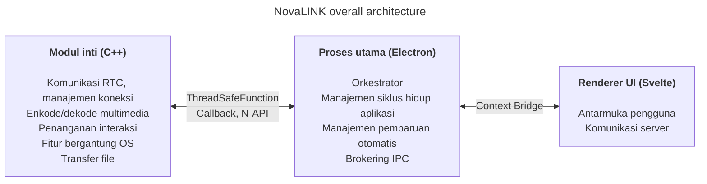
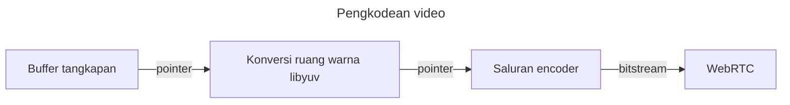
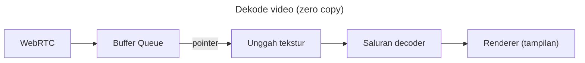

NovaLINK dirancang lintas platform sejak awal. Perangkat lunak kontrol jarak jauh tidak hanya berjalan di Windows, tetapi juga luas di macOS dan Linux, serta penyebaran, pembaruan, dan kebijakan keamanan berbeda per platform. Namun pengguna ingin layar dan pengalaman tetap “sama” di mana pun. Kami pun ingin lingkungan pengembangan yang konsisten. Bagi perusahaan kecil, menyatukan semua lingkungan secara internal tidak mudah. Kekuatan rekayasa harus terfokus pada inti produk; sisanya mengandalkan ekosistem yang matang. Itulah sebabnya kami memikirkan lintas platform sejak tahap awal.

Di sini, “lintas platform” tidak berarti hanya “kode yang sama dapat dibangun di beberapa OS”. Model izin untuk tangkapan layar, hook input, aksesibilitas, pengecualian firewall, daya, dan tidur berbeda; sistem koordinat dan penskalaan di HiDPI, multi-monitor, dan tampilan virtual sedikit menyimpang. Harapan tentang jalur instalasi, mulai otomatis, dan perilaku latar belakang juga beragam. Bagi pengguna ini “pengalaman yang sama di mana-mana”, bagi pengembang ini lebih mirip mengerjakan hal yang sama dengan puluhan cara. Karena itu sejak awal kami memisahkan “peran yang menggambar antarmuka” dan “peran yang memusatkan izin dan kinerja” untuk **mengurangi pengulangan**.

Pasar menawarkan banyak tumpukan lintas platform — Flutter, React Native, .NET, Qt, dan lainnya. Masing-masing punya kelebian dan kekurangan jelas; ditambah dokumentasi dan komunitas untuk masalah tak terduga, pilihan makin luas. Namun layanan kontrol jarak jauh menambah batasan yang menyempitkan pilihan: **kinerja**. Tangkapan layar, enkode/dekode, latensi input, buffering terhadap jitter jaringan, dan transfer file diharapkan terasa hampir real time. Kerangka kerja lintas platform sering menambah lapisan dan pembungkus untuk menyatukan banyak OS di satu abstraksi; lapisan itu membeli kemudahan pengembangan dengan kemacetan atau latensi yang sulit diprediksi di skenario terburuk. Platform yang matang tidak menghapus batas itu secara otomatis. Sulit membandingkan “tumpukan lintas platform populer” dan “kinerja yang dibutuhkan kontrol jarak jauh” pada satu sumbu sederhana.

Dalam kontrol jarak jauh, kinerja bukan slogan abstrak; ia langsung terkait kualitas yang dirasakan. Penundaan dari input ke inti dan kembali ke layar melalui enkode, transmisi, dan dekode; kebijakan saat kehilangan paket dan jitter (membuang frame versus memperbesar buffer); kombinasi resolusi, laju bingkai, bitrate, dan codec membentuk kesan “respons instan”. Masalah ini tidak terselesaikan hanya dengan kenyamanan kerangka UI; perlu jalur tangkapan khusus OS, akselerasi perangkat keras, bahkan penjadwalan utas. Karena itu kami memprioritaskan **jalur panas yang tipis dan terkendali** dibanding berharap “satu tumpukan menyelesaikan semua”.

Melihat kembali alat lintas platform awal, ada yang terasa seperti kulit UI tipis di atas native; ada yang mengharuskan membangun dunia lain di dalam kerangka. Java Swing praktis untuk masanya tetapi terbatas untuk konsistensi visual dan ekspektasi UX modern. Qt mengesankan dalam konsistensi UI dan rantai alat; seperti .NET, memerlukan pemahaman build, penyebaran, dan ekosistem plugin — biaya belajar bervariasi dengan tim. Menariknya, bahkan di antara alat “lintas platform”, masalah operasional — CI, pengemasan, penandatanganan kode — terus memunculkan pengecualian per platform. Python memudahkan UI desktop melalui binding Qt; interpreter dan GIL dapat memberatkan pipeline real-time yang kompleks dalam jangka panjang.

Belakangan, WebAssembly dan berbagai binding native mempopulerkan “teknologi web + native untuk bagian kritis”. Kesimpulan NovaLINK tidak jauh dari arah itu. Namun kontrol jarak jauh adalah proses berjalan lama dengan aliran media dan input terus-menerus; yang penting bukan hanya integrasi tingkat demo, tetapi bagaimana menjaga batas dari sudut operasi — pembaruan, pemulihan kegagalan, dan stabilitas memori.

Seiring waktu, semakin banyak API yang mengekspos native secara tipis; tumpukan dengan basis pengembang besar (Node, React) masuk ke desktop. Visual Studio Code berbasis Electron menjadi titik balik — dengan banyak profil dan optimasi seperti memisahkan renderer dan host ekstensi. Namun fakta bahwa produk kelas IDE dapat hidup di atas teknologi web dan ekosistem Node membantah anggapan lintas platform berarti kinerja rendah. Banyak IDE dan alat melakukan fork atau terinspirasi VS Code — kami membacanya sebagai validasi pasar. Itu membawa kami untuk percaya kinerja dan UX dapat dikejar dengan tumpukan lintas platform.

Tentu pendekatan Electron punya biaya nyata: memori, ketergantungan Chromium, ukuran distribusi. Tanpa optimasi setara VS Code, kinerja yang dirasakan mudah goyah. Meski begitu, tim kecil dapat beriterasi cepat dan mengadopsi pola matang untuk pembaruan otomatis, ekstensi, dan integrasi alat — keuntungan besar. Kuncinya **jangan membiarkan renderer mengerjakan segalanya**; pekerjaan berat harus diturunkan ke inti secara desain.

Kami juga tidak berusaha agar satu kerangka menanggung kinerja dan UX sampai akhir. Jawaban praktis adalah pemisahan peran dan delegasi. Setelah beberapa percobaan, NovaLINK memilih struktur hibrida: pisahkan UX dan inti sebanyak mungkin; bentuk inti untuk jalur sensitif kinerja dan UI untuk merek dan kegunaan. Gambar besar terlihat sederhana, tetapi di detail — hampir fraktal — setiap fitur mengulang pertanyaan yang sama: renderer atau inti untuk mengendalikan latensi dan daya? Batas tidak ditetapkan sekali; ditinjau ulang saat pola lalu lintas dan kebijakan OS berubah.

Secara konkret, inti dalam C++: RTC, multimedia, input tingkat rendah, dan transfer file ditangani di satu tempat. Add-on Node (N-API), fungsi thread-safe, dan callback menghubungkan proses utama sehingga pekerjaan dapat berjalan di luar loop peristiwa UI pada utas terpisah namun mengangkat hasil dengan aman saat diperlukan. Proses utama Electron fokus pada siklus hidup aplikasi, pembaruan otomatis, cangkang (jendela, baki, pintasan global), dan brokering IPC. Renderer berbasis Svelte menangani alur pengguna dan dialog dengan server. Model komponen ringannya membantu mempertahankan layar kontrol jarak jauh yang sering berubah tanpa boilerplate berlebihan.

Pasar kontrol jarak jauh menekankan hal berbeda: kebijakan perusahaan dan log audit versus streaming latensi sangat rendah. NovaLINK mengejar keseimbangan — bukan satu baris benchmark, tetapi perilaku dapat diprediksi dalam skenario nyata yang berulang: sambung, sambung ulang, ubah resolusi, kualitas jaringan, sesi panjang. Karena itu arsitektur juga bertanya bagaimana mengisolasi mode kegagalan: bagaimana UI tahu jika inti macet? bagaimana membersihkan sesi jika renderer membeku? Tidak mencolok, tetapi penting untuk kepercayaan.

Menjalankan struktur ini membutuhkan lebih dari desain — disiplin berkelanjutan. Model berulir tunggal di sekitar loop peristiwa selalu tegang dengan multithreading dan kerja native di inti. Pengatur waktu, input, dan kebijakan daya berbeda per platform; pola asinkron yang sama tidak selalu memberi hasil sama. Pesan IPC memerlukan skema selaras dan biaya serialisasi terkendali; mendorong pipeline media dan interaksi sekaligus berarti berulang kali mengurangi salinan dan kontensi kunci. Ini bukan masalah unik NovaLINK — umum di kontrol jarak jarak jauh, kolaborasi real-time, dan produk streaming. Namun memisahkan inti, utama, dan renderer menambah beban eksplisit pada kontrak, kompatibilitas versi, dan strategi pemulihan di batas.

Dari sisi keamanan, batas yang jelas membantu: permukaan renderer kecil; kemampuan sensitif bersama kebijakan di proses utama dan inti. Membatasi API yang diekspos melalui Context Bridge, menjaga pesan dapat diserialkan, dan matriks kompatibilitas untuk modul native dan versi aplikasi — melelahkan di awal tetapi memudahkan analisis insiden dan rollback.

Terakhir, lintas platform bukan “dipikir sekali di awal” — ini rangkaian pilihan selama produk hidup. Pembaruan OS mengubah dialog izin; driver GPU, firewall, dan perangkat lunak keamanan mengubah perasaan terhadap kode yang sama. Setiap saat kami membaca ulang batas inti–UI, memindahkan tanggung jawab, dan menaikkan versi kontrak. Kurang anggun daripada tumpukan tunggal — tetapi bagi pengguna berarti pembaruan stabil dan layar yang familiar.

Hibrida bermata dua untuk pengalaman pengembangan: tumpukan debug lebih panjang, log tersebar di banyak proses. Kami lebih memilih metrik yang terukur — statistik frame, kedalaman antrean, bolak-balik IPC, CPU inti — dibanding “terasa cepat”. Pengujian regresi per platform, rilis canary, dan interoperabilitas dengan klien lama adalah biaya tersembunyi produk lintas platform. Kami menerima biaya itu untuk prediktabilitas di inti dan kecepatan iterasi di UI.

**Trade-off struktur NovaLINK saat ini dan mitigasi**

| Kekurangan | Arti | Mitigasi |
|------------|------|----------|
| Penggunaan memori | Proses Chromium menaikkan garis dasar | Jalur kinerja kritis sebanyak mungkin di C++ |
| Waktu mulai dingin | Electron dapat memakan beberapa detik | Layar splash untuk UX yang dirasakan |
| Kompleksitas pengikatan N-API | Memelihara jembatan C++↔JS | Struktur proses per tujuan; tiap proses komunikasi C++ sendiri |
| Ukuran biner | Electron plus build C++ menghasilkan installer besar | Paket ASAR + bundel opsional per platform |
| Kompleksitas build | npm plus SDK per platform | Build terpisah per platform di CI |

Satu pembaruan tidak menghapus semua kemacetan. Keputusan dan trade-off serupa akan berlanjut. Namun kami percaya arah — menyeimbangkan ulang apa yang tetap di inti versus UI dan memvalidasi dengan angka — benar, dan akan terus menyempurnakan berdasarkan umpan balik dan pengukuran. Artikelnya panjang, intinya sederhana: lintas platform bukan pilihan sekali jalan tetapi desain berkelanjutan, dan NovaLINK terus mengerjakannya setiap hari.
