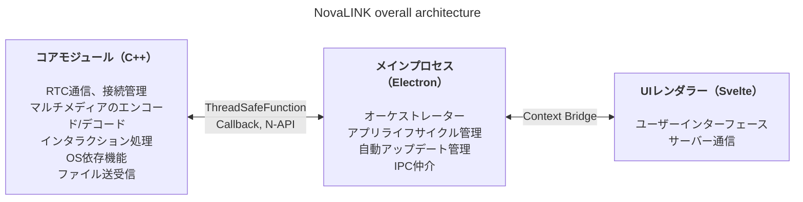
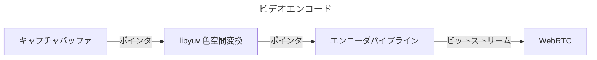
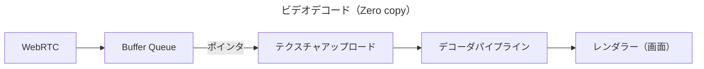

NovaLINKは最初からクロスプラットフォーム向けに設計されました。リモート制御ソフトウェアの利用環境はWindowsだけでなくmacOSやLinuxにも広がり、配布・アップデート・セキュリティ方針もOSごとに異なります。それでもユーザーは一度使った画面と体験を「そのまま」保ちたいと望み、プラットフォームを問いません。私たちも一貫した開発環境を維持したかったのですが、小規模な会社ですべての環境を社内で一元化するのは容易ではありません。開発リソースはコア機能に集中し、残りは成熟したエコシステムの力を借りる必要がありました。そのため初期段階からクロスプラットフォームについて深く考えることになりました。

ここでいうクロスプラットフォームは、単に「同じコードが複数のOSでビルドできる」という水準にとどまりません。画面キャプチャ・入力フック・アクセシビリティ・ファイアウォール例外・電源・スリープなどの権限モデルはOSごとに異なり、HiDPI・マルチモニター・仮想ディスプレイ環境での座標系とスケーリングも微妙にずれます。インストールパス、自動起動、バックグラウンド動作への期待も様々です。ユーザーにとっては「どこでも同じ体験」ですが、開発の現場では同じ作業を何十通りのやり方で繰り返すに近いです。そこで初期から「画面を描く役割」と「権限と性能が集中する役割」を分け、**繰り返しを減らす**判断につながりました。

市場にはFlutter、React Native、.NET、Qtなど多くのクロスプラットフォーム開発環境があります。それぞれ長所と短所があり、想定外の問題に役立つドキュメントやコミュニティまで含めると選択肢はさらに広がります。しかしリモート制御サービスには選択肢を絞る制約があります。それが**性能**です。画面キャプチャ・エンコード・デコード、入力遅延、ネットワーク変動へのバッファリング、ファイル転送まで、ほぼリアルタイムの応答が期待されます。クロスプラットフォームフレームワークは多様なOSを同じ抽象の上に載せるためにレイヤーやラッパーを置くことが多く、そのレイヤーは開発のしやすさと引き換えに、最悪の場合ボトルネックや予測しにくい遅延になります。プラットフォームが成熟してもその限界が自動的に消えるわけではありません。「人気のクロスプラットフォーム」と「リモート制御に必要な性能」を同じ軸で単純比較するのは難しいのです。

リモート制御における性能は抽象的なスローガンではなく、体感品質に直結します。入力がコアに届き、エンコード・転送・デコードを経て再び画面に戻るまでの遅延、パケット損失とジッターが大きいときにフレームを捨てるかバッファを増やすかの方針、解像度・フレームレート・ビットレート・コーデックの組み合わせはすべて、ユーザーが「反応が即座か」と感じる印象を左右します。これらはUIフレームワークの便利さだけでは解決できず、OSごとのキャプチャ経路やハードウェアアクセラレーション、スレッドスケジューリングまで見る必要があります。そこで私たちは「一つのスタックがすべてを解決する」よりも「ホットパスは薄く制御可能に保つ」ことを優先しました。

初期のクロスプラットフォームツールを振り返ると、ネイティブの上にUIの皮だけ被せたようなものもあれば、フレームワークの中に別世界を築く必要があったものもありました。Java Swingは当時としては実用的でしたが、視覚的一貫性や現代的なUXの期待には限界がありました。今の目で見てもSwingのUIに馴染みにくいものがあります。QtはUIの一貫性やツールチェーンの面で印象的で、構造も比較的直感的に感じられました。ただQtも.NET系と同様に独自のビルド・配布・プラグインエコシステムへの理解が必要で、チーム構成によって学習コストが大きくなることがあります。興味深いことに「クロスプラットフォーム」を謳うツール同士でも、CI、パッケージング、コード署名といった運用の場面ではプラットフォーム固有の例外が次々と出て、クロスプラットフォーム対応そのものが苦労の種だった記憶もあります。PythonはQtバインディングなどでデスクトップUIを立ち上げやすかった一方、インタプリタ性やGILは、長期的に重く複雑なリアルタイムパイプラインを設計する際の負担になり得ます。

一方、近年はWebAssemblyや各種ネイティブバインディングにより「ウェブ技術＋性能クリティカルな部分はネイティブ」という組み合わせも一般的になりました。NovaLINKの結論もその方向性と大きく異なりません。ただしリモート制御はメディアと入力が絶えず流れる長時間プロセスなので、デモ水準の統合だけでなく、アップデート・障害復旧・メモリ安定性まで含めた運用の観点で境界をどう保つかがより重要でした。

時間が経つにつれ、ネイティブ機能を薄く露出するAPIが増え、NodeやReactのように開発者プールの広いスタックがデスクトップアプリにも自然に浸透しました。その中でもElectron上のVisual Studio Codeの完成度は大きな転換点でした。その背後には多くの開発者によるプロファイリングや、レンダラーと拡張ホストの分離などの最適化があることを知っています。それでも「ウェブ技術とNodeエコシステムの上にIDE級の製品が成立した」という事実は、クロスプラットフォームがすなわち低性能という決めつけを崩す事例として受け止めました。その後多くのIDEやツールがVS Codeをフォークしたり着想を得たりしたことは、個人的な好みを超えた市場の検証だと考えます。「クロスプラットフォームのスタックで性能とUXの両方を狙える」という考えにつながりました。

もちろんElectronベースのアプローチにはメモリ使用量、Chromium依存、配布サイズといった現実的なコストもあります。VS Code級の最適化がなければ体感性能は揺れやすいです。それでもチームが製品を素早く改善し、自動アップデート・拡張・ツール連携といった「アプリ全体を包む」問題を成熟したパターンで進められることは小さなチームにとって大きな利点です。重要だったのは「レンダラーにすべてを任せない」ことであり、重い処理はコアに下げる設計が前提だと考えました。

同時に、一つのフレームワークの中で性能とUXの両方を最後まで背負い込むつもりはありませんでした。現実的な答えは役割の分離と委譲に近いと考えました。いくつかの試行の末、NovaLINKが選んだ構造はハイブリッドです。UX領域とコアをできるだけ分離し、コアは性能に有利な形、UIはブランドと使い勝手を統一できる形で設計しました。大きな絵は単純に見えても、細部に入るとフラクタルのように機能ごとに同じ問いが繰り返されます。この機能はレンダラー側が正しいのか、コアに置いて遅延と消費電力を制御すべきか。境界は一度決めて終わりではなく、トラフィックパターンやOS方針が変わるたびに再調整が必要です。

具体的にはコアをC++とし、RTC・マルチメディア・低レベル入力・ファイル転送のように遅延とスループットに敏感な経路を一か所で扱うようにしました。Nodeアドオン（N-API）とスレッドセーフ関数、コールバックでメインプロセスと接続すれば、UIイベントループから離れたスレッドで作業を進めつつ、必要な瞬間だけ安全に結果を上げられます。Electronのメインプロセスはアプリ寿命、自動アップデート、ウィンドウ・トレイ・グローバルショートカットなどのシェル役とIPC仲介に集中します。UIはSvelteベースのレンダラーでユーザーフローとサーバーとの対話を担います。コンポーネントモデルが軽く状態変化の扱いが明瞭なため、リモート制御のように状態が頻繁に変わる画面でも、過剰なボイラープレートなしに保守可能な形を保とうという選択でもあります。

リモート制御市場は製品ごとに強調点が異なります。企業環境のポリシーや監査ログに合わせる製品もあれば、超低遅延ストリーミングに焦点を当てる製品もあります。NovaLINKが目指すバランスは「特定ベンチマークの一行」ではなく、実使用で繰り返されるシナリオ——接続・再接続、解像度変更、ネットワーク品質の変化、長いセッション——でも予測可能に動くことです。だからアーキテクチャは機能一覧と同時に、障害モードをどう隔離するかを問います。コアが止まったときUIはどう知らせるか、レンダラーが応答しなくてもセッションはどう片付けるかといった問いは華やかではありませんが、クロスプラットフォームアプリの信頼には欠かせません。

この構造を実際に回すには設計だけでは足りず、継続的な運用と自制が必要です。たとえばイベントループ中心の単一スレッドモデルと、コア側のマルチスレッド・ネイティブ作業との同期は常に緊張関係にあります。プラットフォームごとにタイマー・入力・電源管理の方針が異なり、同じ非同期パターンが常に同じ結果を出すとは限りません。IPCで行き来するメッセージはスキーマを揃え直列化コストを抑え、メディアパイプラインとインタラクション処理を同時に押し進めるときは不要なコピーやロック競合を減らす作業が繰り返されます。この課題はNovaLINKだけの固有問題というより、リモート制御・リアルタイム協業・ストリーミング系の製品全体で共通にぶつかる領域に近いです。ただしコア・メイン・レンダラーに層を分けた分、境界での契約とバージョン互換、失敗時の復旧戦略をより明示的に扱う負担はあります。

セキュリティの観点でも境界は明確であるほどよいです。レンダラーは可能な限り狭い表面積だけを露出し、機密性の高い機能はメイン・コア側で権限とポリシーをまとめて扱う方がよいです。Context Bridgeで露出するAPIの形を制限し、直列化可能なメッセージ形式を保ち、ネイティブモジュールのバージョンとアプリバージョンの組み合わせを互換マトリクスで管理するのは最初は面倒でも、長期的には障害分析とロールバックを楽にします。

最後に、クロスプラットフォームは「最初に一度考えて終わり」ではなく、製品が生きている限り続く選択の連鎖です。OSのアップデートで権限ダイアログが変わり、GPUドライバ・ファイアウォール・セキュリティソフトが介入すると、同じコードでも体感は変わります。そのたびにコアとUIの境界を読み直し、必要なら責任を移し、契約をバージョンアップします。優雅な単一スタックより退屈に聞こえるこの繰り返しが、結局ユーザーには安定したアップデートと慣れた画面として返ります。

開発体験の面でもハイブリッドは諸刃の剣です。レイヤーが増えるほどデバッグスタックは長くなり、再現環境を合わせるためにログやサンプリングポイントを複数プロセスに分けて埋め込む必要があります。だから私たちは「感覚的に速い」よりも、フレーム統計、キュー滞留、IPC往復時間、コアCPU使用率のような捉えられる指標を優先します。プラットフォーム別の回帰テストとカナリア配信、旧バージョンクライアントとの相互運用性もクロスプラットフォーム製品の隠れたコストです。このコストに見合うだけ、コアでの予測可能性とUIでの反復改善の速度の両方を得たいと考えました。

**NovaLINK 現行構造のトレードオフと緩和策**

| 欠点 | 内容 | 緩和方法 |
|------|------|----------|
| メモリ使用量 | Chromiumプロセスによりベースラインが高い | 性能クリティカルな経路はできるだけC++で処理 |
| 起動時間 | Electronの読み込みに数秒かかることがある | スプラッシュスクリーンでUXを緩和 |
| N-APIバインディングの複雑さ | C++↔JSブリッジコードの管理負荷 | 目的別の別プロセス構成、各プロセスがそれぞれC++通信 |
| バイナリサイズ | Electron＋C++ビルドを含めるとインストールが大きい | ASARパッケージング＋プラットフォーム別の選択的バンドル |
| ビルド環境の複雑さ | npmとプラットフォーム別SDKの同時管理 | CIでプラットフォーム別ビルドを分離 |

一度のアップデートですべてのボトルネックが消えるわけではありません。これからも同種の意思決定とトレードオフが続くでしょう。それでも今までの方向——何をコアに残し何をUIに任せるかを絶えず再調整し、数字で検証する——が誤っていなかったと信じ、ユーザーフィードバックと測定結果に基づいて磨き続けます。記事は長くなりましたが要点は単純です。クロスプラットフォームは選択ではなく絶え間ない設計であり、NovaLINKは毎日その悩みを引き継いでいます。
