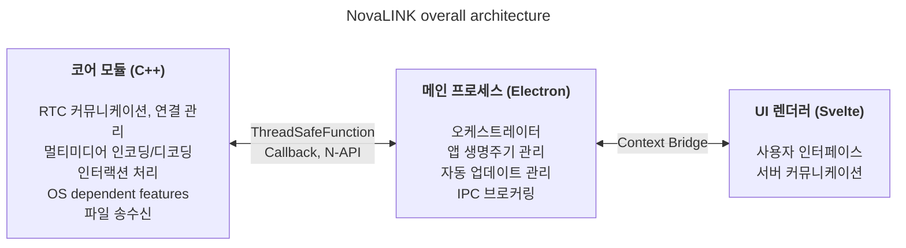
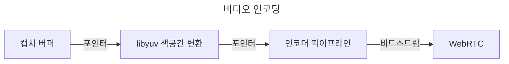
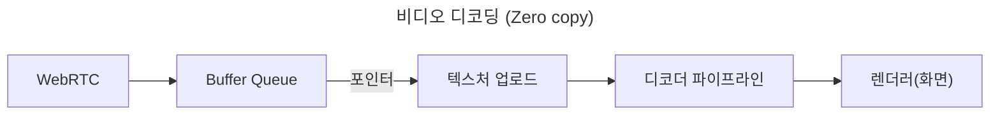

NovaLINK는 처음부터 크로스 플랫폼으로 설계되었습니다. 원격제어 소프트웨어는 사용자 환경이 Windows만이 아니라 macOS, Linux까지 넓게 퍼져 있고, 배포·업데이트·보안 정책도 플랫폼마다 다릅니다. 하지만 유저들의 한 번 사용했던 화면과 경험을 “그대로” 유지하고 싶다는 요구는 플랫폼을 가리지 않습니다. 저희 역시 일관되고 통일성 있는 개발 환경을 유지하고 싶었습니다. 작은 규모의 회사에서 직접 모든 환경을 일원화하는건 쉬운일이 아닙니다. 개발 역량은 코어 기능에 집중하고 나머지는 성숙한 개발 생태계의 도움을 받아야만 했습니다. 이에 초기 단계부터 크로스 플랫폼에 대한 고민을 깊게 하게 되었습니다.

여기서 말하는 크로스 플랫폼은 단순히 “같은 코드가 여러 OS에서 빌드된다” 수준에 머무르지 않습니다. 화면 캡처·입력 후킹·접근성·방화벽 예외·전원·절전 같은 권한 모델은 OS마다 다르고, HiDPI·멀티 모니터·가상 디스플레이 환경에서의 좌표계와 스케일링도 미세하게 어긋납니다. 설치 경로, 자동 실행, 백그라운드 동작에 대한 기대 역시 제각각입니다. 사용자에게는 “어디서든 동일한 경험”이지만, 개발 측면에서는 같은 일을 다른 방식으로 수십번 반복하는 일에 가깝습니다. 그래서 초기부터 ‘화면을 그리는 역할’과 ‘권한과 성능이 몰리는 역할’을 나누어 **반복을 줄여야 한다**는 판단으로 이어졌습니다.

시장에는 Flutter, React Native, .NET, Qt 등 수많은 크로스 플랫폼 개발 환경이 존재합니다. 각각 장단점이 분명하고, 예상치 못했던 문제 해결에 도움이 되는 문서와 커뮤니티까지 고려하면 선택지는 더 넓어집니다. 하지만 이 선택지를 좁혀주는 원격제어 서비스에서의 제약이 있습니다. 바로 **성능**입니다. 화면 캡처·인코딩·디코딩, 입력 지연, 네트워크 변동에 대응하는 버퍼링, 파일 전송까지 실시간에 가까운 응답이 기대됩니다. 크로스 플랫폼 프레임워크는 다양한 OS를 같은 추상화 위에 올리기 위해 레이어와 래퍼를 두는 경우가 많습니다. 그 레이어는 개발 편의를 사고 오는 대가로, 최악의 경우 병목이나 예측하기 어려운 지연이 됩니다. 플랫폼이 성숙했다고 해서 그 한계가 자동으로 사라지지는 않습니다. “잘 나가는 크로스 플랫폼”과 “원격제어에 필요한 성능”은 같은 축 위에 놓고 단순 비교하기 어렵습니다.

[
사용자는 60ms부터 지연 인지 "Are 100 ms Fast Enough? Characterizing Latency Perception Thresholds in Mouse-Based Interaction"](https://www.researchgate.net/publication/317801603_Are_100_ms_Fast_Enough_Characterizing_Latency_Perception_Thresholds_in_Mouse-Based_Interaction)

원격제어에서 성능은 추상적인 슬로건이 아니라 체감 품질과 직결됩니다. 입력이 코어까지 전달되고 인코딩·전송·디코딩을 거쳐 화면에 다시 올라오기까지의 지연, 패킷 손실과 지터가 커질 때 프레임을 버릴지 버퍼를 늘릴지에 대한 정책, 해상도·프레임레이트·비트레이트·코덱 조합은 모두 사용자의 “반응이 즉각적인가”라는 인상을 좌우합니다. 이 문제들은 UI 프레임워크의 편의만으로 해결되지 않고, OS별 캡처 경로와 하드웨어 가속, 심지어 스레드 스케줄링까지 함께 봐야 합니다. 그래서 우리는 “한 스택이 모든 것을 해결해 줄 것”보다 “핫 패스는 얇고 통제 가능하게 유지할 것”을 우선순위에 두었습니다.

초창기 크로스 플랫폼 도구들을 돌이켜 보면, 어떤 것은 네이티브 위에 UI 껍데기만 씌운 느낌이었고, 어떤 것은 프레임워크 안에서 또 다른 세계를 구축해야 했습니다. Java Swing은 당시로서는 실용적이었지만, 시각적 일관성과 현대적인 UX 기대에는 한계가 있었습니다. 모든것을 이해하는 지금의 마음으로 다시봐도 Java Swing의 UI는 적응이 안됩니다. Qt는 UI 일관성과 도구 체인 면에서 인상 깊었고, 구조도 비교적 직관적으로 느껴졌습니다. 다만 Qt 역시 .NET 계열처럼 자체적인 빌드·배포·플러그인 생태계에 대한 이해가 필요했고, 팀 구성에 따라 학습 비용이 커질 수 있습니다. 흥미롭게도 “크로스 플랫폼”을 표방하는 도구들 사이에서도 CI, 패키징, 코드 서명 같은 운영 이슈에서 플랫폼별 예외가 계속 튀어나와, 말 그대로 크로스 플랫폼 지원 자체가 고생거리였던 기억도 있습니다. Python 쪽은 Qt 바인딩 등으로 데스크톱 UI를 올리기 쉬웠지만, 인터프리터 특성과 GIL 등은 장기적으로 무겁고 복잡한 실시간 파이프라인을 설계할 때 부담으로 작용할 수 있습니다.

한편 최근에는 WebAssembly나 각종 네이티브 바인딩을 통해 “웹 기술 + 성능 크리티컬 구간은 네이티브”라는 조합도 흔해졌습니다. NovaLINK의 결론은 그 방향성과 크게 다르지 않습니다. 다만 원격제어는 미디어와 입력이 끊임없이 흐르는 장시간 실행 프로세스이기 때문에, 단순히 데모 수준의 통합이 아니라 업데이트·장애 복구·메모리 안정성까지 포함한 운영 관점에서 경계를 어떻게 유지할지가 더 중요했습니다.

시간이 지나면서 네이티브 기능을 얇게 노출하는 API들이 늘었고, Node나 React처럼 개발자 풀이 넓은 스택이 데스크톱 앱에도 자연스럽게 스며들었습니다. 그중에서도 Electron을 기반으로 한 Visual Studio Code의 완성도는 큰 전환점이었습니다. 그 뒤에는 수많은 개발자들의 피땀어린 프로파일링과 렌더러·Extension 호스트 분리 같은 최적화가 있음을 알고 있습니다. 그럼에도 “웹 기술과 Node 생태계 위에서 IDE급 제품이 성립했다”는 사실은, 크로스 플랫폼이 곧 저성능이라는 단정을 깨는 사례로 받아들였습니다. 이후 많은 IDE·도구들이 VS Code를 포크하거나 영감을 받아 나왔다는 점은, 그 감명이 개인적인 취향을 넘어 시장의 검증으로 이어졌다고 봅니다. “크로스 플랫폼 스택으로 성능과 UX를 동시에 노려볼 수 있겠다”는 생각으로 이어졌습니다.

물론 Electron 기반 접근에는 메모리 사용량, Chromium 의존, 배포 용량 같은 현실적인 비용도 있습니다. VS Code급 최적화가 없다면 체감 성능은 쉽게 흔들립니다. 그럼에도 팀이 제품을 빠르게 개선하고, 자동 업데이트·확장·도구 연동 같은 “앱 전체를 감싸는” 문제를 성숙한 패턴으로 가져갈 수 있다는 점은 작은 팀에게 큰 이점입니다. 중요한 것은 “렌더러가 모든 일을 하게 두지 않는 것”이었고, 무거운 일은 코어로 내려보내는 설계가 전제되어야 한다고 보았습니다.

동시에, 하나의 프레임워크 안에서 성능과 UX를 모두 끝까지 책임지려 하지는 않았습니다. 현실적인 답은 역할의 분리와 위임에 가깝다고 보았습니다. 여러 시도 끝에 NovaLINK가 선택한 구조는 하이브리드입니다. UX 영역과 코어를 최대한 분리하고, 코어는 성능에 유리한 형태로, UI는 브랜드와 사용성을 통일할 수 있는 형태로 설계했습니다. 큰 그림은 단순해 보이지만, 세부로 들어가면 프랙탈처럼 기능 하나하나마다 같은 질문이 반복됩니다. 이 기능은 렌더러 쪽에 두는 것이 맞는가, 코어에 두어야 지연과 전력 소비를 통제할 수 있는가. 경계를 한 번 정했다고 끝이 아니라, 트래픽 패턴과 OS 정책이 바뀔 때마다 다시 조정해야 합니다.

구체적으로 코어는 C++로 두어 RTC·멀티미디어·저수준 입력·파일 전송처럼 지연과 처리량에 민감한 경로를 한곳에서 다루도록 했습니다. Node 애드온(N-API)과 Thread-safe function, 콜백을 통해 메인 프로세스와 연결하면, UI 이벤트 루프와 분리된 스레드에서 작업을 진행하면서도 필요한 순간에만 안전하게 결과를 올릴 수 있습니다. Electron 메인 프로세스는 앱 수명, 자동 업데이트, 창·트레이·전역 단축키 같은 셸 역할과 IPC 브로커링에 집중합니다. UI는 Svelte 기반 렌더러에서 사용자 흐름과 서버와의 대화를 담당합니다. 컴포넌트 모델이 가볍고 상태 변화를 다루기 명확한 편이라, 원격제어처럼 상태가 자주 바뀌는 화면을 구성할 때도 과도한 보일러플레이트 없이 유지보수 가능한 형태를 유지하려는 선택이기도 합니다.

원격제어 시장은 제품마다 강조점이 다릅니다. 어떤 제품은 기업 환경의 정책·감사 로그에 맞추고, 어떤 제품은 초저지연 스트리밍에 초점을 맞춥니다. NovaLINK가 추구하는 균형은 “특정 벤치마크 한 줄”이 아니라, 실사용에서 반복되는 시나리오—연결·재연결, 해상도 변경, 네트워크 품질 변화, 긴 세션—에서도 예측 가능하게 동작하는 것입니다. 그래서 아키텍처는 기능 목록보다 먼저, 실패 모드를 어떻게 격리할지를 함께 묻습니다. 코어가 멈추면 UI는 어떻게 알릴 것인가, 렌더러가 먹통이 되어도 세션은 어떻게 정리할 것인가 같은 질문은 매력적이진 않지만, 크로스 플랫폼 앱의 신뢰를 만드는 데는 필수입니다.

이 구조를 실제로 굴리려면 설계만으로는 부족하고, 지속적인 운영과 절제가 필요합니다. 예를 들어 이벤트 루프 중심의 단일 스레드 모델과, 코어 쪽의 멀티스레드·네이티브 작업 사이의 동기화는 항상 긴장 관계입니다. 플랫폼마다 타이머·입력·전력 관리 정책이 달라, 동일한 비동기 패턴이 항상 같은 결과를 내지는 않습니다. IPC를 통해 오가는 메시지는 스키마를 맞추고 직렬화 비용을 통제해야 하고, 미디어 파이프라인과 인터랙션 처리를 동시에 밀어붙일 때는 불필요한 복사와 락 경합을 줄이는 일이 반복됩니다. 이런 과제는 NovaLINK만의 독자 문제라기보다, 원격제어·실시간 협업·스트리밍 계열 제품 전반에서 공통으로 마주치는 영역에 가깝습니다. 다만 코어·메인·렌더러로 층을 나눈 만큼, 경계에서의 계약과 버전 호환, 실패 시 복구 전략을 조금 더 명시적으로 다루어야 한다는 부담은 있습니다.

보안 측면에서도 경계는 분명할수록 좋습니다. 렌더러는 가능한 한 좁은 표면적만 노출하고, 민감한 기능은 메인·코어 쪽에서 권한과 정책을 함께 묶어 다루는 편이 낫습니다. Context Bridge로 노출하는 API의 모양을 제한하고, 직렬화 가능한 메시지 형태를 유지하며, 네이티브 모듈 버전과 앱 버전의 조합을 호환 매트릭스로 관리하는 일은 처음엔 번거롭지만, 장기적으로는 장애 분석과 롤백을 쉽게 만듭니다.

마지막으로, 크로스 플랫폼은 “초기에 한 번 고민하고 끝”이 아니라 제품이 살아 있는 동안 계속되는 선택의 연속입니다. OS 업데이트로 권한 다이얼로그가 바뀌고, GPU 드라이버·방화벽·보안 소프트웨어가 개입하면 같은 코드라도 체감이 달라집니다. 그때마다 코어와 UI의 경계를 다시 읽고, 필요하면 책임을 옮기고, 계약을 버전업합니다. 우아한 단일 스택보다 지루하게 들릴 수 있는 이 반복이, 결국 사용자에게는 안정적인 업데이트와 익숙한 화면으로 돌아갑니다.

개발 경험 면에서도 하이브리드는 양날의 검입니다. 레이어가 늘수록 디버깅 스택은 길어지고, 재현 환경을 맞추기 위해 로그와 샘플링 지점을 여러 프로세스에 나누어 심어야 합니다. 그래서 우리는 “느낌상 빠르다”보다 프레임 통계, 큐 적체, IPC 왕복 시간, 코어 CPU 사용률처럼 잡을 수 있는 지표를 우선합니다. 플랫폼별 회귀 테스트와 카나리 배포, 구버전 클라이언트와의 상호운용성도 크로스 플랫폼 제품의 숨은 비용입니다. 이런 비용을 감수할 만큼, 코어에서의 예측 가능성과 UI에서의 반복 개선 속도를 동시에 얻고자 했습니다.

**NovaLINK 현재 구조의 트레이드오프 및 완화 방안**

| 단점 | 내용 | 완화 방법 |
|------|------|-----------|
| 메모리 사용량 | Chromium 프로세스로 인해 기본 메모리 높음 | 성능 임계 경로를 최대한 C++에서 처리 |
| 초기 실행 시간 | Electron 로딩 시간 수초 소요 | 스플래시 스크린으로 UX 완화 |
| N-API 바인딩 복잡도 | C++↔JS 브릿지 코드 관리 부담 | 목적별 별도 프로세스 구조 각 프로스세가 각각 C++ Communication |
| 바이너리 크기 | Electron + C++ 빌드 포함 시 설치 크기 큼 | ASAR 패킹 + 플랫폼별 선택적 번들 |
| 빌드 환경 복잡도 | npm + 플랫폼별 SDK 동시 관리 | CI 환경에서 플랫폼별 빌드 분리 |

한 번의 업데이트로 모든 병목이 사라지지는 않습니다. 앞으로도 비슷한 종류의 의사결정과 트레이드오프가 이어질 것입니다. 그럼에도 지금까지의 방향—무엇을 코어에 남기고 무엇을 UI에 맡길지를 끊임없이 재조정하고, 숫자로 검증하는 일—이 틀리지 않았다고 믿으며, 사용자 피드백과 측정 결과를 바탕으로 계속 다듬어 가겠습니다. 글이 길어졌지만 요지는 단순합니다. 크로스 플랫폼은 선택이 아니라 끊임없는 설계이고, NovaLINK는 매일 그 고민을 이어가고 있습니다.
