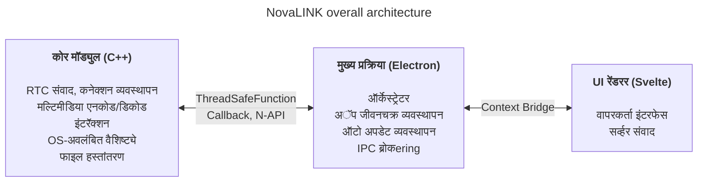
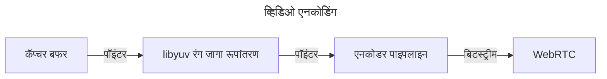
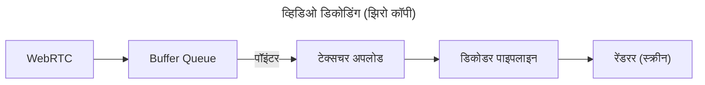

NovaLINK सुरुवातीपासून क्रॉस-प्लॅटफॉर्मसाठी डिझाइन केले होते. रिमोट कंट्रोल सॉफ्टवेअर फक्त Windowsवर नाही, तर macOS आणि Linuxवरही मोठ्या प्रमाणात चालते; तैनाती, अपडेट आणि सुरक्षा धोरणे प्लॅटफॉर्मनुसार वेगळी असतात. तरीही वापरकर्त्यांना एकदा वापरलेले स्क्रीन आणि अनुभव «तसेच» राहावेत असे वाटते—प्लॅटफॉर्म कोणताही असो. आम्हालाही एकसूत्री विकास परिसर हवा होता. लहान कंपनीसाठी सर्व परिसर आतून एकत्र करणे सोपे नाही. अभियांत्रिकी क्षमता मुख्य उत्पादनावर केंद्रित करायची होती; उर्वरित परिपक्व परिसंस्थेवर अवलंबून राहायचे होते. म्हणून सुरुवातीच्या टप्प्यापासून आम्ही क्रॉस-प्लॅटफॉर्मबद्दल गंभीरपणे विचार केला.

येथे «क्रॉस-प्लॅटफॉर्म» म्हणजे फक्त «समान कोड अनेक OSवर बिल्ड होतो» एवढेच नाही. स्क्रीन कॅप्चर, इनपुट हुकिंग, अ‍ॅक्सेसिबिलिटी, फायरवॉल अपवाद, पॉवर आणि स्लीपसारख्या परवानगी मॉडेल OSनुसार वेगळे असतात; HiDPI, मल्टी मॉनिटर आणि व्हर्च्युअल डिस्प्लेमध्ये निर्देशांक आणि स्केलिंग सूक्ष्मपणे बदलते. इंस्टॉल पथ, ऑटो स्टार्ट आणि पार्श्वभूमी वर्तनाबद्दल अपेक्षाही वेगळ्या असतात. वापरकर्त्यासाठी हे «सर्वत्र समान अनुभव» आहे, विकासासाठी मात्र एकच काम अनेक प्रकारे करण्यासारखे. म्हणून सुरुवातीपासून «UI काढण्याची भूमिका» आणि «परवानगी व कार्यक्षमता जास्त असलेली भूमिका» वेगळी करून **पुनरावृत्ती कमी करायची** ठरवले.

बाजारात Flutter, React Native, .NET, Qt अशा अनेक क्रॉस-प्लॅटफॉर्म स्टॅक आहेत. प्रत्येकाचे स्पष्ट फायदे-तोटे; अनपेक्षित समस्यांसाठी दस्तऐवज आणि समुदाय जोडले की पर्याय आणखी वाढतात. पण रिमोट कंट्रोल सेवा एक मर्यादा घालते जी पर्याय संकुचित करते: **कार्यक्षमता**. स्क्रीन कॅप्चर, एनकोड/डिकोड, इनपुट विलंब, नेटवर्क चढउतारांसमोर बफरिंग आणि फाइल हस्तांतरण—हे सर्व जवळजवळ रिअल टाइम प्रतिसाद अपेक्षित करतात. क्रॉस-प्लॅटफॉर्म फ्रेमवर्क अनेकदा अनेक OS एका अमूर्तीवर ठेवण्यासाठी थर आणि रॅपर जोडतात; ते थर विकास सोयीसाठी वाट्टेल ते खर्च—अत्यंत वाईट परिस्थितीत अडथळा किंवा अनपेक्षित विलंब. प्लॅटफॉर्म परिपक्व असला तरी ही मर्यादा आपोआप नाहीशी होत नाही. «लोकप्रिय क्रॉस-प्लॅटफॉर्म स्टॅक» आणि «रिमोट कंट्रोलला लागणारी कार्यक्षमता» एकाच धुरीवर सोप्या तुलनेत ठेवणे कठीण आहे.

रिमोट कंट्रोलमध्ये कार्यक्षमता केवळ घोषणा नाही; ती थेट अनुभवातील गुणवत्तेशी जोडलेली आहे. इनपुट कोरपर्यंत पोहोचून एनकोड, प्रसारण, डिकोड होऊन पुन्हा स्क्रीनवर येण्यापर्यंतचा विलंब; पॅकेट नुकसान आणि जिटर वाढल्यावर फ्रेम टाकणे की बफर वाढवणे याबद्दल धोरण; रिझोल्यूशन, फ्रेम रेट, बिटरेट आणि कोडेक संयोग—हे सर्व वापरकर्त्याच्या «तात्काळ प्रतिक्रिया» या भावनेला आकार देतात. ही समस्या फक्त UI फ्रेमवर्कच्या सोयीने सुटत नाहीत; OS-विशिष्ट कॅप्चर मार्ग, हार्डवेअर प्रवेग आणि थ्रेड शेड्युलिंगही पाहावे लागते. म्हणून आम्ही «एक स्टॅक सर्व काही सोडवेल» या अपेक्षेपेक्षा **हॉट पथ पातळ आणि नियंत्रणात ठेवणे** अग्रक्रमात ठेवले.

सुरुवातीच्या क्रॉस-प्लॅटफॉर्म साधनांकडे पाहिले तर काही नेटिव्हवर पातळ UI कवचासारखी वाटतात, काहींमध्ये फ्रेमवर्कमध्येच दुसरे विश्व उभे करावे लागते. Java Swing त्याकाळासाठी व्यावहारिक होते पण दृश्य सातत्य आणि आधुनिक UX अपेक्षांमध्ये मर्यादित. Qt ने UI सातत्य आणि टूलचेनने प्रभावित केले; .NET कुटुंबासारखेच बिल्ड, तैनाती आणि प्लगइन परिसंस्था समजून घ्यावी लागते—संघानुसार शिकण्याचा खर्च वाढू शकतो. मजेशीर गोष्ट म्हणजे «क्रॉस-प्लॅटफॉर्म» म्हणणाऱ्या साधनांमध्येही CI, पॅकेजिंग, कोड साइनिंगसारख्या ऑपरेशनल मुद्द्यांत प्लॅटफॉर्म-विशिष्ट अपवाद येत राहिले. Python ने Qt बाइंडिंग इत्यादींनी डेस्कटॉप UI सोपे केले; पण इंटरप्रेटर आणि GIL दीर्घकालीन जटिल रिअल-टाइम पाइपलाइन डिझाइनमध्ये ताण बनू शकतात.

अलीकडे WebAssembly आणि विविध नेटिव्ह बाइंडिंगद्वारे «वेब तंत्रज्ञान + कार्यक्षमता-संवेदनशील भाग नेटिव्ह» संयोग सामान्य झाला आहे. NovaLINKचा निष्कर्षही त्या दिशेपासून दूर नाही. पण रिमोट कंट्रोल हा माध्यम आणि इनपुटचा सतत प्रवाह असलेला दीर्घकालीन प्रक्रिया आहे; म्हणून फक्त डेमो पातळीवरील एकत्रीकरणापेक्षा अपडेट, अपयश पुनर्प्राप्ती आणि मेमरी स्थिरता यासह ऑपरेशनल दृष्टीने सीमा कशा राखायच्या हे अधिक महत्त्वाचे होते.

काळानुसार नेटिव्ह क्षमता पातळपणे दाखवणारे API वाढले; Node किंवा Reactसारख्या मोठ्या डेव्हलपर पूलचे स्टॅक डेस्कटॉप अॅप्समध्ये नैसर्गिकपणे शिरले. Electronवरील Visual Studio Codeची परिपक्वता मोठा टप्पा होता. त्यामागे गहन प्रोफाइलिंग आणि रेंडरर व एक्सटेंशन होस्ट वेगळे करणेसारखे ऑप्टिमायझेशन आहेत हे आम्हाला माहीत आहे. तरीही «वेब तंत्रज्ञान आणि Node परिसंस्थेवर IDE-दर्जाचे उत्पादन शक्य आहे» ही गोष्ट क्रॉस-प्लॅटफॉर्म म्हणजे कमी कार्यक्षमता हा गैरसमज मोडते. अनेक IDE आणि साधनांनी VS Code फोर्क केले किंवा प्रेरणा घेतली—आम्ही त्याला बाजारातील पुष्टी मानतो. त्यामुळे «क्रॉस-प्लॅटफॉर्म स्टॅकने कार्यक्षमता आणि UX एकत्र हेतू ठेवता येईल» असे वाटले.

अर्थातच Electron-आधारित दृष्टिकोनाची वास्तविक किंमत आहे: मेमरी, Chromium अवलंबन, वितरण आकार. VS Code-दर्जाच्या ऑप्टिमायझेशनशिवाय अनुभवातील कार्यक्षमता सहज हेलते. तरीही लहान संघाला उत्पादन लवकर सुधारता येते आणि ऑटो अपडेट, एक्सटेंशन, साधन एकत्रीकरणासारख्या «संपूर्ण अॅपला वेढणाऱ्या» गोष्टी परिपक्व नमुन्यांनी घेता येतात—मोठा फायदा. महत्त्वाचे होते **रेंडररला सर्व काम करू न देणे**; जड काम डिझाइननुसार कोरकडे पाठवावे लागते.

त्याच वेळी, एकाच फ्रेमवर्कमध्ये कार्यक्षमता आणि UX शेवटपर्यंत पेलण्याचा प्रयत्न केला नाही. व्यावहारिक उत्तर भूमिका विभागणी आणि प्रत्यायोजनाजवळ आहे. अनेक प्रयत्नांनंतर NovaLINKने हायब्रिड रचना निवडली: UX आणि कोर जास्तीत जास्त वेगळे; कोर कार्यक्षमतेस अनुकूल, UI ब्रँड आणि वापरक्षमता एकत्र करण्यायोग्य. मोठे चित्र सोपे दिसते, पण तपशीलात—जवळजवळ फ्रॅक्टलसारखे—प्रत्येक वैशिष्ट्य समान प्रश्न विचारते: हे रेंडररकडे ठेवावे की कोरकडे—विलंब आणि ऊर्जा वापर नियंत्रित करण्यासाठी? सीमा एकदा ठरवून संपत नाहीत; ट्रॅफिक नमुने आणि OS धोरणे बदलल्यावर पुन्हा जुळवावी लागतात.

ठोसपणे कोर C++ मध्ये: RTC, मल्टिमीडिया, निम्नस्तरीय इनपुट आणि फाइल हस्तांतरणसारख्या विलंब आणि थ्रूपुट-संवेदनशील मार्ग एकाच ठिकाणी. Node ऍड-ऑन (N-API), थ्रेड-सेफ फंक्शन आणि कॉलबॅक मुख्य प्रक्रियेशी जोडतात जेणेकरून काम UI इव्हेंट लूपपासून वेगळ्या थ्रेडवर चालू शकेल आणि गरजेनुसार निकाल सुरक्षितपणे वर आणता येतील. Electron मुख्य प्रक्रिया अॅप आयुष्य, ऑटो अपडेट, विंडो, ट्रे, ग्लोबल शॉर्टकटसारख्या शेल भूमिका आणि IPC ब्रोकeringवर केंद्रित. Svelte-आधारित रेंडरर वापरकर्ता प्रवाह आणि सर्व्हरशी संवाद सांभाळतो. हलका कॉम्पोनेंट मॉडेल आणि स्पष्ट स्थिती व्यवस्थापनाने वारंवार बदलणाऱ्या रिमोट कंट्रोल स्क्रीन कमी बॉयलरप्लेटसह टिकवता येतात.

रिमोट कंट्रोल बाजारात उत्पादे वेगवेगळ्या गोष्टींवर भर देतात: काही कॉर्पोरेट धोरण आणि ऑडिट लॉग, काही अतिशय कमी विलंब स्ट्रीमिंगवर. NovaLINK जे संतुलन शोधते ते «एक विशिष्ट बेंचमार्क ओळ» नाही, तर वास्तविक वापरात पुन्हा येणाऱ्या परिस्थितींमध्ये—जोडणी, पुन्हा जोडणी, रिझोल्यूशन बदल, नेटवर्क गुणवत्ता, लांब सत्र—अपेक्षित वर्तन. म्हणून आर्किटेक्चर वैशिष्ट्य यादीपूर्वी अपयश मोड कसे वेगळे करायचे हेही विचारते: कोर थांबला तर UI कसे कळवेल? रेंडरर अडकला तर सत्र कसे साफ करायचे? आकर्षक नाही, पण क्रॉस-प्लॅटफॉर्म अॅप्समध्ये विश्वासासाठी आवश्यक.

ही रचना प्रत्यक्षात चालवायला फक्त डिझाइन पुरेसे नाही—सतत ऑपरेशन आणि संयम लागतो. उदाहरणार्थ इव्हेंट लूप-केंद्रित एकल-थ्रेड मॉडेल आणि कोरमधील मल्टीथ्रेडेड नेटिव्ह काम यांच्यात समक्रमण नेहमी ताणात राहते. प्लॅटफॉर्मनुसार टायमर, इनपुट आणि पॉवर व्यवस्थापन धोरणे वेगळी; समान अॅसिंक्रोनस नमुना नेहमीच समान निकाल देत नाही. IPC संदेशांसाठी स्कीमा जुळवून सिरियलायझेशन खर्च नियंत्रित करावा लागतो; मीडिया पाइपलाइन आणि इंटरॅक्शन एकत्र ढकलताना अनावश्यक कॉपी आणि लॉक स्पर्धा कमी करावी लागते. ही आव्हाने फक्त NovaLINKची नाहीत—रिमोट कंट्रोल, रिअल-टाइम सहयोग आणि स्ट्रीमिंग प्रकारच्या उत्पादनांमध्ये सामान्य. पण कोर, मुख्य आणि रेंडरर थर करण्यामुळे सीमेवर करार, आवृत्ती सुसंगतता आणि अपयशानंतर पुनर्प्राप्ती धोरणे अधिक स्पष्टपणे हाताळावी लागतात.

सुरक्षिततेदृष्ट्या सीमा जितक्या स्पष्ट तितक्या चांगल्या: रेंडररचे पृष्ठभाग जितके कमी तितके; संवेदनशील क्षमता मुख्य आणि कोरमध्ये परवानगी आणि धोरणासह. Context Bridgeद्वारे उघड केलेल्या APIचे स्वरूप मर्यादित ठेवणे, सिरियलायझेबल संदेश राखणे, नेटिव्ह मॉड्युल आणि अॅप आवृत्ती संयोग सुसंगतता मॅट्रिक्समध्ये व्यवस्थापन—सुरुवातीला कष्टदायक पण दीर्घकालीन अडचण विश्लेषण आणि रोलबॅक सोपे करते.

शेवटी, क्रॉस-प्लॅटफॉर्म «सुरुवातीला एकदा विचारून संपले» नाही—उत्पादन जोपर्यंत जगते तोपर्यंत निवडींची साखळी आहे. OS अपडेट परवानगी संवाद बदलतात; GPU ड्रायव्हर, फायरवॉल, सुरक्षा सॉफ्टवेअर हस्तक्षेप केल्यावर समान कोडही वेगळा वाटतो. तेव्हा कोर आणि UIची सीमा पुन्हा वाचावी लागते, गरज असल्यास जबाबदारी हलवावी लागते, करार आवृत्ती वाढवावी लागतात. एकल स्टॅकपेक्षा कंटाळवाणे वाटणारे हे पुनरावृत्ती शेवटी वापरकर्त्याला स्थिर अपडेट आणि ओळखीच्या स्क्रीन म्हणून परतते.

डेव्हलपर अनुभवातही हायब्रिड दोन धारांचे तलवार: थर वाढतात तसा डीबग स्टॅक लांब होतो, पुनरुत्पादन परिसरासाठी लॉग आणि नमुना बिंदू अनेक प्रक्रियांमध्ये विभागावे लागतात. म्हणून आम्ही «वाटते जलद»पेक्षा फ्रेम आकडेवारी, रांग गर्दी, IPC राउंड ट्रिप वेळ, कोर CPU वापर यासारखे मोजता येणारे निर्देशक अग्रक्रमात ठेवतो. प्लॅटफॉर्म-विशिष्ट प्रतिगमन चाचण्या, कॅनरी तैनाती, जुन्या क्लायंटसह परस्परसंचालनाही क्रॉस-प्लॅटफॉर्म उत्पादनांचा लपलेला खर्च. आम्ही हा खर्च कोरमधील अंदाज योग्यता आणि UIमध्ये वेगवान सुधारणा चक्र एकत्र मिळवण्यासाठी स्वीकारतो.

**NovaLINK सध्याच्या रचनेचे ट्रेडऑफ आणि शमन**

| तोटा | मजकूर | शमन |
|-------|--------|------|
| मेमरी वापर | Chromium प्रक्रियांमुळे पाया मेमरी जास्त | कार्यक्षमता संवेदनशील मार्ग जास्तीत जास्त C++ मध्ये |
| सुरुवातीची चालवण्याची वेळ | Electron लोडिंग काही सेकंद घेऊ शकते | स्प्लॅश स्क्रीनने अनुभवातील UX सुधारणा |
| N-API बाइंडिंग जटिलता | C++↔JS ब्रिज कोड देखभाल | उद्देशानुसार वेगळ्या प्रक्रिया रचना; प्रत्येक प्रक्रियेत स्वतंत्र C++ संवाद |
| बायनरी आकार | Electron + C++ बिल्डमुळे इंस्टॉलर मोठे | ASAR पॅकिंग + प्लॅटफॉर्म-विशिष्ट पर्यायी बंडल |
| बिल्ड परिसर जटिलता | npm + प्लॅटफॉर्म SDK एकत्र | CI मध्ये प्लॅटफॉर्मनुसार वेगळे बिल्ड |

एकच अपडेट सर्व अडथळे दूर करत नाही. पुढेही असेच निर्णय आणि ट्रेडऑफ येतील. तरीही आम्हाला वाटते दिशा—कोरमध्ये काय ठेवायचे आणि UIला काय सोडायचे हे सतत पुन्हा संतुलित करून आकड्यांनी तपासणे—बरोबर आहे, आणि आम्ही वापरकर्ता अभिप्राय आणि मोजमापावर आधारित सुधारणा करत राहू. लेख लांब झाला पण मुख्य मुद्दा सोपा: क्रॉस-प्लॅटफॉर्म एकदाच निवड नाही, तर सतत डिझाइन, आणि NovaLINK दररोज तेच विचार करत राहते.
