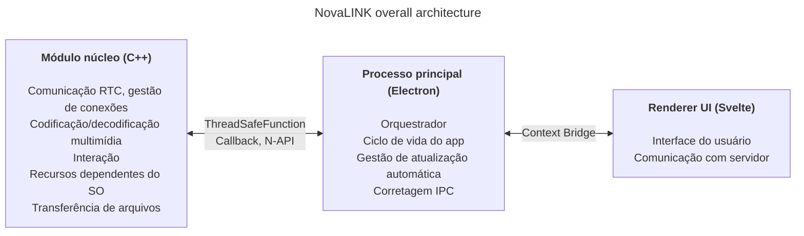
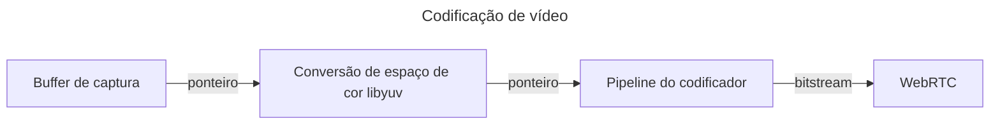
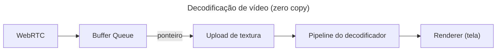

A NovaLINK foi desenhada para multiplataforma desde o início. Software de controle remoto não roda só no Windows, mas também amplamente no macOS e Linux, e implantação, atualizações e políticas de segurança variam por plataforma. Mesmo assim, os usuários querem que telas e experiência permaneçam “as mesmas”, independentemente da plataforma. Também queríamos um ambiente de desenvolvimento consistente. Para uma empresa pequena, unificar todos os ambientes internamente não é fácil. Foi preciso concentrar a engenharia no núcleo do produto e apoiar-se em ecossistemas maduros para o restante. Por isso pensamos profundamente em multiplataforma desde cedo.

Aqui, “multiplataforma” não significa apenas “o mesmo código compila em vários sistemas operacionais”. Modelos de permissão para captura de tela, hook de entrada, acessibilidade, exceções de firewall, energia e suspensão diferem; sistemas de coordenadas e escala em HiDPI, multimonitor e displays virtuais se desalinham sutilmente. Expectativas sobre caminhos de instalação, inicialização automática e comportamento em segundo plano também variam. Para o usuário é “a mesma experiência em qualquer lugar”; para o desenvolvedor é quase repetir o mesmo trabalho de dezenas de formas. Por isso, desde o início separamos “o que desenha a interface” de “o que concentra permissões e carga de desempenho” para **reduzir repetição**.

O mercado oferece muitas pilhas multiplataforma — Flutter, React Native, .NET, Qt, etc. Cada uma tem prós e contras claros; somando documentação e comunidades para problemas inesperados, o leque cresce. Mas o controle remoto adiciona uma restrição que estreita o campo: **desempenho**. Captura de tela, codificação/decodificação, latência de entrada, buffering diante de variações de rede e transferência de arquivos devem parecer quase em tempo real. Frameworks multiplataforma costumam adicionar camadas e wrappers para unificar sistemas operacionais; essas camadas trocam conveniência de desenvolvimento por gargalos ou latências difíceis de prever no pior caso. Um ecossistema maduro não elimina automaticamente esses limites. É difícil comparar num único eixo “uma pilha multiplataforma popular” e “o desempenho que o controle remoto exige”.

No controle remoto, desempenho não é um slogan abstrato: liga-se diretamente à qualidade percebida. O atraso desde a entrada até o núcleo e de volta à tela passando por codificação, transmissão e decodificação; políticas ante perda de pacotes e jitter (descartar quadros versus aumentar buffer); combinações de resolução, taxa de quadros, bitrate e codec moldam a impressão de “reação instantânea”. Esses problemas não se resolvem só com a conveniência de um framework de UI; exigem caminhos de captura específicos do SO, aceleração de hardware e até escalonamento de threads. Por isso priorizamos um **caminho quente fino e controlável** em vez de esperar que “uma pilha resolva tudo”.

Olhando para as primeiras ferramentas multiplataforma, algumas pareciam uma casca fina de UI sobre nativo; outras exigiam construir outro mundo dentro do framework. Java Swing foi prático na época, mas limitado para consistência visual e expectativas UX modernas. Qt impressionou por consistência de UI e cadeia de ferramentas; como .NET, exige entender build, implantação e ecossistema de plugins — o custo de aprendizado varia com o time. Curiosamente, mesmo entre ferramentas “multiplataforma”, questões operacionais — CI, empacotamento, assinatura de código — continuavam gerando exceções por plataforma. Python facilitava UIs de desktop com bindings Qt; o interpretador e o GIL podem pesar em pipelines em tempo real complexos a longo prazo.

Recentemente, WebAssembly e diversos bindings nativos popularizaram “tecnologia web + nativo nas partes críticas”. A conclusão da NovaLINK não difere muito dessa direção. Mas o controle remoto é um processo de longa duração com fluxo contínuo de mídia e entrada; além de integração em nível de demo, importava como manter fronteiras sob operações — atualizações, recuperação de falhas e estabilidade de memória.

Com o tempo, mais APIs expõem nativo de forma fina; pilhas com muitos desenvolvedores (Node, React) chegaram ao desktop. O Visual Studio Code sobre Electron foi um marco — com muito profiling e otimizações como separar renderer e host de extensões. Ainda assim, o fato de existir produto nível IDE sobre tecnologia web e ecossistema Node quebra a ideia de que multiplataforma implica baixo desempenho. Muitas IDEs e ferramentas fizeram fork ou se inspiraram no VS Code: lemos isso como validação de mercado. Levou-nos a acreditar que dá para buscar desempenho e UX com pilha multiplataforma.

Claro, Electron tem custos reais: memória, dependência do Chromium e tamanho de distribuição. Sem otimização nível VS Code, o desempenho percebido oscila facilmente. Mesmo assim, uma equipe pequena pode iterar rápido e adotar padrões maduros para atualização automática, extensões e integração com ferramentas — uma grande vantagem. O essencial foi **não deixar o renderer fazer tudo**; trabalho pesado deve descer ao núcleo por desenho.

Ao mesmo tempo, não tentamos que um único framework carregue desempenho e UX até o fim. A resposta prática é separação de papéis e delegação. Após várias tentativas, a NovaLINK escolheu uma arquitetura híbrida: separar ao máximo UX e núcleo; moldar o núcleo para caminhos sensíveis a desempenho e a UI para marca e usabilidade. O panorama geral parece simples, mas no detalhe — quase fractal — cada recurso repete as mesmas perguntas: renderer ou núcleo para controlar latência e consumo? Fronteiras não se definem uma vez: revisam-se quando mudam padrões de tráfego e políticas do SO.

Concretamente, o núcleo é C++: RTC, multimídia, entrada de baixo nível e transferência de arquivos ficam centralizados. Addons Node (N-API), funções thread-safe e callbacks ligam o processo principal para trabalhar fora do loop de eventos da UI e subir resultados com segurança quando necessário. O processo principal Electron foca ciclo de vida do app, atualização automática, casca (janelas, bandeja, atalhos globais) e corretagem IPC. O renderer em Svelte cuida dos fluxos de usuário e diálogo com servidores. O modelo de componentes leve ajuda a manter telas de controle remoto que mudam frequentemente sem excesso de boilerplate.

O mercado de controle remoto enfatiza coisas diferentes: políticas corporativas e logs de auditoria versus streaming de ultra baixa latência. A NovaLINK busca equilíbrio — não uma linha isolada de benchmark, mas comportamento previsível em cenários reais repetidos: conexão, reconexão, mudança de resolução, qualidade de rede, sessões longas. Por isso a arquitetura também pergunta como isolar modos de falha: como a UI sabe se o núcleo travou? como limpar sessões se o renderer congelar? Não é espetacular, mas é essencial para confiança.

Colocar essa estrutura em prática exige mais que desenho: disciplina contínua. O modelo single-thread centrado no loop de eventos está sempre em tensão com multithreading e trabalho nativo no núcleo. Temporizadores, entrada e políticas de energia variam: o mesmo padrão assíncrono nem sempre produz o mesmo resultado. Mensagens IPC precisam de esquemas alinhados e custo de serialização controlado; empurrar pipelines de mídia e interação ao mesmo tempo exige reduzir cópias e contenção de locks. Não é problema só da NovaLINK — é comum em controle remoto, colaboração em tempo real e produtos tipo streaming. Mas separar núcleo, principal e renderer adiciona carga explícita em contratos, compatibilidade de versões e recuperação nas fronteiras.

Em segurança, fronteiras claras ajudam: superfície do renderer pequena; recursos sensíveis ligados a políticas no principal e no núcleo. Restringir APIs expostas via Context Bridge, manter mensagens serializáveis e matriz de compatibilidade para módulos nativos e versões do app é trabalhoso no início, mas facilita análise de incidentes e rollbacks.

Por fim, multiplataforma não é “pensar uma vez no início”: é uma cadeia de escolhas enquanto o produto vive. Atualizações do SO mudam diálogos de permissão; drivers GPU, firewalls e software de segurança alteram a percepção. É preciso reler a fronteira núcleo–UI, mover responsabilidades e versionar contratos. Menos elegante que uma pilha única — mas para o usuário significa atualizações estáveis e telas familiares.

Híbrido corta nos dois sentidos para desenvolvedores: pilhas de debug mais longas, logs espalhados por processos. Preferimos métricas — estatísticas de quadros, profundidade de fila, ida e volta IPC, CPU do núcleo — a “parece rápido”. Testes de regressão por plataforma, implantações canary e interoperabilidade com clientes antigos são custos ocultos do multiplataforma. Aceitamos esses custos para ganhar previsibilidade no núcleo e velocidade de iteração na UI.

**Compromissos da estrutura atual da NovaLINK e mitigações**

| Desvantagem | O que significa | Mitigação |
|-------------|-----------------|-----------|
| Uso de memória | Processos Chromium elevam a linha de base | Caminhos críticos de desempenho em C++ na medida do possível |
| Tempo de arranque a frio | Electron pode levar segundos para carregar | Tela inicial para melhorar UX percebida |
| Complexidade N-API | Manter ponte C++↔JS | Estrutura de processos por função; cada processo sua comunicação C++ |
| Tamanho do binário | Electron mais builds C++ geram instaladores grandes | Empacotamento ASAR + bundles opcionais por plataforma |
| Complexidade de build | npm mais SDK por plataforma | Builds separados por plataforma em CI |

Uma única atualização não remove todos os gargalos. Decisões e trade-offs semelhantes continuarão. Ainda assim, acreditamos que a direção — reequilibrar continuamente o que fica no núcleo versus a UI e validar com números — está correta, e seguiremos refinando com feedback de usuários e medições. O artigo é longo, a ideia é simples: multiplataforma não é escolha única, mas design contínuo, e a NovaLINK segue trabalhando nisso todos os dias.
