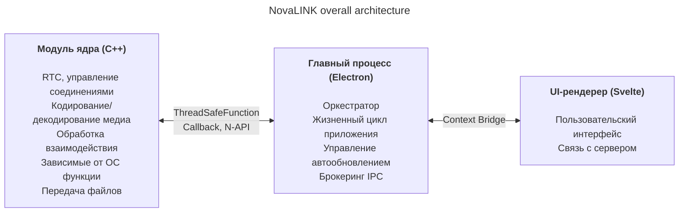
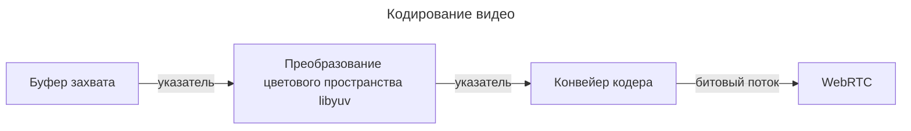
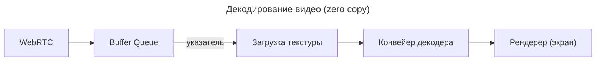

NovaLINK изначально проектировалась как кроссплатформенное решение. ПО удалённого доступа используется не только в Windows, но и широко в macOS и Linux; развёртывание, обновления и политики безопасности различаются по платформам. Тем не менее пользователи хотят, чтобы экраны и опыт оставались «теми же» независимо от ОС. Нам тоже нужна была единообразная среда разработки. Небольшой компании сложно унифицировать все окружения силами одной команды. Инженерные ресурсы нужно было сосредоточить на ядре продукта, а остальное опереть на зрелые экосистемы. Поэтому мы глубоко обдумывали кроссплатформенность с ранних этапов.

Здесь «кроссплатформенность» — не только «один и тот же код собирается на нескольких ОС». Модели разрешений для захвата экрана, перехвата ввода, специальных возможностей, исключений брандмауэра, питания и сна различаются; системы координат и масштабирование при HiDPI, нескольких мониторах и виртуальных дисплеях слегка расходятся. Ожидания от путей установки, автозапуска и фоновой работы тоже разные. Для пользователя это «одинаковый опыт везде», для разработчика — почти одна и та же работа десятками способов. Поэтому с самого начала мы разделили «то, что рисует интерфейс» и «то, где сосредоточены разрешения и нагрузка на производительность», чтобы **сократить повторения**.

На рынке много кроссплатформенных стеков — Flutter, React Native, .NET, Qt и другие. У каждого явные плюсы и минусы; если учесть документацию и сообщества для неожиданных проблем, выбор ещё шире. Но удалённое управление добавляет ограничение, которое сужает поле: **производительность**. Захват экрана, кодирование/декодирование, задержка ввода, буферизация при сетевых колебаниях и передача файлов должны ощущаться почти в реальном времени. Кроссплатформенные фреймворки часто добавляют слои и обёртки, чтобы объединить ОС под одной абстракцией; эти слои покупают удобство разработки ценой узких мест или труднопредсказуемых задержек в худшем случае. Зрелость платформы не снимает эти ограничения автоматически. Сложно поставить на одну ось «популярный кроссплатформенный стек» и «производительность, нужную удалённому управлению».

В удалённом управлении производительность — не абстрактный лозунг: она напрямую связана с воспринимаемым качеством. Задержка от ввода до ядра и обратно на экран через кодирование, передачу и декодирование; политика при потерях пакетов и джиттере (сбрасывать кадры или увеличивать буфер); сочетания разрешения, частоты кадров, битрейта и кодека формируют ощущение «мгновенной реакции». Эти задачи не решаются одним удобством UI-фреймворка; нужны пути захвата под конкретные ОС, аппаратное ускорение и даже планирование потоков. Поэтому мы ставили во главу угла **тонкий управляемый горячий путь**, а не надежду, что «один стек решит всё».

Оглядываясь на ранние кроссплатформенные инструменты, одни казались тонкой UI-оболочкой на нативе, другие требовали строить отдельный мир внутри фреймворка. Java Swing был практичен для своего времени, но ограничен в визуальной согласованности и современных ожиданиях UX. Qt впечатлял согласованностью UI и цепочкой инструментов; как и .NET, требует понимания сборки, развёртывания и экосистемы плагинов — стоимость обучения зависит от команды. Любопытно, что даже среди «кроссплатформенных» инструментов в CI, упаковке и подписи кода постоянно всплывали платформенные исключения. Python упрощал десктопные UI через привязки Qt; интерпретатор и GIL могут обременять долгосрочные сложные конвейеры реального времени.

В последнее время WebAssembly и нативные привязки популяризовали связку «веб-технологии + натив на критичных участках». Вывод NovaLINK близок к этому направлению. Но удалённое управление — долгоживущий процесс с непрерывным потоком медиа и ввода; важнее не демо-интеграция, а как удерживать границы в эксплуатации: обновления, восстановление после сбоев и стабильность памяти.

Со временем всё больше API тонко открывают нативные возможности; стеки с большим пулом разработчиков (Node, React) естественно пришли на десктоп. Visual Studio Code на Electron стал поворотным моментом — за ним стоят серьёзный профилинг и оптимизации вроде разделения рендерера и хоста расширений. Тем не менее факт существования IDE-класса на веб-технологиях и экосистеме Node ломает штамп «кроссплатформенность = низкая производительность». Многие IDE и инструменты форкнули VS Code или вдохновлялись им — мы читаем это как рыночную валидацию. Это привело к мысли, что можно совмещать производительность и UX на кроссплатформенном стеке.

Конечно, у Electron есть реальные издержки: память, зависимость от Chromium, размер дистрибутива. Без оптимизаций уровня VS Code воспринимаемая производительность легко «плавает». Тем не менее небольшая команда может быстро итерировать и использовать зрелые паттерны автообновления, расширений и интеграции инструментов — большое преимущество. Важно **не поручать рендереру всё**; тяжёлая работа должна по замыслу опускаться в ядро.

Мы не пытались, чтобы один фреймворк тащил производительность и UX до конца. Практичный ответ — разделение ролей и делегирование. После нескольких попыток NovaLINK выбрала гибрид: максимально разделить UX и ядро; ядро — для чувствительных к производительности путей, UI — для бренда и удобства. Общая картина кажется простой, но в деталях — почти фрактально — каждая функция задаёт те же вопросы: рендерер или ядро для контроля задержки и энергопотребления? Границы задаются не раз навсегда — их пересматривают при изменении трафика и политик ОС.

Конкретно ядро на C++: RTC, мультимедиа, низкоуровневый ввод и передача файлов сосредоточены в одном месте. Node-аддоны (N-API), thread-safe функции и колбэки связывают главный процесс, чтобы работа шла вне цикла событий UI на отдельных потоках с безопасной выдачей результатов. Главный процесс Electron отвечает за жизненный цикл приложения, автообновление, оболочку (окна, трей, глобальные горячие клавиши) и брокеринг IPC. Рендерер на Svelte ведёт пользовательские сценарии и общение с серверами. Лёгкая модель компонентов помогает поддерживать часто меняющиеся экраны удалённого управления без лишнего шаблонного кода.

На рынке удалённого управления акценты разные: корпоративные политики и аудит против сверхнизкой задержки стриминга. NovaLINK стремится к балансу — не к одной строке бенчмарка, а к предсказуемому поведению в повторяющихся реальных сценариях: подключение, переподключение, смена разрешения, качество сети, длинные сессии. Поэтому архитектура спрашивает и о том, как изолировать режимы отказа: как UI узнает о зависании ядра, как убирать сессии при зависании рендерера? Не эффектно, но необходимо для доверия.

Чтобы это работало, нужно не только проектирование, но и дисциплина в эксплуатации. Однопоточная модель вокруг цикла событий всегда в напряжении с многопоточностью и нативной работой в ядре. Таймеры, ввод и энергополитика различаются по платформам; один и тот же асинхронный шаблон не всегда даёт одинаковый результат. Сообщения IPC нуждаются в согласованных схемах и контроле стоимости сериализации; одновременная нагрузка на медиаконвейер и взаимодействие требует сокращать копирования и конкуренцию за блокировки. Это не уникальная проблема NovaLINK — типично для удалённого управления, совместной работы в реальном времени и стриминга. Но разделение на ядро, главный процесс и рендерер добавляет явную нагрузку на контракты, совместимость версий и стратегии восстановления на границах.

В безопасности чёткие границы полезны: минимальная поверхность рендерера; чувствительные функции вместе с политикой в главном процессе и ядре. Ограничение API через Context Bridge, сериализуемые сообщения и матрица совместимости нативных модулей и версий приложения — сначала хлопотно, но облегчает разбор инцидентов и откаты.

Наконец, кроссплатформенность — не «один раз подумали в начале»: это цепочка решений на всём сроке жизни продукта. Обновления ОС меняют диалоги разрешений; драйверы GPU, брандмауэры и ПО безопасности меняют ощущения от того же кода. Снова и снова перечитывается граница ядра и UI, переносятся обязанности, версионируются контракты. Менее изящно, чем единый стек — зато для пользователя стабильные обновления и привычный интерфейс.

Гибрид — палка о двух концах для разработчиков: длиннее стек отладки, логи и точки выборки по процессам. Мы предпочитаем измеримые величины — статистику кадров, глубину очереди, время IPC, загрузку CPU ядра — вместо «кажется быстро». Регрессионные тесты по платформам, канареечные выкаты и совместимость со старыми клиентами — скрытые издержки кроссплатформенности. Мы принимаем их ради предсказуемости ядра и скорости итераций в UI.

**Компромиссы текущей структуры NovaLINK и смягчения**

| Минус | Суть | Смягчение |
|-------|------|-----------|
| Память | Процессы Chromium поднимают базовый уровень | Критичные к производительности пути по возможности в C++ |
| Холодный старт | Загрузка Electron может занимать секунды | Заставка для улучшения воспринимаемого UX |
| Сложность N-API | Поддержка моста C++↔JS | Разделение процессов по назначению; у каждого процесса своё C++-взаимодействие |
| Размер бинарника | Electron + сборки C++ дают большие установщики | Упаковка ASAR + опциональные бандлы по платформам |
| Сложность сборки | npm и SDK по платформам | Раздельные сборки по платформам в CI |

Одно обновление не снимает все узкие места. Похожие решения и компромиссы будут продолжаться. Тем не менее мы верим, что направление — постоянно перебалансировать ядро и UI и проверять цифрами — верное, и будем дорабатывать по отзывам и измерениям. Статья длинная, мысль простая: кроссплатформенность — не разовый выбор, а непрерывное проектирование, и NovaLINK продолжает эту работу каждый день.
