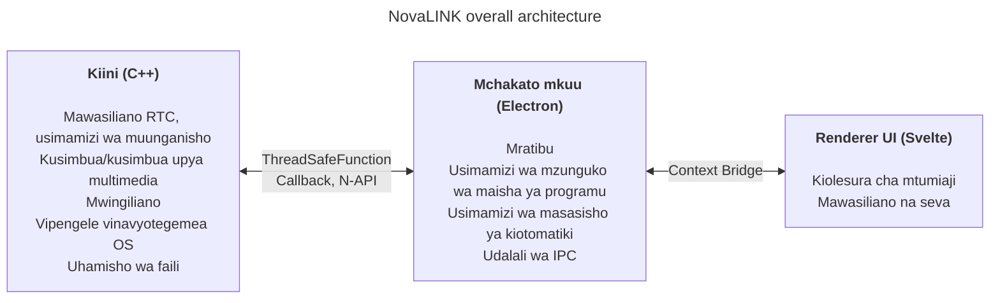
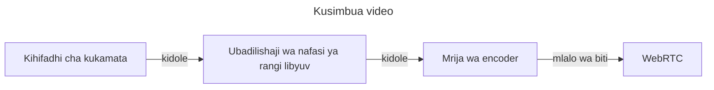
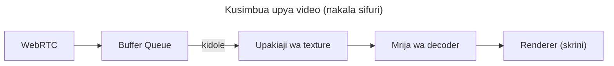

NovaLINK iliundwa kwa mipaka mbalimbali ya mfumo tangu mwanzo. Programu za udhibiti wa mbali hazitumiki tu kwenye Windows, bali pia kwa upana kwenye macOS na Linux, na usambazaji, masasisho na sera za usalama hutofautiana kwa mfumo. Hata hivyo watumiaji wanataka skrini na uzoefu uliotumika mara moja uendelee «vile vile» bila kujali mfumo. Sisi pia tulitaka mazingira thabiti ya maendeleo. Kwa kampuni ndogo, kuunganisha mazingira yote ndani si rahisi. Uwezo wa uhandisi ulilazimika kulenga kwenye kiini cha bidhaa; mengine yalitegemea ikolojia iliyostawi. Kwa hiyo tulifikiria kwa kina kuhusu mipaka mbalimbali tangu awali.

Hapa «mipaka mbalimbali» haimaanishi tu «msimbo huo huo unajenga kwenye OS nyingi». Mifano ya ruhusa kwa kukamata skrini, kuingilia pembejeo, upatikanaji, istisna za kuta wa moto, nguvu na usingizi hutofautiana; mifumo ya kuratibu na ukuzaji chini ya HiDPI, skrini nyingi na onyesho bandia hubadilika kidogo. Matarajio kuhusu njia za kusakinisha, kuanza kiotomatiki na tabia ya mandhari pia hutofautiana. Kwa mtumiaji ni «uzoefu sawa popote», kwa msanidi programu ni karibu kufanya kazi ile ile kwa njia nyingi. Kwa hiyo tangu mwanzo tuligawa «wajibu wa kuchora kiolesura» na «wajibu wa ruhusa na utendaji mzito» ili **kupunguza kurudia**.

Soko lina mifuko mingi ya mipaka mbalimbali — Flutter, React Native, .NET, Qt, n.k. Kila moja ina faida na hasara wazi; ukiongeza nyaraka na jamii kwa matatizo yasiyotarajiwa, chaguo linaongezeka. Lakini huduma ya udhibiti wa mbali ina kikwazo kinachopunguza chaguo: **utendaji**. Kukamata skrini, kusimbua/kusimbua upya, kuchelewa kwa pembejeo, kuhifadhi muda mbele ya mtetemo wa mtandao na uhamisho wa faili — yote yanatarajiwa kuonekana karibu kwa wakati halisi. Mifuko ya mipaka mbalimbali mara nyingi huongeza safu na vifuniko kuunganisha OS nyingi juu ya utoaji mmoja; safu hizo zinanunua urahisi wa maendeleo kwa bei ya vizingiti au kuchelewa kwakutotarajiwa katika hali mbaya zaidi. Ikolojia iliyostawi haiondoi kikomo hicho kiotomatiki. Ni vigumu kulinganisha kwenye mhimili mmoja «mifuko maarufu ya mipaka mbalimbali» na «utendaji unaohitajika kwa udhibiti wa mbali».

Katika udhibiti wa mbali, utendaji si kishindo tupu; unaunganishwa moja kwa moja na ubora unaohisiwa. Kuchelewa kutoka pembejeo hadi kiini na kurudi skrini kupitia kusimbua, utumaji na kusimbua upya; sera wakati wa upotevu wa paketi na jitter (kutupa fremu dhidi ya kuongeza kihifadhi); mchanganyiko wa ubora, kiwango cha fremu, kiwango cha biti na codec — yote hushughulikia hisia ya «majibu ya papo hapo». Matatizo haya hayatatuliwi kwa urahisi wa mifuko ya UI pekee; zinahitaji njia za kukamata za OS, kuharakisha kwa maunzi na hata ratiba ya mifuatano. Kwa hiyo tulipa kipaumbele **njia moto nyembamba na iwezayo kudhibitiwa** badala ya matumaini ya «mfuko mmoja utatatua kila kitu».

Tukirudi kwenye zana za mwanzo za mipaka mbalimbali, zingine zilionekana kama gamba la UI nyembamba juu ya asili, zingine zilihisi kujenga ulimwengu mwingine ndani ya mfuko. Java Swing ilikuwa na manufaa kwa wakati wake lakini ilikuwa na mipaka kwa muundo wa kuona na matarajio ya kisasa ya UX. Qt ilishtua kwa utulivu wa UI na mnyororo wa zana; kama familia ya .NET, inahitaji kuelewa ujenzi, usambazaji na ikolojia ya programu-jalizi — gharama ya kujifunza inategemea timu. Kwa kushangaza, hata kati ya zana zinazosema «mipaka mbalimbali», masuala ya uendeshaji — CI, ufungaji, saini ya msimbo — yaliendelea kuonyesha tofauti kwa mfumo. Python ilifanya UI za mezani kuwa rahisi kupitia viunganishi vya Qt; mchakato wa maelezo na GIL vinaweza kuwa mzigo kwa mialo ya muda halisi yenye utata mrefu.

Hivi karibuni WebAssembly na viunganishi mbalimbali vya asili vimekuza mchanganyiko wa «teknolojia ya wavuti + asili kwa sehemu muhimu za utendaji». Hitimisho la NovaLINK halitofautiani sana na mwelekeo huo. Lakini udhibiti wa mbali ni mchakato wa muda mrefu wenye mtiririko endelevu wa midia na pembejeo; muhimu kuliko muunganisho wa kiwango cha onyesho lilikuwa jinsi ya kudumisha mipaka katika uendeshaji — masasisho, uponyaji baada ya hitilafu na uthabiti wa kumbukumbu.

Muda ukipita, API zaidi zinaonyesha kina kidogo cha uwezo wa asili; mifuko yenye wateja wengi (Node, React) ilingia kwa kawaida kwenye programu za mezani. Visual Studio Code kwenye Electron ilikuwa hatua kubwa — na uchunguzi mzito na uboreshaji kama kutenganisha renderer na mwenyeji wa viendelezi. Hata hivyo ukweli kwamba bidhaa ya kiwango cha IDE inaweza kuwepo juu ya teknolojia ya wavuti na ikolojia ya Node hubomoa dhana ya kwamba mipaka mbalimbali inamaanisha utendaji dhaifu. Programu nyingi za IDE na zana zilifuta au zikawa na msukumo kutoka VS Code — tunaisoma kama uthibitisho wa soko. Ilisababisha tuamini kwamba utendaji na UX vinaweza kulengwa kwa pamoja kwa kutumia mfuko wa mipaka mbalimbali.

Bila shaka, njia ya Electron ina gharama halisi: kumbukumbu, utegemezi wa Chromium, ukubwa wa usambazaji. Bila uboreshaji wa kiwango cha VS Code utendaji unaohisiwa unaweza kutetereka kwa urahisi. Hata hivyo timu ndogo inaweza kuboresha bidhaa haraka na kuchukua mifumo thabiti kwa masasisho ya kiotomatiki, viendelezi na muunganisho wa zana — faida kubwa. Muhimu ilikuwa **kutoruhusu renderer afanye kila kitu**; kazi nzito lazima ishuke kwenye kiini kwa muundo.

Wakati huo huo, hatukujaribu mfuko mmoja kubeba utendaji na UX mwishoni. Jibu la vitendo ni ugawaji wa majukumu na uhamisho. Baada ya majaribu kadhaa NovaLINK ilichagua muundo wa mchanganyiko: toa UX na kiini kwa kiwango kikubwa iwezekanavyo; unda kiini kwa njia nzuri kwa utendaji na UI kwa chapa na matumizi. Picha kubwa inaonekana rahisi, lakini katika maelezo — karibu kama fractal — kila kipengele kinarudia maswali yale yale: renderer au kiini ili kudhibiti kuchelewa na matumizi ya nguvu? Mipaka haipangwa mara moja — inarekebishwa wakati mifumo ya trafiki na sera za OS zinabadilika.

Kwa maana halisi kiini ni C++: RTC, multimedia, pembejeo ya kiwango cha chini na uhamisho wa faili vinashughulikiwa mahali pamoja. Viongezi vya Node (N-API), kazi salama za mfuatano na callbacks huunganisha mchakato mkuu ili kazi iendelee nje ya mzunguko wa matukio ya UI kwenye mifuatano tofauti lakini kupanda matokeo kwa usalama inapohitajika. Mchakato mkuu wa Electron hulenga maisha ya programu, masasisho ya kiotomatiki, ganda (madirisha, trei, njia za mkato za jumla) na udalali wa IPC. Renderer unaotumia Svelte unashughulikia mtiririko wa watumiaji na mazungumzo na seva. Muundo mwepesi wa vipengele husaidia kuweka skrini za udhibiti wa mbali zinazobadilika mara kwa mara bila msimbo wa ziada mwingi.

Soko la udhibiti wa mbali linaangazia tofauti: sera za kampuni na kumbukumbu za ukaguzi dhidi ya utiririshi wa kuchelewa kidogo sana. NovaLINK inatafuta usawa — si mstari mmoja wa kipimo, bali tabia inayoweza kutabiriwa katika hali halisi zinazorudiwa: kuunganisha, kuunganisha tena, kubadilisha ubora, mtiririko wa mtandao, vipindi virefu. Kwa hiyo usanifu pia huuliza jinsi ya kutenganisha hali za kushindwa: UI inajifahamu vipi ikiwa kiini kimesimama? vikao vinasafishwa vipi ikiwa renderer imeganda? Si ya kuvutia, lakini muhimu kwa uaminifu kwenye programu za mipaka mbalimbali.

Kuendesha muundo huu kunahitaji zaidi ya muundo — nidhamu endelevu. Muundo wa mfuatano mmoja karibu na mzunguko wa matukio daima yako katika mvutano na kazi nyingi za mifuatano na asili katika kiini. Vitimiaji, pembejeo na sera za nguvu hutofautiana kwa mfumo; mchoro huo huo wa asinkroni haileti matokeo sawa kila wakati. Ujumbe wa IPC unahitaji miradi inayolingana na gharama ya serialisation inayodhibitiwa; kusukuma mialo ya midia na mwingiliano pamoja kunamaanisha kupunguza nakala na mashindano ya kufuli. Haya si matatizo ya NovaLINK pekee — ni ya kawaida katika udhibiti wa mbali, ushirikiano wa wakati halisi na bidhaa za aina ya utiririshi. Lakini kugawa kiini, mkuu na renderer kuongeza mzigo wazi wa mikataba, utangamano wa toleo na mikakati ya kupona kwenye mipaka.

Kiusalama, mipaka wazi husaidia: uso mdogo wa renderer; uwezo muhimu pamoja na sera katika mchakato mkuu na kiini. Kuzuia API zinazoonyeshwa kupitia Context Bridge, kuweka ujumbe unaoweza kuserialisha, na matriki ya utangamano kwa moduli za asili na matoleo ya programu — ni kazi mwanzoni lakini hurahisisha uchunguzi wa tukio na kurudisha nyuma.

Mwishowe, mipaka mbalimbali si «kufikiria mara moja mwanzoni» — ni mnyororo wa maamuzi maisha yote ya bidhaa. Masasisho ya OS hubadilisha mazungumzo ya ruhusa; dereva za GPU, kuta wa moto na programu za usalama hubadilisha hisia kwa msimbo ule ule. Kila wakati tunasoma tena mpaka wa kiini–UI, kuhamisha majukumu na kuboresha mikataba. Kurudiwa hili halitaji kama mfuko mmoja thabiti — lakini kwa mtumiaji kinamaanisha masasisho thabiti na skrini zilizozoea.

Uzoefu wa msanidi pia mchanganyiko ni upanga wa pande mbili: safu ndefu zaidi za utatuzi, kumbukumbu zimegawanywa kwenye michakato. Tunatanguliza vipimo vinavyoweza kupimika — takwimu za fremu, kina cha foleni, muda wa kwenda-rudi wa IPC, matumizi ya CPU ya kiini — badala ya «inaonekana haraka». Majaribio ya kurudi kwa mfumo, usambazaji wa canary na utangamano na wateja wa zamani ni gharama zilizofichwa za bidhaa za mipaka mbalimbali. Tunakubali gharama hizi kwa utabiri katika kiini na kasi ya uboreshaji katika UI.

**Ushirikiano wa muundo wa sasa wa NovaLINK na upunguzaji wa athari**

| Hasara | Maana | Upunguzaji |
|--------|-------|------------|
| Matumizi ya kumbukumbu | Michakato ya Chromium huongeza kiwango cha msingi | Njia muhimu za utendaji kwa C++ iwezekanavyo |
| Muda wa kuanza baridi | Electron inaweza kuchukua sekunde kadhaa | Skrini ya splash kuboresha UX inayohisiwa |
| Utata wa uunganishaji N-API | Kurekebisha msimbo wa daraja C++↔JS | Muundo wa michakato kwa lengo; kila mchakato mawasiliano yake ya C++ |
| Ukubwa wa faili thabiti | Electron pamoja na ujenzi wa C++ hufanya wainstalli kubwa | Kufunga ASAR + vifungio vya hiari kwa mfumo |
| Utata wa mazingira ya ujenzi | npm pamoja na SDK kwa mfumo | Ujenzi uliotenganishwa kwa mfumo katika CI |

Sasisho moja haliondoi vizingiti vyote. Maamuzi na ushirikiano wa kifani utaendelea. Hata hivyo tunaamini mwelekeo — kusawazisha tena kinachoendelea kiini dhidi ya UI na kuthibitisha kwa nambari — ni sahihi, na tutaendelea kuboresha kwa maoni ya watumiaji na vipimo. Makala ni ndefu, ujumbe ni rahisi: mipaka mbalimbali si chaguo la mara moja bali muundo unaendelea, na NovaLINK inaendelea kufikiria hilo kila siku.
