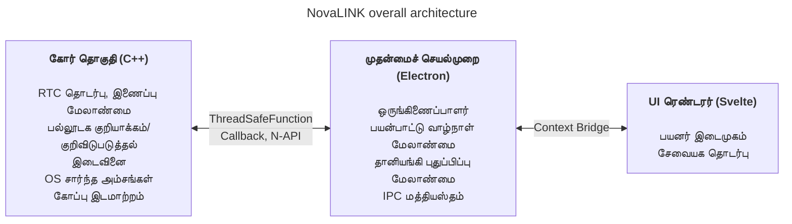
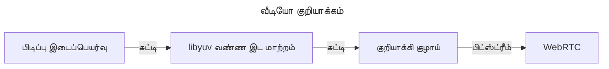
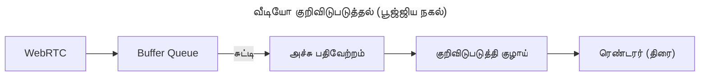

NovaLINK தொடக்கத்திலிருந்தே குறுக்கு-தளத்திற்காக வடிவமைக்கப்பட்டது. தொலைக் கட்டுப்பாடு மென்பொருள் Windows மட்டுமல்ல, macOS மற்றும் Linux இலும் பரவலாக இயங்குகிறது; விநியோகம், புதுப்பிப்புகள் மற்றும் பாதுகாப்புக் கொள்கைகள் தளவாரியாக வேறுபடுகின்றன. இருப்பினும் பயனர்கள் ஒருமுறை பயன்படுத்திய திரை மற்றும் அனுபவம் «அப்படியே» இருக்க வேண்டும் என விரும்புகிறார்கள்—தளம் எதுவாக இருந்தாலும். நாங்களும் ஒருங்கிணைந்த மேம்பாட்டுச் சூழலை விரும்பினோம். சிறிய நிறுவனத்திற்கு அனைத்துச் சூழல்களை உள்ளகமாக ஒருங்கிணைப்பது எளிதல்ல. பொறியியல் திறன் மையப் பொருளில் குவிக்கப்பட வேண்டியது; மீதம் முதிர்ந்த சூழல் அமைப்புகளைச் சார வேண்டியதாயிற்று. ஆதலால் தொடக்க நிலையிலிருந்தே குறுக்கு-தளம் குறித்து ஆழமாகச் சிந்தித்தோம்.

இங்கு «குறுக்கு-தளம்» என்பது வெறும் «அதே குறியீடு பல இயக்க முறைமைகளில் கட்டமைக்கப்படுகிறது» என்ற நிலையில் மட்டும் நிற்கவில்லை. திரைப் பிடிப்பு, உள்ளீட்டு ஹூக்கிங், அணுகல்தன்மை, ஃபயர்வால் விதிவிலக்குகள், மின்சக்தி மற்றும் உறக்கம் போன்ற அனுமதி மாதிரிகள் இயக்க முறைமை வாரியாக வேறுபடுகின்றன; HiDPI, பல திரைகள் மற்றும் மெய்நிகர் காட்சி சூழல்களில் ஆயத்தொகுப்பு மற்றும் அளவிடல் நுணுக்கமாக விலகுகிறது. நிறுவல் பாதைகள், தானியங்கி தொடக்கம் மற்றும் பின்புல நடத்தை குறித்த எதிர்பார்ப்புகளும் மாறுபடுகின்றன. பயனருக்கு இது «எங்கும் ஒரே அனுபவம்», உருவாக்குநருக்கு ஒரே வேலையை பல வழிகளில் மீண்டும் செய்வதற்கு அருகில் உள்ளது. ஆதலால் தொடக்கத்திலிருந்தே «இடைமுகத்தை வரையும் பங்கு» மற்றும் «அனுமதிகளும் செயல்திறனும் குவியும் பங்கு» எனப் பிரித்து **மீள்ச்சியைக் குறைக்க** முடிவு செய்தோம்.

சந்தையில் Flutter, React Native, .NET, Qt போன்ற பல குறுக்கு-தள அடுக்குகள் உள்ளன. ஒவ்வொன்றிற்கும் தெளிவான நன்மைகள் மற்றும் தீமைகள் உள்ளன; எதிர்பாராத சிக்கல்களுக்கு உதவும் ஆவணங்கள் மற்றும் சமூகங்களையும் சேர்த்தால் தேர்வுகள் மேலும் விரிவடைகின்றன. ஆனால் தொலைக் கட்டுப்பாட்டுச் சேவை ஒரு கட்டுப்பாட்டைச் சேர்க்கிறது அது தேர்வை நெருக்குகிறது: **செயல்திறன்**. திரைப் பிடிப்பு, குறியாக்கம்/குறிவிடுபடுத்தல், உள்ளீட்டுத் தாமதம், பிணைய மாறுபாடுகளுக்கு எதிரான இடைப்பெயர்வு, கோப்பு இடமாற்றம்—அனைத்தும் கிட்டத்தட்ட நிகழ்நேரப் பதிலை எதிர்பார்க்கின்றன. குறுக்கு-தளக் கட்டமைப்புகள் பெரும்பாலும் பல இயக்க முறைமைகளை ஒரே சுருக்கத்தின் மீது வைக்க அடுக்குகள் மற்றும் மூடிகளைச் சேர்க்கின்றன; அந்த அடுக்குகள் உருவாக்க வசதிக்குப் பதிலாக மோசமான நிலையில் நெரிசல் அல்லது கணிக்க முடியாத தாமதத்தை விலை கொள்ளலாம். தளம் முதிர்ச்சியடைந்தாலும் இந்த வரம்புகள் தானாக மறையா. «பிரபலமான குறுக்கு-தள அடுக்கு» மற்றும் «தொலைக் கட்டுப்பாட்டிற்குத் தேவையான செயல்திறன்» ஒரே அச்சில் எளிதாக ஒப்பிடப்படுவது கடினம்.

தொலைக் கட்டுப்பாட்டில் செயல்திறன் சாதாரண முழக்கமல்ல; அது நேரடியாக உணரப்படும் தரத்துடன் இணைக்கப்பட்டுள்ளது. உள்ளீடு கோரை அடைந்து குறியாக்கம், பரிமாற்றம், குறிவிடுபடுத்தல் வழியாகத் திரைக்குத் திரும்பும் வரையிலான தாமதம்; பொதி இழப்பு மற்றும் நடுக்கம் அதிகரிக்கும்போது சட்டங்களை எறிய வேண்டுமா இடைப்பெயர்வை அதிகரிக்க வேண்டுமா என்ற கொள்கை; தெளிவுத்திறன், சட்ட வீதம், பிட்வீதம் மற்றும் குறியீட்டு இணைப்புகள்—அனைத்தும் பயனரின் «உடனடி எதிர்வினை» என்ற உணர்வை வடிவமைக்கின்றன. இவை UI கட்டமைப்பின் வசதியால் மட்டும் தீர்வதில்லை; இயக்க முறைமைக்குரிய பிடிப்புப் பாதைகள், வன்பொருள் முடுக்கம் மற்றும் நூல் அட்டவணைப்படுத்தல் ஆகியவற்றையும் பார்க்க வேண்டும். ஆதலால் «ஒரே அடுக்கு எல்லாவற்றையும் தீர்க்கும்» என்ற எதிர்பார்ப்பை விட **சூடான பாதையை மெல்லியதாகவும் கட்டுப்படுத்தக்கூடியதாகவும் வைத்திருப்பதை** முன்னுரிமைப்படுத்தினோம்.

ஆரம்பகால குறுக்கு-தளக் கருவிகளைப் பார்த்தால் சில நேட்டிவின் மீது மெல்லிய UI உறை போல இருந்தன, சிலவற்றில் கட்டமைப்புக்குள் மற்றொரு உலகைக் கட்ட வேண்டியிருந்தது. Java Swing தன் காலத்திற்குப் பயனுள்ளதாக இருந்தது ஆனால் காட்சி ஒருங்கிணைப்பு மற்றும் நவீன UX எதிர்பார்ப்புகளில் வரம்புடையது. Qt UI ஒருங்கிணைப்பு மற்றும் கருவிச் சங்கிலியில் ஈர்க்கிறது; .NET குடும்பம் போலவே கட்டமைப்பு, விநியோகம் மற்றும் செருகுநிரல் சூழல் அமைப்பைப் புரிந்து கொள்ள வேண்டும்—குழு அமைப்பைப் பொறுத்து கற்றல் செலவு அதிகரிக்கலாம். சுவாரசியமாக, «குறுக்கு-தளம்» என்று சொல்லும் கருவிகளுக்கிடையிலும் CI, தொகுப்பாக்கம், குறியீடு கையொப்பம் போன்ற செயல்பாட்டு விஷயங்களில் தளவாரியான விதிவிலக்குகள் தொடர்ந்து வெளிப்பட்டன. Python Qt இணைப்புகள் மூலம் டெஸ்க்டாப் UI எளிதாக்கியது; மொழிபெயர்ப்பாளர் மற்றும் GIL நீண்ட காலத்தில் கனமான நிகழ்நேர குழாய்களை வடிவமைக்கும்போது சுமையாக அமையலாம்.

சமீபத்தில் WebAssembly மற்றும் பல்வேறு நேட்டிவ் இணைப்புகள் மூலம் «வலை தொழில்நுட்பம் + செயல்திறன்-முக்கிய பகுதிகள் நேட்டிவ்» கலவை பொதுவானது. NovaLINK இன் முடிவும் அந்தத் திசையிலிருந்து வேறுபடவில்லை. ஆனால் தொலைக் கட்டுப்பாடு ஊடகம் மற்றும் உள்ளீட்டு தொடர்ச்சியான ஓட்டமுள்ள நீண்டகாலச் செயல்முறை; எனவே வெறும் செயல்முறை நிலை ஒருங்கிணைப்பை விட புதுப்பிப்புகள், செயலிழப்பு மீட்பு மற்றும் நினைவக நிலைப்புத்தன்மை உட்பட செயல்பாட்டு கண்ணோட்டத்தில் எல்லைகளை எவ்வாறு பேணுவது முக்கியமானது.

காலப்போக்கில் நேட்டிவ் திறன்களை மெல்லியதாக வெளிப்படுத்தும் API கள் அதிகரித்தன; Node அல்லது React போன்ற பரந்த உருவாக்குநர் குளத்தைக் கொண்ட அடுக்குகள் டெஸ்க்டாப் பயன்பாடுகளில் இயல்பாகப் புகுந்தன. Electron அடிப்படையிலான Visual Studio Code இன் முதிர்ச்சி ஒரு பெரிய திருப்பம். அதன் பின்னால் ஆழமான சுயவிவரமும் ரெண்டரர் மற்றும் நீட்டிப்பு ஓச்ட் பிரிப்பு போன்ற மேம்பாடுகளும் உள்ளன என நாங்கள் அறிவோம். இருப்பினும் «வலை தொழில்நுட்பம் மற்றும் Node சூழல் அமைப்பின் மீது IDE-நிலை பொருள் சாத்தியம்» என்பது குறுக்கு-தளம் என்றால் குறைந்த செயல்திறன் என்ற கருத்தை உடைக்கிறது. பல IDE களும் கருவிகளும் VS Code ஐ நகலெடித்தன அல்லது உத்வேகம் பெற்றன—அதைச் சந்தை உறுதிப்படுத்தலாக நாங்கள் காண்கிறோம். அது «குறுக்கு-தள அடுக்குடன் செயல்திறன் மற்றும் UX இரண்டையும் இலக்கு வைக்கலாம்» என்ற எண்ணத்திற்கு வழிவகுத்தது.

நிச்சயமாக Electron அடிப்படையிலான அணுகுமுறைக்கு உண்மையான செலவுகள் உள்ளன: நினைவகம், Chromium சார்பு, விநியோக அளவு. VS Code நிலை மேம்பாடு இல்லாமல் உணரப்படும் செயல்திறன் எளிதில் அசைகிறது. இருப்பினும் சிறிய குழு விரைவாகப் பொருளை மேம்படுத்தவும், தானியங்கி புதுப்பிப்பு, நீட்டிப்புகள், கருவி ஒருங்கிணைப்பு போன்ற «முழு பயன்பாட்டைச் சுற்றிய» சிக்கல்களை முதிர்ந்த முறைகளுடன் எடுத்துக் கொள்ளவும் முடிகிறது—பெரிய நன்மை. முக்கியமானது **ரெண்டரர் அனைத்தையும் செய்ய விடாதது**; கனமான வேலை வடிவமைப்பின்படி கோருக்குக் கீழே செல்ல வேண்டும்.

அதே நேரத்தில், ஒரே கட்டமைப்பில் செயல்திறன் மற்றும் UX இரண்டையும் முழுமையாகச் சுமக்க முயற்சிக்கவில்லை. நடைமுறை விடை பங்குப் பிரிப்பு மற்றும் ஒப்படைப்புக்கு அருகில் உள்ளது. பல முயற்சிகளுக்குப் பிறகு NovaLINK கலப்பு அமைப்பைத் தேர்ந்தெடுத்தது: UX மற்றும் கோரை அதிகபட்சமாகப் பிரிக்கவும்; கோரைச் செயல்திறன்-உணர்வு பாதைகளுக்கு, UI ஐப் பிராண்டு மற்றும் பயன்பாட்டுத்தன்மையை ஒருங்கிணைக்கக்கூடிய வடிவில் வடிவமைக்கவும். பெரிய படம் எளிதாகத் தெரிகிறது, ஆனால் விவரங்களில்—கிட்டத்தட்ட பிராக்டல் போல—ஒவ்வொரு அம்சமும் அதே கேள்விகளை மீண்டும் கேட்கிறது: இது ரெண்டரரிலா கோரிலா தாமதம் மற்றும் மின்சக்தி நுகர்வைக் கட்டுப்படுத்த? எல்லை ஒருமுறை நிர்ணயித்து முடிந்துவிடாது; போக்குவரத்து முறைகளும் இயக்க முறைமைக் கொள்கைகளும் மாறும்போது மீண்டும் சீரமைக்க வேண்டும்.

குறிப்பாக கோர் C++ இல்: RTC, பல்லூடகம், குறைந்த நிலை உள்ளீடு மற்றும் கோப்பு இடமாற்றம் போன்ற தாமதம் மற்றும் வழிசெலுத்துதிறன்-உணர்வு பாதைகள் ஒரே இடத்தில். Node துணைநிரல்கள் (N-API), நூல்-பாதுகாப்பு செயல்பாடுகள் மற்றும் மறு அழைப்புகள் முதன்மைச் செயல்முறையுடன் இணைக்கின்றன—UI நிகழ்வு சுழற்சியிலிருந்து வேறு நூல்களில் வேலை நடக்கவும் தேவைப்படும்போது முடிவுகளைப் பாதுகாப்பாக மேலே கொண்டு வரவும். Electron முதன்மைச் செயல்முறை பயன்பாட்டு வாழ்நாள், தானியங்கி புதுப்பிப்பு, சாளரங்கள், டிரே, உலகளாவிய குறுக்குவழிகள் போன்ற ஷெல் பங்குகள் மற்றும் IPC மத்தியஸ்தத்தில் கவனம் செலுத்துகிறது. Svelte அடிப்படையிலான ரெண்டரர் பயனர் ஓட்டங்கள் மற்றும் சேவையக உரையாடல்களைக் கையாளுகிறது. இலகு கூறு மாதிரி மற்றும் தெளிவான நிலை மாற்றங்கள் அடிக்கடி மாறும் தொலைக் கட்டுப்பாட்டுத் திரைகளை அதிகப்படியான வார்ப்புரு குறியீடு இல்லாமல் பேண உதவுகிறது.

தொலைக் கட்டுப்பாட்டுச் சந்தை பொருட்கள் வெவ்வேறு வலுவைக் காட்டுகின்றன: சில நிறுவனக் கொள்கைகள் மற்றும் தணிக்கை பதிவேடுகளுக்கு ஏற்ப, சில மிகக் குறைந்த தாமத ஸ்ட்ரீமிங்கில் கவனம் செலுத்துகின்றன. NovaLINK சமநிலையை நாடுகிறது—ஒரு குறிப்பிட்ட பெஞ்ச்மார்க் வரியல்ல, உண்மையான பயன்பாட்டில் மீண்டும் வரும் காட்சிகள்—இணைப்பு, மீண்டும் இணைப்பு, தெளிவுத்திறன் மாற்றம், பிணையத் தரம், நீண்ட அமர்வுகள்—இலும் கணிக்கக்கூடிய நடத்தை. ஆதலால் கட்டமைப்பு அம்சப் பட்டியலுக்கு முன் தோல்வி முறைகளை எவ்வாறு பிரிப்பது என்றும் கேட்கிறது: கோர் நின்றால் UI எப்படி அறியும்? ரெண்டரர் முடங்கினால் அமர்வுகளை எப்படிச் சுத்தம் செய்வது? கவர்ச்சியானதல்ல, ஆனால் குறுக்கு-தள பயன்பாடுகளில் நம்பிக்கைக்கு அவசியம்.

இந்த அமைப்பை உண்மையில் இயக்க வடிவமைப்பு மட்டும் போதாது—தொடர்ச்சியான செயல்பாடும் ஒழுக்கமும் தேவை. எடுத்துக்காட்டாக நிகழ்வு சுழற்சி-மையமான ஒற்றை நூல் மாதிரி மற்றும் கோரில் பலநூல் நேட்டிவ் வேலை இடையே ஒத்திசைவு எப்போதும் பதற்ற உறவில் உள்ளது. தளவாரியாக டைமர்கள், உள்ளீடு மற்றும் மின்சக்தி மேலாண்மைக் கொள்கைகள் வேறுபடுகின்றன; ஒரே அசிங்கிரோனஸ் முறை எப்போதும் ஒரே முடிவைத் தராது. IPC செய்திகளுக்கு ஒத்த திட்டவடிவம் மற்றும் கட்டுப்படுத்தப்பட்ட தொடர்ச்சியாக்கச் செலவு தேவை; ஊடகக் குழாய் மற்றும் இடைவினையை ஒரே நேரத்தில் தள்ளும்போது தேவையற்ற நகல்கள் மற்றும் பூட்டுப் போட்டி குறைப்பு மீண்டும் மீண்டும் நிகழ்கிறது. இவை NovaLINK க்கு மட்டுமானவை அல்ல—தொலைக் கட்டுப்பாடு, நிகழ்நேர ஒத்துழைப்பு மற்றும் ஸ்ட்ரீமிங் வகைப் பொருட்களில் பொதுவானவை. ஆனால் கோர், முதன்மை மற்றும் ரெண்டரர் எனப் பிரிப்பதால் எல்லைகளில் ஒப்பந்தங்கள், பதிப்பு இணக்கம் மற்றும் தோல்விக்குப் பின் மீட்பு உத்திகளை வெளிப்படையாகக் கையாள வேண்டிய சுமை அதிகரிக்கிறது.

பாதுகாப்பு கண்ணோட்டத்திலும் எல்லைகள் தெளிவாக இருப்பது நல்லது: ரெண்டரின் மேற்பரப்பு சிறியதாக; உணர்வுபூர்வ திறன்கள் முதன்மை மற்றும் கோரில் அனுமதி மற்றும் கொள்கையுடன் இணைத்து. Context Bridge வழி வெளிப்படுத்தப்படும் API வடிவத்தைக் கட்டுப்படுத்துதல், தொடர்ச்சியாக்கக்கூடிய செய்தி வடிவத்தைப் பேணுதல், நேட்டிவ் தொகுதி மற்றும் பயன்பாட்டுப் பதிப்பு இணைப்பு இணக்க அட்டவணை—முதலில் சிரமம், நீண்ட காலத்தில் சம்பவ பகுப்பாய்வு மற்றும் திரும்பப் பெறுதலை எளிதாக்குகிறது.

கடைசியாக, குறுக்கு-தளம் «தொடக்கத்தில் ஒருமுறை சிந்தித்து முடித்தது» அல்ல—பொருள் உயிரோடு இருக்கும் வரை தொடர்ச்சியான தேர்வுகளின் தொடர். OS புதுப்பிப்புகள் அனுமதி உரையாடல்களை மாற்றுகின்றன; GPU இயக்கிகள், ஃபயர்வால்கள், பாதுகாப்பு மென்பொருள் தலையிடும்போது அதே குறியீடும் வேறுபட்டதாக உணரப்படுகிறது. ஒவ்வொரு முறையும் கோர் மற்றும் UI எல்லையை மீண்டும் வாசிக்க வேண்டும், தேவைப்பட்டால் பொறுப்புகளை நகர்த்த வேண்டும், ஒப்பந்தங்களைப் பதிப்பேற்ற வேண்டும். ஒரே அடுக்கை விட குறைவான நளினமாக இந்த மீள்ச்சி கேட்கலாம்—ஆனால் பயனருக்கு நிலையான புதுப்பிப்புகளும் பழக்கமான திரைகளுமாகத் திரும்புகிறது.

உருவாக்குநர் அனுபவத்திலும் கலப்பு இருபுறமும் கூர்மையான வாள்: அடுக்குகள் அதிகரிக்கும்போது பிழைத்திருத்த அடுக்கு நீளமாகிறது, மீண்டும் உருவாக்கச் சூழலுக்கு பதிவுகள் மற்றும் மாதிரி புள்ளிகளைப் பல செயல்முறைகளில் பிரிக்க வேண்டும். ஆதலால் «வேகமாகத் தோன்றுகிறது» என்பதை விட அளவிடக்கூடிய குறிகாட்டிகள்—சட்ட விவரங்கள், வரிசை நெரிசல், IPC சுற்று பயண நேரம், கோர் CPU பயன்பாடு—முன்னுரிமை பெறுகின்றன. தளவாரியான பின்னடைவு சோதனைகள், கனரி விநியோகம், பழைய வாடிக்கையாளர்களுடன் இணக்கமும் குறுக்கு-தளப் பொருட்களின் மறைந்த செலவுகள். கோரில் கணிக்கத்தக்க தன்மையையும் UI இல் விரைவான மேம்பாட்டுச் சுழலையும் ஒருங்கே பெற இந்தச் செலவுகளை ஏற்கிறோம்.

**NovaLINK தற்போதைய அமைப்பின் வருவாய்-செலவுகள் மற்றும் தணிப்புகள்**

| குறைபாடு | உள்ளடக்கம் | தணிப்பு |
|----------|-------------|----------|
| நினைவகப் பயன்பாடு | Chromium செயல்முறைகள் அடிப்படை நினைவை உயர்த்துகின்றன | செயல்திறன் முக்கிய பாதைகளை அதிகபட்சம் C++ இல் |
| குளிர் தொடக்க நேரம் | Electron ஏற்றம் சில வினாடிகள் எடுக்கலாம் | தெறிப்புத் திரை மூலம் உணரப்படும் UX தணிப்பு |
| N-API இணைப்புச் சிக்கல் | C++↔JS பாலம் குறியீடு பராமரிப்பு | நோக்கத்திற்கேற்ப தனிச் செயல்முறை அமைப்பு; ஒவ்வொரு செயல்முறைக்கும் தனி C++ தொடர்பு |
| இருமப் பொருள் அளவு | Electron + C++ கட்டமைப்புகளுடன் நிறுவிகள் பெரியவை | ASAR தொகுப்பாக்கம் + தளவாரியான விருப்பத் தொகுப்புகள் |
| கட்டமைப்புச் சூழல் சிக்கல் | npm + தள SDK ஒரே நேரத்தில் | CI இல் தளவாரியாகப் பிரிக்கப்பட்ட கட்டமைப்புகள் |

ஒரே புதுப்பித்தல் அனைத்து நெரிசல்களையும் அகற்றாது. ஒத்த வகையான முடிவுகளும் வருவாய்-செலவுகளும் தொடரும். இருப்பினும் இதுவரையிலான திசை—கோரில் எது நிலைத்து UI இல் எது ஒப்படைக்கப்படுகிறது என்பதைத் தொடர்ந்து மீண்டும் சமநிலைப்படுத்தி எண்களால் சரிபார்ப்பு—தவறாதது என நம்புகிறோம், பயனர் கருத்து மற்றும் அளவீடுகளின் அடிப்படையில் தொடர்ந்து செம்மைப்படுத்துவோம். கட்டுரை நீளமானது ஆனால் சாரம் எளிது: குறுக்கு-தளம் ஒருமுறைத் தேர்வு அல்ல, தொடர்ச்சியான வடிவமைப்பு, NovaLINK அன்றாடம் அந்தச் சிந்தனையைத் தொடர்கிறது.
