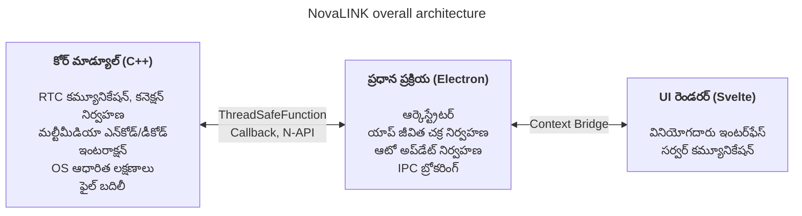
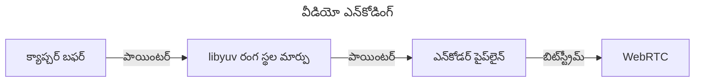
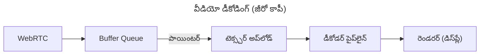

NovaLINK ప్రారంభం నుంచే క్రాస్-ప్లాట్‌ఫారమ్ కోసం రూపొందించబడింది. రిమోట్ కంట్రోల్ సాఫ్ట్‌వేర్ Windowsలో మాత్రమే కాదు, macOS మరియు Linuxలోనూ విస్తృతంగా నడుస్తుంది; అమలు, నవీకరణలు మరియు భద్రతా విధానాలు ప్లాట్‌ఫారమ్ వారీగా భిన్నంగా ఉంటాయి. అయినా వినియోగదారులు ఒకసారి ఉపయోగించిన స్క్రీన్ మరియు అనుభవం «అలాగే» ఉండాలని కోరుకుంటారు—ప్లాట్‌ఫారమ్ ఏదైనా. మేము కూడా స్థిరమైన అభివృద్ధి వాతావరణం కోరుకున్నాము. చిన్న సంస్థకు అన్ని వాతావరణాలను అంతర్గతంగా ఏకీకృతం చేయడం సులభం కాదు. ఇంజినీరింగ్ సామర్థ్యాన్ని కోర్ ఉత్పత్తిపై కేంద్రీకరించాలి; మిగిలినవి పరిపక్వం చెందిన పరిసర వ్యవస్థలపై ఆధారపడాలి. అందుకే ప్రారంభ దశ నుంచే క్రాస్-ప్లాట్‌ఫారమ్ గురించి లోతుగా ఆలోచించాము.

ఇక్కడ «క్రాస్-ప్లాట్‌ఫారమ్» అంటే కేవలం «అదే కోడ్ అనేక OSలలో బిల్డ్ అవుతుంది» అనే స్థాయి మాత్రమే కాదు. స్క్రీన్ క్యాప్చర్, ఇన్‌పుట్ హుకింగ్, యాక్సెసిబిలిటీ, ఫైర్‌వాల్ మినహాయింపులు, పవర్ మరియు స్లీప్ వంటి అనుమతి నమూనాలు OS వారీగా భిన్నంగా ఉంటాయి; HiDPI, మల్టీ మానిటర్ మరియు వర్చువల్ డిస్‌ప్లే వాతావరణంలో నిరూపక వ్యవస్థలు మరియు స్కేలింగ్ సూక్ష్మంగా తేడా అవుతాయి. ఇన్‌స్టాల్ మార్గాలు, ఆటో స్టార్ట్ మరియు నేపథ్య ప్రవర్తనపై ఆశలు కూడా వేర్వేరుగా ఉంటాయి. వినియోగదారుకు ఇది «ఎక్కడా ఒకే అనుభవం», డెవలపర్‌కు మాత్రం ఒకే పనిని డజన్ల కొద్దీ విధానాలలో చేయడానికి దగ్గరగా ఉంటుంది. అందుకే ప్రారంభం నుంచే «UI గీసే పాత్ర» మరియు «అనుమతులు మరియు పనితీరు భారం కేంద్రీకృతమైన పాత్ర» వేరు చేసి **పునరావృత్తిని తగ్గించాలి** అని నిర్ణయించుకున్నాము.

మార్కెట్‌లో Flutter, React Native, .NET, Qt వంటి అనేక క్రాస్-ప్లాట్‌ఫారమ్ స్టాక్‌లు ఉన్నాయి. ప్రతిదానికి స్పష్టమైన ప్రయోజనాలు మరియు లోపాలు ఉన్నాయి; ఊహించని సమస్యలకు సహాయక దస్తావేజులు మరియు కమ్యూనిటీలను కూడా లెక్కిస్తే ఎంపికలు మరింత విస్తృతమవుతాయి. కానీ రిమోట్ కంట్రోల్ సేవ ఒక పరిమితిని జోడిస్తుంది అది ఎంపికను సంకీర్ణం చేస్తుంది: **పనితీరు**. స్క్రీన్ క్యాప్చర్, ఎన్‌కోడ్/డీకోడ్, ఇన్‌పుట్ ఆలస్యం, నెట్‌వర్క్ అస్థిరతకు ఎదురు బఫరింగ్ మరియు ఫైల్ బదిలీ—వీటన్నింటికీ దాదాపు రియల్ టైమ్ ప్రతిస్పందన అంచనా ఉంటుంది. క్రాస్-ప్లాట్‌ఫారమ్ ఫ్రేమ్‌వర్క్‌లు తరచుగా అనేక OSలను ఒకే అమూర్తతపై ఉంచడానికి పొరలు మరియు ర్యాపర్‌లను జోడిస్తాయి; ఆ పొరలు అభివృద్ధి సౌలభ్యాన్ని కొనుగోలు చేస్తాయి—అత్యంత చెడు సందర్భంలో అడ్డంకులు లేదా అంచనా వేయలేని ఆలస్యం. ప్లాట్‌ఫారమ్ పరిపక్వత చెందినా ఆ పరిమితులు ఆటోమేటిక్‌గా తొలగిపోవు. «ప్రజాదరణ పొందిన క్రాస్-ప్లాట్‌ఫారమ్ స్టాక్» మరియు «రిమోట్ కంట్రోల్‌కు అవసరమైన పనితీరు» ఒకే అక్షంపై సరళంగా పోల్చడం కష్టం.

రిమోట్ కంట్రోల్‌లో పనితీరు అమూర్త నినాదం కాదు; అది నేరుగా అనుభవించే నాణ్యతకు అనుసంధానించబడింది. ఇన్‌పుట్ కోర్‌కు చేరి ఎన్‌కోడ్, ప్రసారం, డీకోడ్ ద్వారా తిరిగి స్క్రీన్‌పైకి వచ్చే వరకు ఆలస్యం; ప్యాకెట్ నష్టం మరియు జిటర్ పెరిగినప్పుడు ఫ్రేమ్‌లను విసర్జించడం లేదా బఫర్ పెంచడం ధోరణి; రిజల్యూషన్, ఫ్రేమ్ రేట్, బిట్ రేట్ మరియు కోడెక్ కలయికలు—వినియోగదారుని «తక్షణ ప్రతిస్పందన» అనే భావనను ఆకారం ఇస్తాయి. ఈ సమస్యలు UI ఫ్రేమ్‌వర్క్ సౌలభ్యంతో మాత్రమే పరిష్కరించబడవు; OS-నిర్దిష్ట క్యాప్చర్ మార్గాలు, హార్డ్‌వేర్ వేగవంతం మరియు థ్రెడ్ షెడ్యూలింగ్ కూడా చూడాలి. అందుకే మేము «ఒకే స్టాక్ ప్రతిదీ పరిష్కరిస్తుంది» కంటే **హాట్ పాత్ సన్నగా మరియు నియంత్రణలో ఉంచడాన్ని** ప్రాధాన్యత ఇచ్చాము.

ప్రారంభ క్రాస్-ప్లాట్‌ఫారమ్ సాధనాలను తిరిగి చూస్తే కొన్ని నేటివ్‌పై సన్నని UI పొరలా అనిపించాయి, కొన్నింటిలో ఫ్రేమ్‌వర్క్ లోపల మరో ప్రపంచం కట్టాల్సి వచ్చింది. Java Swing తన కాలానికి ప్రాయోగికమైనా దృశ్య స్థిరత్వం మరియు ఆధునిక UX ఆశలకు పరిమితం. Qt UI స్థిరత్వం మరియు టూల్‌చైన్‌లో మెప్పించింది; .NET కుటుంబంలా బిల్డ్, అమలు మరియు ప్లగిన్ పరిసర వ్యవస్థ అవగాహన అవసరం—జట్టు ఆధారంగా నేర్చుకునే ఖర్చు పెరగవచ్చు. ఆసక్తికరంగా «క్రాస్-ప్లాట్‌ఫారమ్» అని చెప్పే సాధనాల మధ్య కూడా CI, ప్యాకేజింగ్, కోడ్ సైనింగ్ వంటి ఆపరేషనల్ విషయాలలో ప్లాట్‌ఫారమ్-నిర్దిష్ట మినహాయింపులు తరచూ వచ్చాయి. Python Qt బైండింగ్‌ల ద్వారా డెస్క్‌టాప్ UI సులభం చేసింది; ఇంటర్‌ప్రెటర్ మరియు GIL దీర్ఘకాలంలో బరువైన రియల్ టైమ్ పైప్‌లైన్‌లను రూపొందించేటప్పుడు భారంగా పనిచేయవచ్చు.

ఇటీవల WebAssembly మరియు వివిధ నేటివ్ బైండింగ్‌ల ద్వారా «వెబ్ సాంకేతికత + పనితీరు-నాజూకైన భాగాలు నేటివ్» కలయిక సాధారణమైంది. NovaLINK నిర్ణయం ఆ దిశకు దూరంగా లేదు. కానీ రిమోట్ కంట్రోల్ మీడియా మరియు ఇన్‌పుట్ నిరంతరం ప్రవహించే దీర్ఘకాల ప్రక్రియ; డెమో స్థాయి ఏకీకరణ కంటే నవీకరణలు, వైఫల్య పునరుద్ధరణ మరియు మెమరీ స్థిరత్వం సహా ఆపరేషనల్ దృష్టికోణం నుంచి సరిహద్దులను ఎలా నిర్వహించాలో ముఖ్యమైంది.

కాలక్రమేణా నేటివ్ సామర్థ్యాలను సన్నగా బయటపెట్టే APIలు పెరిగాయి; Node లేదా React వంటి విశాల డెవలపర్ పూల్ ఉన్న స్టాక్‌లు డెస్క్‌టాప్ యాప్‌లలో సహజంగా చేరాయి. Electron ఆధారిత Visual Studio Code పరిపక్వం పెద్ద మలుపు. దాని వెనుక లోతైన ప్రొఫైలింగ్ మరియు రెండరర్ మరియు ఎక్స్‌టెన్షన్ హోస్ట్ వేరు చేయడం వంటి ఆప్టిమైజేషన్‌లు ఉన్నాయని మాకు తెలుసు. అయినా «వెబ్ సాంకేతికత మరియు Node పరిసర వ్యవస్థపై IDE-స్థాయి ఉత్పత్తి సాధ్యం» అనే వాస్తవం క్రాస్-ప్లాట్‌ఫారమ్ అంటే తక్కువ పనితీరు అనే ఊహను బద్దలు కొడుతుంది. అనేక IDEలు మరియు సాధనాలు VS Codeను ఫోర్క్ చేశాయి లేదా ప్రేరణ పొందాయి—దానిని మేము మార్కెట్ ధృవీకరణగా చదువుతాము. అది «క్రాస్-ప్లాట్‌ఫారమ్ స్టాక్‌తో పనితీరు మరియు UX రెండింటినీ లక్ష్యం చేయవచ్చు» అనే ఆలోచనకు దారితీసింది.

అనివార్యంగా Electron ఆధారిత విధానానికి వాస్తవ ఖర్చులు ఉన్నాయి: మెమరీ, Chromium ఆధారపడటం, పంపిణీ పరిమాణం. VS Code స్థాయి ఆప్టిమైజేషన్ లేకుండా అనుభవించే పనితీరు సులభంగా కదులుతుంది. అయినా చిన్న జట్టు ఉత్పత్తిని వేగంగా మెరుగుపరచగలదు మరియు ఆటో అప్‌డేట్, ఎక్స్‌టెన్షన్‌లు, సాధన ఏకీకరణ వంటి «మొత్తం యాప్‌ను కవర్ చేసే» సమస్యలను పరిపక్వమైన నమూనాలతో తీసుకోగలదు—పెద్ద ప్రయోజనం. ముఖ్యమైనది **రెండరర్ ప్రతిదీ చేయనివ్వకూడదు**; బరువైన పని డిజైన్ ప్రకారం కోర్‌కు దిగాలి.

అదే సమయంలో, ఒకే ఫ్రేమ్‌వర్క్‌లో పనితీరు మరియు UX రెండింటినీ చివరి వరకు మోయాలని ప్రయత్నించలేదు. వాస్తవిక సమాధానం పాత్రల వేర్పాటు మరియు అప్పగింతకు దగ్గరగా ఉంటుంది. అనేక ప్రయత్నాల తర్వాత NovaLINK హైబ్రిడ్ నిర్మాణాన్ని ఎంచుకుంది: UX మరియు కోర్‌ను గరిష్టంగా వేరు చేయండి; కోర్‌ను పనితీరుకు అనుకూలంగా, UIని బ్రాండ్ మరియు వినియోగయోగ్యతను ఏకీకృతం చేయగల రూపంలో రూపొందించండి. పెద్ద చిత్రం సరళంగా కనిపిస్తుంది, కానీ వివరాలలో—దాదాపు ఫ్రాక్టల్‌లా—ప్రతి లక్షణం ఒకే ప్రశ్నలను పునరావృతం చేస్తుంది: ఇది రెండరర్‌లో ఉండాలా లేదా కోర్‌లోనా ఆలస్యం మరియు విద్యుత్ వినియోగాన్ని నియంత్రించడానికి? సరిహద్దు ఒకసారి నిర్ణయించి ముగిసిపోదు; ట్రాఫిక్ నమూనాలు మరియు OS విధానాలు మారినప్పుడల్లా మళ్లీ సరిచేయాలి.

నిర్దిష్టంగా కోర్ C++లో: RTC, మల్టీమీడియా, తక్కువ స్థాయి ఇన్‌పుట్ మరియు ఫైల్ బదిలీ వంటి ఆలస్యం మరియు థ్రూపుట్-సున్నిత మార్గాలు ఒకే చోట. Node యాడ్-ఆన్‌లు (N-API), థ్రెడ్-సేఫ్ ఫంక్షన్‌లు మరియు కాల్‌బ్యాక్‌లు ప్రధాన ప్రక్రియకు కనెక్ట్ చేస్తాయి—UI ఈవెంట్ లూప్ నుంచి వేరు థ్రెడ్‌లలో పని జరిగేలా, అవసరమైనప్పుడు ఫలితాలను సురక్షితంగా పైకి తీసుకురాగలవు. Electron ప్రధాన ప్రక్రియ యాప్ జీవితకాలం, ఆటో అప్‌డేట్, విండోలు, ట్రే, గ్లోబల్ షార్ట్‌కట్‌ల వంటి షెల్ పాత్రలు మరియు IPC బ్రోకరింగ్‌పై దృష్టి పెడుతుంది. Svelte ఆధారిత రెండరర్ వినియోగదారు ప్రవాహాలు మరియు సర్వర్‌లతో సంభాషణను నిర్వహిస్తుంది. తేలికైన కాంపోనెంట్ మోడల్ మరియు స్పష్టమైన స్థితి నిర్వహణ తరచుగా మారే రిమోట్ కంట్రోల్ స్క్రీన్‌లను అతివ్యాప్త బాయిలర్‌ప్లేట్ లేకుండా నిర్వహించడానికి సహాయపడుతుంది.

రిమోట్ కంట్రోల్ మార్కెట్‌లో ఉత్పత్తులు వేర్వేరు అంశాలపై బలం చూపుతాయి: కొన్ని సంస్థా విధానాలు మరియు ఆడిట్ లాగ్‌లకు అనుగుణంగా, కొన్ని అతి తక్కువ ఆలస్య స్ట్రీమింగ్‌పై దృష్టి పెడతాయి. NovaLINK సమతుల్యత కోరుకుంటుంది—ఒక నిర్దిష్ట బెంచ్‌మార్క్ పంక్తి కాదు, నిజ జీవితంలో పునరావృతమయ్యే దృశ్యాలలో—కనెక్ట్, రీకనెక్ట్, రిజల్యూషన్ మార్పు, నెట్‌వర్క్ నాణ్యత, దీర్ఘ సెషన్‌లు—కూడా అంచనా వేయదగిన ప్రవర్తన. అందుకే ఆర్కిటెక్చర్ లక్షణ జాబితాతో పాటు విఫలతా మోడ్‌లను ఎలా వేరు చేయాలో కూడా అడుగుతుంది: కోర్ ఆగిపోతే UI ఎలా తెలుసుకుంటుంది? రెండరర్ స్థిరంగా ఉంటే సెషన్‌లను ఎలా శుభ్రం చేయాలి? ఆకర్షణీయం కాదు, కానీ క్రాస్-ప్లాట్‌ఫారమ్ యాప్‌లలో విశ్వాసానికి తప్పనిసరి.

ఈ నిర్మాణాన్ని నిజంగా నడపడానికి డిజైన్ మాత్రమే సరిపోదు—నిరంతర ఆపరేషన్ మరియు ఆచారం అవసరం. ఉదాహరణకు ఈవెంట్ లూప్-కేంద్రీకృత ఒకే థ్రెడ్ నమూనా మరియు కోర్‌లోని మల్టీథ్రెడ్ నేటివ్ పనుల మధ్య సమకాలీకరణ ఎల్లప్పుడూ ఉద్రిక్త సంబంధంలో ఉంటుంది. ప్లాట్‌ఫారమ్ వారీగా టైమర్‌లు, ఇన్‌పుట్ మరియు పవర్ నిర్వహణ విధానాలు భిన్నం; ఒకే అసింక్రోనస్ నమూనా ఎల్లప్పుడూ ఒకే ఫలితం ఇవ్వదు. IPC ద్వారా వెళ్లే సందేశాలకు స్కీమా సరిపోవాలి మరియు సీరియలైజేషన్ ఖర్చు నియంత్రించబడాలి; మీడియా పైప్‌లైన్ మరియు ఇంటరాక్షన్‌ను ఒకేసారి నెట్టినప్పుడు అనవసర కాపీలు మరియు లాక్ పోటీ తగ్గించడం పునరావృతం అవుతుంది. ఇవి కేవలం NovaLINKకు ప్రత్యేకం కావు—రిమోట్ కంట్రోల్, రియల్ టైమ్ సహకారం మరియు స్ట్రీమింగ్ రకం ఉత్పత్తులలో సాధారణం. కానీ కోర్, ప్రధాన మరియు రెండరర్‌ను పొరలుగా విభజించడం సరిహద్దులలో ఒప్పందాలు, సంస్కరణ అనుకూలత మరియు విఫలత తర్వాత పునరుద్ధరణ వ్యూహాలను మరింత స్పష్టంగా నిర్వహించాల్సిన భారాన్ని జోడిస్తుంది.

భద్రతా దృష్టికోణం నుంచి సరిహద్దులు ఎంత స్పష్టంగా ఉంటే అంత మంచిది: రెండరర్ యొక్క ఉపరితలం చిన్నదిగా ఉంచండి; సున్నితమైన సామర్థ్యాలు ప్రధాన మరియు కోర్ వైపు అనుమతి మరియు విధానంతో కలిపి నిర్వహించండి. Context Bridge ద్వారా బయటపెట్టే API ఆకృతిని పరిమితం చేయడం, సీరియలైజ్ చేయగల సందేశ రూపం నిర్వహించడం, నేటివ్ మాడ్యూల్ మరియు యాప్ సంస్కరణ కలయిక అనుకూలత మాత్రిక్స్ నిర్వహించడం—మొదట కష్టం కానీ దీర్ఘకాలంలో సంఘటన విశ్లేషణ మరియు రోల్‌బ్యాక్ సులభం చేస్తుంది.

చివరగా, క్రాస్-ప్లాట్‌ఫారమ్ «మొదట ఒకసారి ఆలోచించి ముగించేది» కాదు—ఉత్పత్తి జీవించి ఉన్నంత కాలం నిరంతర ఎంపికల శ్రేణి. OS నవీకరణలు అనుమతి డైలాగ్‌లను మారుస్తాయి; GPU డ్రైవర్‌లు, ఫైర్‌వాల్‌లు, భద్రతా సాఫ్ట్‌వేర్ జోక్యం చేసుకుంటే అదే కోడ్ కూడా వేరేగా అనిపిస్తుంది. ప్రతిసారి కోర్ మరియు UI సరిహద్దును మళ్లీ చదవాలి, అవసరమైతే బాధ్యతలు మార్చాలి, ఒప్పందాలను సంస్కరించాలి. ఏకీకృత స్టాక్ కంటే విసుగు పుట్టించే ఈ పునరావృత్తి చివరకు వినియోగదారుకు స్థిరమైన నవీకరణలు మరియు పరిచయ స్క్రీన్‌లుగా తిరిగి వస్తుంది.

డెవలపర్ అనుభవంలో కూడా హైబ్రిడ్ రెండు అంచుల కత్తి: పొరలు పెరిగేకొద్దీ డీబగ్ స్టాక్ పొడవుగా ఉంటుంది, పునరుత్పత్తి వాతావరణానికి లాగ్‌లు మరియు నమూనా బిందువులను అనేక ప్రక్రియలలో పంచాలి. అందుకే మేము «వేగంగా అనిపిస్తుంది» కంటే ఫ్రేమ్ గణాంకాలు, క్యూ నిండుతనం, IPC రౌండ్ ట్రిప్ సమయం, కోర్ CPU వినియోగం వంటి కొలదగిన సూచికలకు ప్రాధాన్యత ఇస్తాము. ప్లాట్‌ఫారమ్-నిర్దిష్ట రిగ్రెషన్ పరీక్షలు, కానరీ అమలు, పాత క్లయింట్‌లతో పరస్పర కార్యక్షమత కూడా క్రాస్-ప్లాట్‌ఫారమ్ ఉత్పత్తుల దాచిన ఖర్చు. ఈ ఖర్చులను కోర్‌లో అంచనా వేయదగినత మరియు UIలో వేగవంతమైన మెరుగుదల చక్రం రెండింటినీ పొందడానికి మేము అంగీకరిస్తాము.

**NovaLINK ప్రస్తుత నిర్మాణంలోని రాబడి-ఖర్చులు మరియు మృదుపరిచే మార్గాలు**

| లోపం | వివరణ | మృదుపరచే మార్గం |
|-------|--------|------------------|
| మెమరీ వినియోగం | Chromium ప్రక్రియల వలన ప్రాథమిక మెమరీ ఎక్కువ | పనితీరు క్రిటికల్ మార్గాలను గరిష్టంగా C++లో |
| ప్రారంభ రన్ సమయం | Electron లోడింగ్ కొన్ని సెకన్లు పట్టవచ్చు | స్ప్లాష్ స్క్రీన్‌తో అనుభవించే UX మెరుగు |
| N-API బైండింగ్ సంక్లిష్టత | C++↔JS బ్రిజ్ కోడ్ నిర్వహణ | ఉద్దేశ్యానుసారం వేరు ప్రక్రియ నిర్మాణం; ప్రతి ప్రక్రియకు స్వతంత్ర C++ కమ్యూనికేషన్ |
| బైనరీ పరిమాణం | Electron + C++ బిల్డ్‌తో ఇన్‌స్టాలర్ పెద్దది | ASAR ప్యాకింగ్ + ప్లాట్‌ఫారమ్-నిర్దిష్ట ఐచ్ఛిక బండిల్‌లు |
| బిల్డ్ వాతావరణ సంక్లిష్టత | npm + ప్లాట్‌ఫారమ్ SDK ఏకకాలంలో | CIలో ప్లాట్‌ఫారమ్ వారీగా వేరు బిల్డ్‌లు |

ఒకే నవీకరణ అన్ని అడ్డంకులను తొలగించదు. ఇలాంటి నిర్ణయాలు మరియు రాబడి-ఖర్చులు కొనసాగుతాయి. అయినా ఇప్పటివరకు దిశ—కోర్‌లో ఏమి ఉంచాలి మరియు UIకు ఏమి వదులాలో నిరంతరం పునర్‌మాపనం మరియు సంఖ్యలతో ధృవీకరణ—తప్పు కాదని మేము నమ్ముతాము, మరియు వినియోగదారు అభిప్రాయం మరియు కొలతల ఆధారంగా మెరుగుపరుచుకుంటాము. వ్యాసం పొడవుగా ఉంది కానీ సారాంశం సరళం: క్రాస్-ప్లాట్‌ఫారమ్ ఒకసారి చేసే ఎంపిక కాదు, నిరంతర డిజైన్, మరియు NovaLINK ప్రతిరోజూ ఆ ఆలోచన కొనసాగిస్తుంది.
