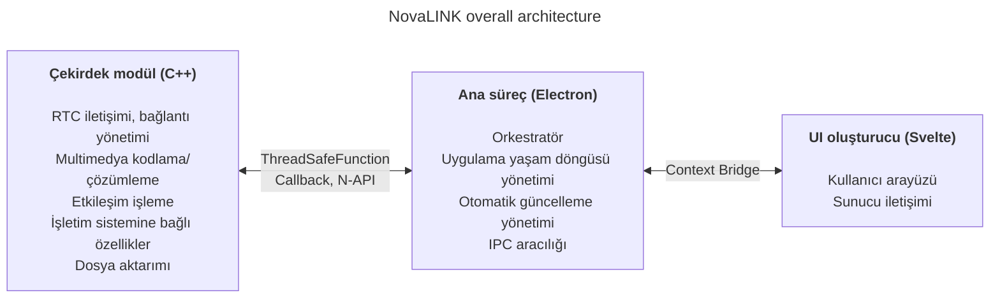
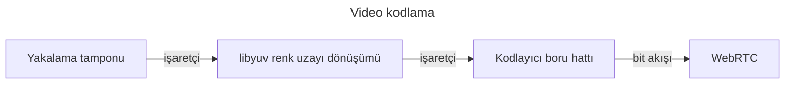
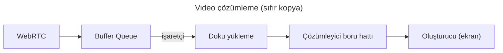

NovaLINK baştan çapraz platform için tasarlandı. Uzaktan kontrol yazılımı yalnızca Windows’ta değil, macOS ve Linux’ta da yaygın çalışır; dağıtım, güncelleme ve güvenlik politikaları platforma göre değişir. Yine de kullanıcılar bir kez kullandıkları ekran ve deneyimin “aynı” kalmasını ister; platform fark etmez. Biz de tutarlı bir geliştirme ortamı istiyorduk. Küçük bir şirket için tüm ortamları içeride tek tip hale getirmek kolay değildir. Mühendislik gücünü ürün çekirdeğinde yoğunlaştırmak, geri kalanında olgun ekosistemlerden yararlanmak gerekiyordu. Bu yüzden erken aşamadan itibaren çapraz platformu derinlemesine düşündük.

Burada “çapraz platform” yalnızca “aynı kodun birkaç işletim sisteminde derlenmesi” düzeyinde değildir. Ekran yakalama, girdi kancalama, erişilebilirlik, güvenlik duvarı istisnaları, güç ve uyku gibi izin modelleri işletim sistemine göre değişir; HiDPI, çoklu monitör ve sanal ekranlarda koordinat sistemi ve ölçekleme ince farklarla kayar. Kurulum yolları, otomatik başlatma ve arka plan davranışına ilişkin beklentiler de farklıdır. Kullanıcı için “her yerde aynı deneyim”, geliştirici için ise aynı işi onlarca farklı şekilde yapmak gibidir. Bu yüzden baştan “arayüzü çizen rol” ile “izinleri ve performans yükünü üstlenen rol”ü ayırarak **tekrarı azaltmaya** karar verdik.

Piyasada Flutter, React Native, .NET, Qt gibi birçok çapraz platform yığını var; her birinin net artı ve eksileri vardır; beklenmedik sorunlarda yardımcı olacak belgeler ve toplulukları da hesaba kattığınızda seçenekler daha da genişler. Ancak uzaktan kontrol hizmeti seçenekleri daraltan bir kısıt ekler: **performans**. Ekran yakalama, kodlama/çözümleme, girdi gecikmesi, ağ dalgalanmalarına karşı tamponlama ve dosya aktarımı neredeyse gerçek zamanlı bir yanıt bekler. Çapraz platform çerçeveleri çoğu zaman birçok işletim sistemini tek soyutlamanın üzerine oturtmak için katmanlar ve sarmalayıcılar ekler; bu katmanlar geliştirme kolaylığını en kötü durumda darboğaz veya öngörülmesi zor gecikmelerle satın alır. Olgun bir platform bu sınırları otomatik olarak ortadan kaldırmaz. “Popüler bir çapraz platform yığını” ile “uzaktan kontrolün gerektirdiği performansı” tek eksende basitçe karşılaştırmak zordur.

Uzaktan kontrolde performans soyut bir slogan değildir; doğrudan algılanan kaliteyle bağlantılıdır. Girdinin çekirdeğe ulaşmasından kodlama, iletim ve çözümleme yoluyla ekrana geri dönmesine kadar gecikme; paket kaybı ve jitter arttığında kareleri düşürme veya tamponu büyütme politikası; çözünürlük, kare hızı, bit hızı ve codec birleşimleri, kullanıcının “anında tepki” izlenimini şekillendirir. Bu sorunlar yalnızca UI çerçevesinin kolaylığıyla çözülmez; işletim sistemine özgü yakalama yolları, donanım hızlandırması ve hatta iş parçacığı zamanlaması gerekir. Bu yüzden “tek yığın her şeyi çözer” umudundan çok **sıcak yolu ince ve kontrol edilebilir tutmayı** önceliklendirdik.

Erken çapraz platform araçlarına döndüğümüzde bazıları yerel kodun üzerine ince bir UI kabuğu gibi duruyordu; bazıları çerçeve içinde başka bir dünya kurmayı gerektiriyordu. Java Swing dönemi için pratikti ancak görsel tutarlılık ve modern UX beklentilerinde sınırlı kalıyordu. Qt, UI tutarlılığı ve araç zinciri açısından etkileyiciydi; .NET ailesi gibi kendi derleme, dağıtım ve eklenti ekosistemini anlamayı gerektiriyor ve ekip yapısına göre öğrenme maliyeti artabiliyordu. İlginç olan, “çapraz platform” diyen araçlar arasında bile CI, paketleme, kod imzalama gibi operasyonel konularda platforma özel istisnaların sürekli çıkması ve çapraz platform desteğinin başlı başına zahmet olmasıydı. Python, Qt bağlamaları vb. ile masaüstü arayüzlerini kolaylaştırdı; ancak yorumlayıcı ve GIL gibi unsurlar uzun vadede ağır ve karmaşık gerçek zamanlı boru hatları tasarlarken yük oluşturabilir.

Son yıllarda WebAssembly ve çeşitli yerel bağlamalar aracılığıyla “web teknolojisi + performans kritik kısımlar yerel” birleşimi yaygınlaştı. NovaLINK’in sonucu da bu yönden pek farklı değil. Ancak uzaktan kontrol, medya ve girdinin sürekli aktığı uzun süreli bir süreçtir; bu yüzden yalnızca demo düzeyinde entegrasyondan çok, güncelleme, arıza kurtarma ve bellek kararlılığı dahil operasyonel açıdan sınırların nasıl korunacağı daha önemliydi.

Zamanla yerel işlevleri ince gösteren API’ler çoğaldı; Node veya React gibi geniş geliştirici havuzuna sahip yığınlar masaüstü uygulamalara doğal biçimde sızdı. Bunların arasında Electron tabanlı Visual Studio Code’un olgunluğu büyük bir dönüm noktasıydı. Arkasında yoğun profil çıkarma ve oluşturucu ile uzantı ana bilgisayarının ayrılması gibi iyileştirmeler olduğunu biliyoruz. Yine de “web teknolojisi ve Node ekosistemi üzerinde IDE sınıfı bir ürünün var olması”, çapraz platformun düşük performans olduğu varsayımını kıran bir örnektiir. Birçok IDE ve aracın VS Code’u çatallaması veya ondan ilham alması, bunun yalnızca kişisel bir tercih değil piyasa doğrulaması olduğunu düşündürüyor. Bizi “çapraz platform yığınıyla hem performans hem UX’i birlikte hedefleyebiliriz” düşüncesine götürdü.

Elbette Electron tabanlı yaklaşımın bellek kullanımı, Chromium bağımlılığı ve dağıtım boyutu gibi gerçek maliyetleri var. VS Code düzeyinde iyileştirme yoksa algılanan performans kolayca sarsılır. Yine de küçük bir ekibin ürünü hızlı iyileştirmesi ve otomatik güncelleme, uzantılar ve araç entegrasyonu gibi “tüm uygulamayı saran” sorunları olgun kalıplarla yürütmesi büyük avantaj. Önemli olan **oluşturucunun her şeyi yapmasına izin vermemekti**; ağır işin tasarım gereği çekirdeğe indirilmesi gerekiyordu.

Aynı anda, tek bir çerçevenin performans ve UX’i baştan sona üstlenmesini de beklemiyorduk. Pratik yanıt rol ayrımına ve delegasyona yakındır. Birçok denemeden sonra NovaLINK’in seçtiği yapı hibrittir: UX ile çekirdeği mümkün olduğunca ayırmak; çekirdeği performansa uygun şekilde, arayüzü marka ve kullanılabilirliği birleştirebilecek şekilde tasarlamak. Büyük resim basit görünür; ayrıntıya inildiğinde ise fraktal gibi her özellik aynı soruları tekrarlar: Bu özellik oluşturucuda mı kalmalı, gecikme ve güç tüketimini kontrol etmek için çekirdekte mi olmalı? Sınır bir kez çizilip bitmez; trafik örüntüleri ve işletim sistemi politikaları değiştikçe yeniden ayarlanır.

Somut olarak çekirdek C++’tır: RTC, multimedya, düşük seviye girdi ve dosya aktarımı gibi gecikme ve verim hassas yollar tek yerde toplanır. Node eklentileri (N-API), iş parçacığı güvenli işlevler ve geri aramalar ana sürece bağlanır; böylece iş UI olay döngüsünden ayrı iş parçacıklarında yürütülür, gerektiğinde sonuçlar güvenle yukarı iletilir. Electron ana süreci uygulama ömrü, otomatik güncelleme, pencere, tepsi ve genel kısayollar gibi kabuk rolleri ve IPC aracılığına odaklanır. Svelte tabanlı oluşturucu kullanıcı akışlarını ve sunucularla konuşmayı üstlenir. Bileşen modeli hafif ve durum değişimleri net olduğundan, sık değişen uzaktan kontrol ekranlarını aşırı kalıp kod olmadan sürdürülebilir tutmayı hedefleriz.

Uzaktan kontrol pazarı ürüne göre farklı vurgular taşır: bazıları kurumsal politika ve denetim günlüklerine göre, bazıları ultra düşük gecikmeli akışa odaklanır. NovaLINK’in aradığı denge “tek bir kıyaslama satırı” değil; bağlanma ve yeniden bağlanma, çözünürlük değişimi, ağ kalitesi dalgalanmaları, uzun oturumlar gibi gerçek kullanımda tekrarlayan senaryolarda öngörülebilir davranıştır. Bu yüzden mimari, özellik listesinden önce arıza modlarının nasıl izole edileceğini de sorar: Çekirdek durunca arayüz nasıl haberdar olur? Oluşturucu kilitlense bile oturumlar nasıl temizlenir? Çekici değil ama çapraz platform uygulamalarda güven için şarttır.

Bu yapıyı gerçekten çalıştırmak tasarımdan fazlasını ister: sürekli operasyon ve ölçülülük. Örneğin olay döngüsü merkezli tek iş parçacığı modeli ile çekirdekteki çok iş parçacıklı ve yerel iş arasındaki eşzamanlama her zaman gerilimlidir. Platforma göre zamanlayıcılar, girdi ve güç yönetimi politikaları farklıdır; aynı asenkron desen her zaman aynı sonucu vermez. IPC ile giden gelen iletiler şemaya uygun olmalı ve serileştirme maliyeti kontrol altında tutulmalı; medya boru hattı ile etkileşimi aynı anda zorlarken gereksiz kopyalar ve kilit çekişmesi azaltılır. Bu tür görevler yalnızca NovaLINK’e özgü değil; uzaktan kontrol, gerçek zamanlı iş birliği ve akış sınıfı ürünlerde yaygındır. Ancak çekirdek, ana ve oluşturucuyu katmanlamak, sınırlarda sözleşme, sürüm uyumu ve arıza sonrası kurtarma stratejilerini daha açık ele alma yükünü getirir.

Güvenlik açısından da sınırlar ne kadar net olursa o kadar iyidir: Oluşturucu mümkün olduğunca dar bir yüzey sunmalı; hassas işlevler ana süreç ve çekirdekte izin ve politika ile birlikte ele alınmalıdır. Context Bridge ile sunulan API biçimini sınırlamak, serileştirilebilir ileti biçimini korumak, yerel modül sürümü ile uygulama sürümü birleşimini uyumluluk matrisiyle yönetmek başta zahmetli olsa da uzun vadede olay analizi ve geri almayı kolaylaştırır.

Son olarak çapraz platform “başta bir kez düşünülüp biter” değildir; ürün yaşadığı sürece süren seçimler zinciridir. İşletim sistemi güncellemeleri izin iletişim kutularını değiştirir; GPU sürücüleri, güvenlik duvarları ve güvenlik yazılımları devreye girince aynı kod bile farklı hissedilir. Her seferinde çekirdek ile arayüz sınırını yeniden okur, gerektiğinde sorumlulukları kaydırır ve sözleşmeleri yükseltiriz. Zarif tek yığından daha sıkıcı duyulan bu tekrar, sonunda kullanıcıya kararlı güncellemeler ve tanıdık ekranlar olarak döner.

Geliştirici deneyimi açısından hibrit yapı da iki uçlu bir kılıçtır: Katman arttıkça hata ayıklama yığını uzar; yeniden üretim ortamı için günlükleri ve örnekleme noktalarını birden fazla sürece yaymak gerekir. Bu yüzden “hızlı hissediyor”dan çok kare istatistikleri, kuyruk birikimi, IPC gidiş dönüş süresi, çekirdek CPU kullanımı gibi ölçülebilir göstergeleri önceliklendiriyoruz. Platforma özel gerileme testleri, kanarya dağıtımları ve eski istemcilerle birlikte çalışabilirlik de çapraz platform ürünlerin gizli maliyetidir. Bu maliyetleri, çekirdekte öngörülebilirlik ile arayüzde yineleme hızını birlikte kazanmak için göze aldık.

**NovaLINK mevcut yapısının ödünleşmeleri ve hafifletmeler**

| Eksi | İçerik | Hafifletme |
|------|--------|------------|
| Bellek kullanımı | Chromium süreçleri taban çizgisini yükseltir | Performans kritik yollar mümkün olduğunca C++’ta |
| Soğuk başlangıç süresi | Electron yüklemesi saniyeler sürebilir | Splash ekranı ile algılanan UX |
| N-API bağlama karmaşıklığı | C++↔JS köprü kodunu yönetme yükü | Amaçlara göre ayrı süreç yapısı; her süreç kendi C++ iletişimi |
| İkili boyutu | Electron + C++ derlemeleriyle kurulum büyük | ASAR paketleme + platforma özel isteğe bağlı paketler |
| Derleme ortamı karmaşıklığı | npm ile platform SDK’larını birlikte yönetmek | CI’da platforma göre ayrı derlemeler |

Tek bir güncelleme tüm darboğazları ortadan kaldırmaz. Benzer türde kararlar ve ödünleşmeler sürecek. Yine de bugüne kadar yönün — çekirdeğe ne kalıp arayüze ne bırakılacağını sürekli yeniden dengelemek ve sayılarla doğrulamak — doğru olduğuna inanıyoruz; kullanıcı geri bildirimi ve ölçümlerle ince ayara devam edeceğiz. Yazı uzadı ama özü basit: çapraz platform tek seferlik seçim değil, sürekli tasarımdır ve NovaLINK bu düşünceyi her gün sürdürüyor.
