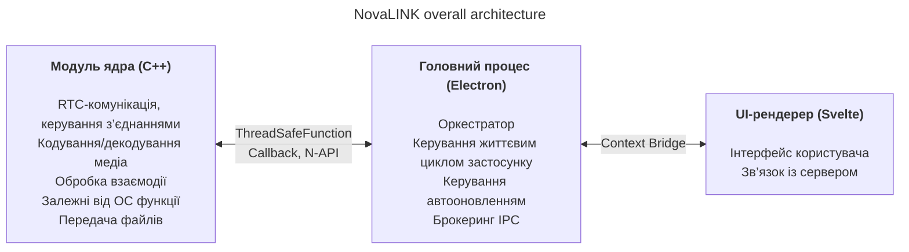
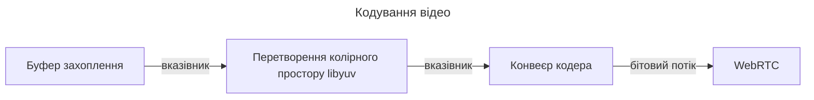
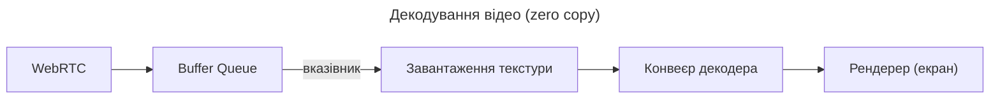

NovaLINK спроєктовано кросплатформенно з самого початку. Програмне забезпечення віддаленого керування працює не лише в Windows, а й широко в macOS і Linux; розгортання, оновлення та політики безпеки відрізняються за платформою. Проте користувачі хочуть, щоб екрани й досвід залишалися «тими самими» незалежно від платформи. Нам також потрібне було послідовне середовище розробки. Для невеликої компанії важко уніфікувати всі середовища внутрішньо. Інженерні зусилля треба було зосередити на ядрі продукту, а решту спирати на зрілі екосистеми. Тому ми глибоко замислювалися над кросплатформенністю з ранніх етапів.

Тут «кросплатформенність» — не лише «той самий код збирається на кількох ОС». Моделі дозволів для захоплення екрана, перехоплення вводу, доступності, винятків брандмауера, живлення та сну відрізняються; системи координат і масштабування при HiDPI, кількох моніторах і віртуальних дисплеях трохи розходяться. Очікування щодо шляхів установки, автозапуску та фонової поведінки теж різні. Для користувача це «однаковий досвід усюди», для розробника — майже те саме завдання десятками способів. Тому з початку ми розділили «роль, що малює інтерфейс» і «роль, де зосереджені дозволи й навантаження на продуктивність», щоб **зменшити повторення**.

На ринку багато кросплатформенних стеків — Flutter, React Native, .NET, Qt тощо. У кожного чіткі плюси й мінуси; якщо врахувати документацію та спільноти для неочікуваних проблем, вибір ще ширший. Але віддалене керування додає обмеження, яке звужує поле: **продуктивність**. Захоплення екрана, кодування/декодування, затримка вводу, буферизація при мережевих коливаннях і передача файлів мають відчуватися майже в реальному часі. Кросплатформенні фреймворки часто додають шари й обгортки, щоб об’єднати кілька ОС під однією абстракцією; ці шари купують зручність розробки ціною вузьких місць або важкопередбачуваних затримок у найгіршому випадку. Зрілість платформи не прибирає ці межі автоматично. Важко порівняти на одній осі «популярний кросплатформенний стек» і «продуктивність, потрібну для віддаленого керування».

У віддаленому керуванні продуктивність — не абстрактний гаслог; вона безпосередньо пов’язана зі сприйняттям якості. Затримка від вводу до ядра й назад на екран через кодування, передачу та декодування; політика при втраті пакетів і джитері (скидавання кадрів проти збільшення буфера); комбінації роздільної здатності, частоти кадрів, бітрейту та кодека формують враження «миттєвої відповіді». Ці проблеми не вирішуються лише зручністю UI-фреймворка; потрібні шляхи захоплення під конкретні ОС, апаратне прискорення й навіть планування потоків. Тому ми надавали перевагу **тонкому керованому гарячому шляху**, а не надії, що «один стек вирішить усе».

Озираючись на ранні кросплатформенні інструменти, одні здавалися тонкою UI-оболонкою на нативі, інші вимагали будувати окремий світ у фреймворку. Java Swing був практичним для свого часу, але обмеженим для візуальної узгодженості та сучасних очікувань UX. Qt вражав узгодженістю UI та ланцюжком інструментів; як і .NET, потребує розуміння збирання, розгортання та екосистеми плагінів — вартість навчання залежить від команди. Цікаво, що навіть серед інструментів «кросплатформенних» у CI, пакуванні та підписі коду постійно спливали платформні винятки. Python полегшував десктопні UI через прив’язки Qt; інтерпретатор і GIL можуть обтяжувати довгострокові складні конвеєри реального часу.

Останнім часом WebAssembly та різні нативні прив’язки популяризували «вебтехнології + натив на критичних ділянках». Висновок NovaLINK мало чим відрізняється від цього напряму. Але віддалене керування — довготривалий процес із безперервним потоком медіа та вводу; важливіше не демоінтеграція, а як підтримувати межі з погляду експлуатації — оновлення, відновлення після збоїв і стабільність пам’яті.

З часом усе більше API тонко відкривають нативні можливості; стеки з великим пулом розробників (Node, React) природно дійшли до настільних програм. Visual Studio Code на Electron став переломним моментом — з великим профілюванням та оптимізаціями на кшталт розділення рендерера та хоста розширень. Тим не менш факт існування продукту класу IDE на вебтехнологіях та екосистемі Node ламає штамп «кросплатформенність = низька продуктивність». Багато IDE та інструментів зробили форк VS Code або черпали натхнення — ми читаємо це як ринкову валідацію. Це привело до думки, що можна поєднувати продуктивність і UX на кросплатформенному стеку.

Звісно, підхід на Electron має реальні витрати: пам’ять, залежність від Chromium, розмір дистрибутива. Без оптимізацій рівня VS Code сприйнята продуктивність легко коливається. Проте невелика команда може швидко ітерувати й застосовувати зрілі шаблони автооновлення, розширень і інтеграції інструментів — велика перевага. Ключове — **не давати рендереру робити все**; важка робота має опускатися в ядро за задумом.

Ми також не намагалися, щоб один фреймворк тягнув продуктивність і UX до кінця. Практична відповідь — розділення ролей і делегування. Після кількох спроб NovaLINK обрала гібрид: максимально розділити UX і ядро; формувати ядро для чутливих до продуктивності шляхів, а UI — для бренду та зручності. Загальна картина здається простою, але в деталях — майже фрактально — кожна функція повторює ті самі питання: рендерер чи ядро для контролю затримки та споживання енергії? Межі задаються не раз назавжди — їх переглядають, коли змінюються патерни трафіку та політики ОС.

Конкретно ядро на C++: RTC, мультимедіа, низькорівневий ввід і передача файлів зосереджені в одному місці. Доповнення Node (N-API), потокобезпечні функції та зворотні виклики з’єднують головний процес, щоб робота йшла поза циклом подій UI на окремих потоках і безпечно піднімала результати за потреби. Головний процес Electron зосереджується на життєвому циклі програми, автооновленні, оболонці (вікна, трей, глобальні гарячі клавіші) та брокерингу IPC. Рендерер на Svelte веде користувацькі сценарії та діалог із серверами. Легка модель компонентів допомагає підтримувати часто мінливі екрани віддаленого керування без зайвого шаблонного коду.

Ринок віддаленого керування наголошує на різному: корпоративні політики та журнали аудиту проти ультранизької затримки стримінгу. NovaLINK прагне балансу — не одного рядка бенчмарку, а передбачуваної поведінки в реальних сценаріях, що повторюються: підключення, перепідключення, зміна роздільної здатності, якість мережі, довгі сесії. Тому архітектура запитує й про ізоляцію режимів відмов: як UI дізнається, що ядро зависло? як прибирати сесії, якщо рендерер не відповідає? Не ефектно, але необхідно для довіри.

Щоб це працювало, потрібно більше ніж проєктування — постійна дисципліна. Однопотокова модель навколо циклу подій завжди в напруженні з багатопотоковістю та нативною роботою в ядрі. Таймери, ввід і енергополітика відрізняються за платформою; той самий асинхронний шаблон не завжди дає той самий результат. Повідомлення IPC потребують узгоджених схем і контрольованої вартості серіалізації; одночасний навантаж на медіаконвеєр і взаємодію вимагає зменшувати копії та конкуренцію за блокування. Це не лише проблема NovaLINK — типово для віддаленого керування, співпраці в реальному часі та стримінгових продуктів. Але розділення на ядро, головний процес і рендерер додає явне навантаження на контракти, сумісність версій і стратегії відновлення на межах.

З погляду безпеки чіткі межі корисні: мінімальна поверхня рендерера; чутливі функції разом із політикою в головному процесі та ядрі. Обмеження API через Context Bridge, серіалізовані повідомлення та матриця сумісності для нативних модулів і версій застосунку — спочатку клопітно, але полегшує аналіз інцидентів і відкати.

Нарешті, кросплатформенність — не «подумати раз на початку»: це ланцюг рішень, доки живе продукт. Оновлення ОС змінюють діалоги дозволів; драйвери GPU, брандмауери та ПЗ безпеки змінюють відчуття від того самого коду. Знову й знову перечитуємо межу ядра та UI, переносимо відповідальність, підвищуємо версії контрактів. Менш витончено, ніж єдиний стек — зате для користувача стабільні оновлення й знайомі екрани.

Гібрид — палка з двома кінцями для досвіду розробки: довший стек налагодження, журнали в кількох процесах. Ми надаємо перевагу вимірюваним показникам — статистиці кадрів, глибині черги, часу IPC, завантаженню CPU ядра — замість «здається швидким». Регресійні тести за платформами, канаркові розгортання та взаємодія зі старими клієнтами — приховані витрати кросплатформенних продуктів. Ми приймаємо їх за передбачуваність у ядрі та швидкість ітерацій в UI.

**Компроміси поточної структури NovaLINK та пом’якшення**

| Мінус | Зміст | Пом’якшення |
|-------|-------|-------------|
| Пам’ять | Процеси Chromium піднімають базовий рівень | Критичні для продуктивності шляхи за можливості в C++ |
| Холодний старт | Завантаження Electron може тривати секунди | Заставка для сприйняття UX |
| Складність N-API | Підтримка мосту C++↔JS | Розділення процесів за призначенням; у кожного процесу своя C++-комунікація |
| Розмір бінарника | Electron плюс збірки C++ дають великі інсталятори | Пакування ASAR + опціональні бандли за платформою |
| Складність збірки | npm і SDK за платформою | Окремі збірки за платформою в CI |

Одне оновлення не прибирає всі вузькі місця. Подібні рішення й компроміси триватимуть. Проте ми віримо, що напрям — постійно перебалансовувати ядро та UI й перевіряти цифрами — правильний, і продовжуватимемо уточнювати за відгуками та вимірами. Стаття довга, думка проста: кросплатформенність — не разовий вибір, а безперервне проєктування, і NovaLINK продовжує цю роботу щодня.
