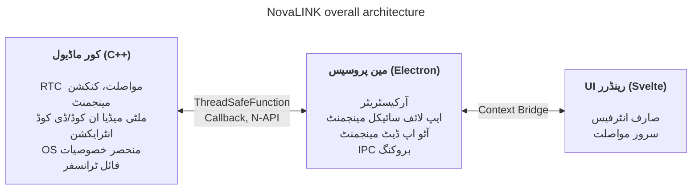

NovaLINK کو شروع سے ہی کراس پلیٹ فارم کے لیے ڈیزائن کیا گیا تھا۔ ریموٹ کنٹرول سافٹ ویئر صرف Windows پر نہیں، بلکہ macOS اور Linux پر بھی وسیع پیمانے پر چلتا ہے؛ تعینات، اپ ڈیٹس اور سیکیورٹی پالیسیاں پلیٹ فارم کے لحاظ سے مختلف ہیں۔ پھر بھی صارفین چاہتے ہیں کہ ایک بار استعمال کی گئی اسکرین اور تجربہ «ویسا ہی» رہے—پلیٹ فارم سے قطع نظر۔ ہمیں بھی متسق ترقیاتی ماحول چاہیے تھا۔ چھوٹی کمپنی کے لیے تمام ماحول کو اندرون ملک یکجا کرنا آسان نہیں۔ انجینئرنگ کو مرکزی پروڈکٹ پر مرکوز کرنا تھا؛ باقی پر پختہ ماحولیاتی نظاموں کا سہارا لینا تھا۔ اسی لیے ابتدائی مرحلے سے ہی ہم نے کراس پلیٹ فارم پر گہری سوچ بچاری۔

یہاں «کراس پلیٹ فارم» کا مطلب صرف «وہی کوڈ کئی OS پر بنتا ہے» تک محدود نہیں۔ اسکرین کیپچر، ان پٹ ہکنگ، رسائی، فائر وال استثناء، پاور اور سلیپ جیسے اجازت کے ماڈل OS کے لحاظ سے مختلف ہیں؛ HiDPI، ملٹی مانیٹر اور ورچوئل ڈسپلے میں کوآرڈینیٹ سسٹم اور اسکیلنگ میں باریک فرق ہوتا ہے۔ انسٹال پاتھ، آٹو اسٹارٹ اور پس منظر کے رویے کی توقعات بھی مختلف ہیں۔ صارف کے لیے یہ «ہر جگہ یکساں تجربہ» ہے، ڈیولپر کے لیے ایک ہی کام کو درجنوں طریقوں سے دہرانا۔ اسی لیے شروع سے ہی ہم نے «UI بنانے کا کردار» اور «اجازتوں اور کارکردگی کا بوجھ» الگ رکھ کر **دہراؤ کم کرنے** کا فیصلہ کیا۔

بازار میں Flutter، React Native، .NET، Qt وغیرہ بہت سے کراس پلیٹ فارم اسٹیک ہیں۔ ہر ایک کے واضح فائدے اور نقصانات ہیں؛ غیر متوقع مسائل کے لیے دستاویزات اور کمیونٹیز شامل کریں تو انتخاب اور وسیع ہو جاتا ہے۔ لیکن ریموٹ کنٹرول سروس ایک پابندی لگاتی ہے جو میدان تنگ کرتی ہے: **کارکردگی**۔ اسکرین کیپچر، ان کوڈ/ڈی کوڈ، ان پٹ میں تاخیر، نیٹ ورک میں اتار چڑھاؤ کے سامنے بفرنگ، فائل ٹرانسفر—سب تقریباً ریئل ٹائم جواب کی توقع رکھتے ہیں۔ کراس پلیٹ فارم فریم ورکس اکثر کئی OS کو ایک تجرید کے اوپر رکھنے کے لیے پرتیں اور ریپرز لگاتے ہیں؛ وہ پرتیں ترقی کی آسانی کے بدلے بدترین صورت میں روک یا مشکل سے قابل پیشین گوئی تاخیر بن سکتی ہیں۔ پلیٹ فارم پختہ ہونے سے یہ حدیں خود بخود نہیں جاتیں۔ «مقبول کراس پلیٹ فارم اسٹیک» اور «ریموٹ کنٹرول کی ضروری کارکردگی» کو ایک ہی محور پر سادہ موازنہ کرنا مشکل ہے۔

ریموٹ کنٹرول میں کارکردگی صرف نعرہ نہیں؛ یہ براہ راست محسوس شدہ معیار سے جڑی ہے۔ ان پٹ سے کور تک اور ان کوڈ، ٹرانسمیشن، ڈی کوڈ ہو کر اسکرین پر واپس آنے تک کی تاخیر؛ پیکٹ نقصان اور جٹر بڑھنے پر فریم پھینکنے یا بفر بڑھانے کی پالیسی؛ ریزولوشن، فریم ریٹ، بٹ ریٹ اور کوڈیک کے امتزاج—سب صارف کے «فوری رد عمل» کے تاثر کو ڈھالتے ہیں۔ یہ مسائل صرف UI فریم ورک کی سہولت سے حل نہیں ہوتے؛ OS مخصوص کیپچر راستے، ہارڈ ویئر ایکسیلیریشن اور تھریڈ شیڈولنگ بھی دیکھنی پڑتی ہے۔ اسی لیے ہم نے «ایک اسٹیک سب کچھ حل کرے گا» سے زیادہ **گرم راستے کو پتلا اور قابل کنٹرول رکھنے** کو ترجیح دی۔

ابتدائی کراس پلیٹ فارم ٹولز کو یاد کریں تو کچھ نیٹیو پر پتلی UI جھلی جیسے لگتے تھے، کچھ میں فریم ورک کے اندر ایک اور دنیا بنانی پڑتی تھی۔ Java Swing اپنے زمانے کے لیے عملی تھا مگر بصری ہم آہنگی اور جدید UX توقعات میں محدود۔ Qt نے UI ہم آہنگی اور ٹول چین سے متاثر کیا؛ .NET خاندان کی طرح بِلڈ، تعینات اور پلگ ان ماحولیاتی نظام سمجھنا پڑتا ہے—ٹیم کی ساخت کے لحاظ سے سیکھنے کا خرچ بڑھ سکتا ہے۔ دلچسپ بات یہ کہ «کراس پلیٹ فارم» کہنے والے ٹولز میں بھی CI، پیکجنگ، کوڈ سائننگ جیسے آپریشنل معاملات میں پلیٹ فارم مخصوص استثناءات آتے رہے۔ Python نے Qt بائنڈنگ وغیرہ سے ڈیسک ٹاپ UI آسان بنایا؛ انٹرپریٹر اور GIL طویل مدتی بھاری ریئل ٹائم پائپ لائن ڈیزائن میں بوجھ بن سکتے ہیں۔

حالیہ برسوں میں WebAssembly اور مختلف نیٹیو بائنڈنگز کے ذریعے «ویب ٹیکنالوجی + کارکردگی کے حساس حصے نیٹیو» کا امتزاج عام ہو گیا۔ NovaLINK کا نتیجہ بھی اسی سمت کے قریب ہے۔ لیکن ریموٹ کنٹرول میڈیا اور ان پٹ کا مسلسل بہاؤ رکھنے والا طویل عمل ہے؛ اس لیے صرف ڈیمو سطح کے انٹیگریشن سے زیادہ اپ ڈیٹس، ناکامی سے بحالی اور میموری استحکام سمیت آپریشنل نقطہ نظر سے سرحدیں کیسے برقرار رکھی جائیں—یہ اہم تھا۔

وقت گزرنے کے ساتھ نیٹیو صلاحیتوں کو پتلی شکل میں ظاہر کرنے والے API بڑھے؛ Node یا React جیسے وسیع ڈیولپر پول والے اسٹیک ڈیسک ٹاپ ایپس میں قدرتی طور پر داخل ہوئے۔ Electron پر مبنی Visual Studio Code کا پختگی کا معیار ایک بڑا موڑ تھا۔ ہم جانتے ہیں کہ اس کے پیچھے گہری پروفائلنگ اور رینڈرر اور ایکسٹینشن ہوسٹ الگ کرنے جیسے اصلاحات ہیں۔ پھر بھی «ویب ٹیکنالوجی اور Node ماحولیاتی نظام پر IDE سطح کی پروڈکٹ ممکن ہے» یہ حقیقت کراس پلیٹ فارم کو کم کارکردگی ماننے کے خیال کو توڑتی ہے۔ بہت سے IDE اور ٹولز نے VS Code کو فورک کیا یا اس سے متاثر ہوئے—ہم اسے مارکیٹ کی توثیق سمجھتے ہیں۔ اس نے ہمیں یقین دلایا کہ کراس پلیٹ فارم اسٹیک سے کارکردگی اور UX دونوں کو ایک ساتھ ہدف بنایا جا سکتا ہے۔

یقیناً Electron پر مبنی نقطہ نظر کی حقیقی لاگت ہے: میموری، Chromium انحصار، تقسیم کا سائز۔ VS Code جیسے اصلاحات کے بغیر محسوس شدہ کارکردگی آسانی سے ہلتی ہے۔ پھر بھی چھوٹی ٹیم تیزی سے پروڈکٹ بہتر بنا سکتی ہے اور آٹو اپ ڈیٹ، ایکسٹینشنز، ٹول انٹیگریشن جیسے «پوری ایپ کو گھیرنے والے» مسائل پختہ نمونوں سے لے سکتی ہے—بہت بڑا فائدہ۔ اہم بات یہ تھی کہ **رینڈرر سب کچھ نہ کرے**؛ بھاری کام ڈیزائن کے مطابق کور میں جانا چاہیے۔

اس کے ساتھ ساتھ، ہم نے ایک ہی فریم ورک میں کارکردگی اور UX کو آخر تک سنبھالنے کی کوشش نہیں کی۔ عملی جواب کردار کی تقسیم اور تفویض کے قریب ہے۔ کئی کوششوں کے بعد NovaLINK نے ہائبرڈ ڈھانچہ چنا: UX اور کور کو زیادہ سے زیادہ الگ؛ کور کو کارکردگی کے حساس راستوں کے لیے، UI کو برانڈ اور استعمال کے لیے۔ بڑا منظر سادہ لگتا ہے، مگر تفصیل میں—تقریباً فراکٹل کی طرح—ہر فیچر وہی سوالات دہراتا ہے: یہ رینڈرر میں ہے یا کور میں تاخیر اور بجلی کے استعمال کو کنٹرول کرنے کے لیے؟ سرحد ایک بار طے ہو کر ختم نہیں؛ ٹریفک پیٹرن اور OS پالیسی بدلنے پر دوبارہ ترتیب دینی پڑتی ہے۔

مخصوص طور پر کور C++ میں ہے: RTC، ملٹی میڈیا، کم سطح کی ان پٹ اور فائل ٹرانسفر جیسے تاخیر اور تھروپٹ حساس راستے ایک جگہ۔ Node ایڈ آنز (N-API)، تھریڈ سیف فنکشنز اور کال بیکس مین پروسیس سے جوڑتے ہیں تاکہ کام UI ایونٹ لوپ سے الگ تھریڈز پر چلے اور ضرورت پر نتائج محفوظ طریقے سے اوپر آئیں۔ Electron مین پروسیس ایپ کی زندگی، آٹو اپ ڈیٹ، ونڈوز، ٹرے، گلوبل شارٹ کٹس جیسے شیل کردار اور IPC بروکنگ پر مرکوز ہے۔ Svelte پر مبنی رینڈرر صارف کے بہاؤ اور سرورز سے گفتگو سنبھالتا ہے۔ ہلکا کمپوننٹ ماڈل اور واضح حالت کی تبدیلی اکثر بدلنے والی ریموٹ کنٹرول اسکرینز کو زیادہ بوائلر پلیٹ کے بغیر برقرار رکھنے میں مدد کرتا ہے۔

ریموٹ کنٹرول مارکیٹ میں پروڈکٹس مختلف باتوں پر زور دیتی ہیں: کچھ کارپوریٹ پالیسیوں اور آڈٹ لاگز پر، کچھ انتہائی کم تاخیر سٹریمنگ پر۔ NovaLINK توازن چاہتا ہے—صرف ایک بینچ مارک لائن نہیں، حقیقی استعمال میں دہرائے جانے والے منظرناموں—کنیکٹ، ریکنیکٹ، ریزولوشن تبدیلی، نیٹ ورک کا معیار، لمبے سیشن—میں بھی قابل پیشین گوئی رویہ۔ اسی لیے فن تعمیر خصوصیات کی فہرست سے پہلے ناکامی کے طریقوں کو کیسے الگ کریں یہ بھی پوچھتی ہے: کور رک جائے تو UI کو کیسے پتہ چلے؟ رینڈرر جم جائے تو سیشنز کیسے صاف ہوں؟ دلکش نہیں، لیکن کراس پلیٹ فارم ایپس میں اعتماد کے لیے ضروری۔

اس ڈھانچے کو واقعی چلانے کے لیے صرف ڈیزائن کافی نہیں—مسلسل آپریشن اور ضبط درکار ہے۔ مثال کے طور پر ایونٹ لوپ مرکزی سنگل تھریڈ ماڈل اور کور میں ملٹی تھریڈ نیٹیو کام کے درمیان ہم آہنگی ہمیشہ تناؤ میں رہتی ہے۔ پلیٹ فارم کے لحاظ سے ٹائمر، ان پٹ اور پاور مینجمنٹ پالیسیاں مختلف؛ ایک ہی غیر ہم وقت پیٹرن ہمیشہ ایک ہی نتیجہ نہیں دیتا۔ IPC پیغامات کے لیے اسکیمہ ملا کر سیریلائزیشن لاگ کنٹرول کرنا ہوتا ہے؛ میڈیا پائپ لائن اور انٹرایکشن ایک ساتھ دھکیلتے وقت غیر ضروری کاپی اور لاک مقابلہ کم کرنا دہرایا جاتا ہے۔ یہ صرف NovaLINK کا مسئلہ نہیں—ریموٹ کنٹرول، ریئل ٹائم تعاون اور سٹریمنگ قسم کی پروڈکٹس میں عام۔ لیکن کور، مین اور رینڈرر کو پرتوں میں تقسیم کرنے سے سرحدوں پر معاہدے، ورژن مطابقت اور ناکامی کے بعد بحالی کی حکمت عملی واضح طور پر سنبھالنی پڑتی ہے۔

سیکیورٹی کے لحاظ سے بھی سرحدیں جتنی واضح اتنی بہتر: رینڈرر کی سطح ممکن حد تک چھوٹی؛ حساس صلاحیتیں مین اور کور میں اجازت اور پالیسی کے ساتھ۔ Context Bridge سے ظاہر API کی شکل محدود رکھنا، سیریلائز یبل پیغام کی شکل برقرار رکھنا، نیٹیو ماڈیول اور ایپ ورژن کے امتزاج کی مطابقت میٹرکس—شروع میں تکلیف دہ، طویل مدت میں واقعہ تجزیہ اور رول بیک آسان۔

آخر میں، کراس پلیٹ فارم «شروع میں ایک بار سوچ کر ختم» نہیں—جب تک پروڈکٹ زندہ ہے تب تک انتخابات کی زنجیر۔ OS اپ ڈیٹس اجازت کے ڈائیلاگ بدلتے ہیں؛ GPU ڈرائیور، فائر وال، سیکیورٹی سافٹ ویئر مداخلت کریں تو وہی کوڈ بھی مختلف محسوس ہوتا ہے۔ ہر بار کور اور UI کی سرحد دوبارہ پڑنی، ضرورت ہو تو ذمہ داریاں منتقل، معاہدے ورژن اپ۔ واحد اسٹیک سے کم نفیس لگنے والا یہ دہراؤ آخر کار صارف کو مستحکم اپ ڈیٹس اور واقف اسکرینز واپس دیتا ہے۔

ڈیولپر تجربے میں بھی ہائبرڈ دو دھاری تلوار: پرتیں بڑھنے پر ڈیبگ اسٹیک لمبا، دوبارہ پیدا کرنے کے ماحول کے لیے لاگ اور نمونہ نقطے کئی پروسیسز میں بانٹنے پڑتے ہیں۔ اسی لیے ہم «محسوس ہوتا ہے تیز» سے زیادہ پیمائش کے قابل اشارے—فریم اعداد و شمار، قطار میں بھراؤ، IPC راؤنڈ ٹرپ وقت، کور CPU استعمال—کو ترجیح دیتے ہیں۔ پلیٹ فارم مخصوص رگریشن ٹیسٹ، کینری تعینات، پرانے کلائنٹس کے ساتھ باہمی کارکردگی بھی کراس پلیٹ فارم پروڈکٹس کا پوشیدہ خرچ۔ ہم یہ خرچ کور میں قابل پیشین گوئی اور UI میں تیزی سے بہتری کے چکر دونوں حاصل کرنے کے لیے قبول کرتے ہیں۔

**NovaLINK موجودہ ڈھانچے کے سودے اور کم از کم نقصان**

| نقصان | مطلب | کم از کم |
|--------|------|----------|
| میموری استعمال | Chromium پروسیسز بنیادی میموری بڑھاتے ہیں | کارکردگی کے اہم راستے جتنا ممکن ہو C++ میں |
| سرد شروع کا وقت | Electron لوڈنگ میں چند سیکنڈ لگ سکتے ہیں | اسپلیش اسکرین سے محسوس UX بہتر |
| N-API بائنڈنگ پیچیدگی | C++↔JS پل کوڈ دیکھ بھال | مقصد کے لحاظ سے الگ پروسیس ڈھانچہ؛ ہر پروسیس میں الگ C++ مواصلت |
| بائنری سائز | Electron + C++ بلڈز بڑے انسٹالر دیتے ہیں | ASAR پیکنگ + پلیٹ فارم مخصوص اختیاری بنڈل |
| بلڈ ماحول پیچیدگی | npm + پلیٹ فارم SDK ایک ساتھ | CI میں پلیٹ فارم کے لحاظ سے الگ بلڈ |

ایک ہی اپ ڈیٹ تمام روکوں کو نہیں ہٹاتا۔ اسی قسم کے فیصلے اور سودے جاری رہیں گے۔ پھر بھی ہمیں یقین ہے کہ رخ—کور میں کیا رہے اور UI میں کیا سونپا جائے اسے بار بار دوبارہ متوازن کرنا اور اعداد سے تصدیق—درست ہے، اور ہم صارف کی رائے اور پیمائش کی بنیاد پر بہتر بناتے رہیں گے۔ مضمون لمبا ہو گیا مگر بات سادہ ہے: کراس پلیٹ فارم ایک بار کا انتخاب نہیں، مسلسل ڈیزائن، اور NovaLINK روزانہ یہی سوچ جاری رکھتا ہے۔
