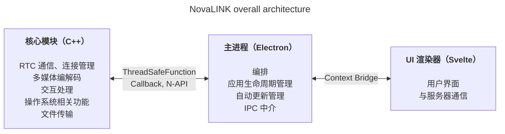
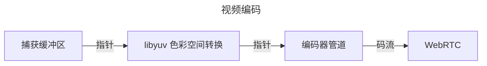
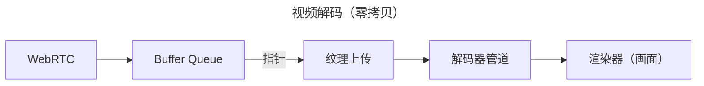

NovaLINK 从一开始就为跨平台而设计。远程控制软件的用户环境不仅限于 Windows，还广泛分布在 macOS 与 Linux 上，部署、更新与安全策略也因平台而异。但用户希望曾经用过的界面与体验“始终如一”，并不区分平台。我们也希望保持统一、连贯的开发环境。对一家小公司而言，要在内部把所有环境完全统一并不容易。开发能力需要集中在核心功能上，其余部分必须借助成熟的开发者生态。因此我们在早期就深入思考跨平台问题。

此处所说的跨平台，并不止于“同一份代码能在多个操作系统上编译”。屏幕捕获、输入钩子、无障碍、防火墙例外、电源与休眠等权限模型因操作系统而异；在 HiDPI、多显示器与虚拟显示环境下，坐标系与缩放也会细微错位。安装路径、自启动与后台行为的期望也各不相同。对用户而言是“处处一致的体验”，对开发而言却接近把同一件事用几十种方式重复完成。因此我们从一开始就决定将“负责绘制界面”与“承载权限与性能敏感工作”分开，以**减少重复**。

市场上有 Flutter、React Native、.NET、Qt 等众多跨平台方案，各有优劣；若再算上帮助解决意外问题的文档与社区，选择面会更广。但远程控制服务有一条约束会收窄选项：**性能**。屏幕捕获与编解码、输入延迟、应对网络波动的缓冲、文件传输，都期望接近实时响应。跨平台框架为了在统一抽象上覆盖多种操作系统，往往会增加层与封装；这些层以开发便利换取最坏情况下的瓶颈或难以预测的延迟。平台成熟并不会自动消除这些限制。“流行的跨平台技术”与“远程控制所需的性能”很难放在同一根轴上做简单比较。

在远程控制中，性能不是空洞的口号，而是直接关系到主观体验质量。从输入到达核心，再经编码、传输、解码回到屏幕的延迟；丢包与抖动增大时是丢帧还是扩大缓冲的策略；分辨率、帧率、码率与编解码组合，都会影响用户是否觉得“反应即时”。这些问题无法仅靠 UI 框架的便利解决，还必须审视各操作系统的捕获路径、硬件加速乃至线程调度。因此我们优先选择让**热路径保持轻薄、可控**，而不是指望“一套技术栈解决一切”。

回顾早期的跨平台工具，有的像只在原生之上套了一层 UI 外壳，有的则要求在框架内再构建一个世界。Java Swing 在当时很实用，但在视觉一致性与现代 UX 预期上有局限——以今天的眼光看仍难以习惯。Qt 在界面一致性与工具链方面令人印象深刻，结构也相对直观。但 Qt 与 .NET 系类似，也需要理解其构建、部署与插件生态，团队构成不同，学习成本可能很高。有趣的是，即便在标榜“跨平台”的工具之间，CI、打包、代码签名等运维环节仍会不断冒出平台特例，跨平台支持本身往往就是苦差。Python 借助 Qt 绑定等能较容易搭建桌面 UI，但解释器特性与 GIL 等会在长期、复杂的实时管道设计中成为负担。

近年来，通过 WebAssembly 与各类原生绑定，“Web 技术 + 性能关键路径走原生”的组合已很常见。NovaLINK 的结论与此方向大体一致。但远程控制是媒体与输入持续流动的长时间进程，因此除了演示级整合，更重要的是在更新、故障恢复与内存稳定性等运维视角下如何守住边界。

随着时间推移，越来越多 API 以轻薄方式暴露原生能力，Node、React 等开发者池庞大的技术栈也自然进入桌面应用。其中基于 Electron 的 Visual Studio Code 的成熟度是一个重要转折点。我们知道其背后有大量性能分析与渲染进程、扩展宿主分离等优化。即便如此，“在 Web 技术与 Node 生态之上能做出 IDE 级产品”这一事实，打破了跨平台必然低性能的刻板印象。随后许多 IDE 与工具 fork 或借鉴 VS Code，我们认为这已超越个人偏好，成为市场验证。它让我们相信可以用跨平台栈同时追求性能与用户体验。

当然，基于 Electron 也有现实成本：内存占用、依赖 Chromium、安装包体积等。若没有 VS Code 级别的优化，主观性能很容易波动。即便如此，小团队仍能快速迭代产品，并以成熟模式处理自动更新、扩展与工具集成等“包裹整个应用”的问题，这是巨大优势。关键是**不要让渲染进程承担一切**；重活必须下沉到核心层，这是设计前提。

同时，我们也不指望单一框架从头到尾同时扛住性能与 UX。务实的答案是角色分离与委托。经过多次尝试，NovaLINK 选择混合架构：尽量分离用户体验区域与核心；核心面向性能敏感路径，UI 面向品牌与可用性的统一。大图看似简单，深入细节则如分形——每个功能都会重复同一组问题：该放在渲染进程还是核心，才能控制延迟与功耗？边界不是一次划定就结束，流量模式与操作系统策略变化时都要重新调整。

具体而言，核心使用 C++，将 RTC、多媒体、底层输入、文件传输等延迟与吞吐敏感路径集中处理。通过 Node 插件（N-API）、线程安全函数与回调连接主进程，可在脱离 UI 事件循环的线程上工作，并在需要时安全地上报结果。Electron 主进程负责应用生命周期、自动更新、窗口/托盘/全局快捷键等外壳职责与 IPC 中介。基于 Svelte 的渲染器承担用户流程及与服务器的交互。组件模型轻量、状态变化清晰，有助于在远程控制这类状态频繁变化的界面中保持可维护性而不过度模板化。

远程控制市场各产品侧重点不同：有的面向企业策略与审计日志，有的专注超低延迟流媒体。NovaLINK 追求的平衡不是“某条基准测试的一行数字”，而是在真实场景中反复出现的情境——连接与重连、分辨率变化、网络质量波动、长会话——下仍能可预测地运行。因此架构在功能清单之外，还要问如何隔离故障模式：核心卡住时 UI 如何通知？渲染器无响应时会话如何清理？这些问题不炫目，却是跨平台应用赢得信任所必需。

要真正运转这一结构，仅有设计不够，还需要持续运营与克制。例如以事件循环为中心的单线程模型，与核心侧多线程/原生任务之间的同步，始终存在张力。各平台的定时器、输入与电源策略不同，同一异步模式未必总得到相同结果。经 IPC 往返的消息需要对齐模式并控制序列化成本；同时推进媒体管道与交互处理时，需要反复减少不必要拷贝与锁竞争。这些挑战并非 NovaLINK 独有，而是远程控制、实时协作与流媒体类产品的共性。但把核心、主进程、渲染器分层后，在边界上明确契约、版本兼容与失败恢复策略的负担也会更重。

从安全角度，边界越清晰越好。渲染进程应尽量缩小暴露面，敏感能力宜在主进程与核心侧与权限和策略一并处理。限制 Context Bridge 暴露的 API 形态、保持可序列化消息、用兼容矩阵管理原生模块版本与应用版本组合，起初繁琐，长期却能简化故障分析与回滚。

最后，跨平台不是“早期想一次就结束”，而是产品存续期间一连串选择。操作系统更新会改变权限对话框；GPU 驱动、防火墙与安全软件介入后，同一代码的主观感受也会不同。每次都要重新审视核心与 UI 的边界，必要时迁移职责并升级契约。这种重复听起来不如优雅的单栈，但对用户却意味着稳定更新与熟悉的界面。

对开发者体验而言，混合架构也是双刃剑。层越多，调试栈越长，为复现环境需要在多个进程中分散埋点日志与采样。因此我们优先选择可量化指标——帧统计、队列积压、IPC 往返时间、核心 CPU 占用——而非“感觉很快”。各平台回归测试、金丝雀发布、与旧版客户端的互操作性，也是跨平台产品的隐性成本。我们愿意承担这些成本，以换取核心的可预测性与 UI 的快速迭代。

**NovaLINK 当前架构的权衡与缓解**

| 缺点 | 说明 | 缓解方式 |
|------|------|----------|
| 内存占用 | Chromium 进程导致基线偏高 | 尽量将性能临界路径放在 C++ |
| 冷启动时间 | Electron 加载可能需数秒 | 用启动画面改善主观体验 |
| N-API 绑定复杂度 | 维护 C++↔JS 桥接代码的负担 | 按用途拆分进程结构，各进程各自承担 C++ 通信 |
| 二进制体积 | Electron 与 C++ 构建一并打包时安装包较大 | ASAR 打包 + 按平台可选捆绑 |
| 构建环境复杂 | 同时管理 npm 与各平台 SDK | 在 CI 中按平台拆分构建 |

一次更新无法消除所有瓶颈。今后仍会有同类决策与权衡。但我们相信当前方向——不断重新平衡核心与 UI 的职责，并用数据验证——是正确的，并将基于用户反馈与测量结果持续改进。文章虽长，要点很简单：跨平台不是一次性选择，而是持续的设计工作，NovaLINK 每天都在延续这一思考。
